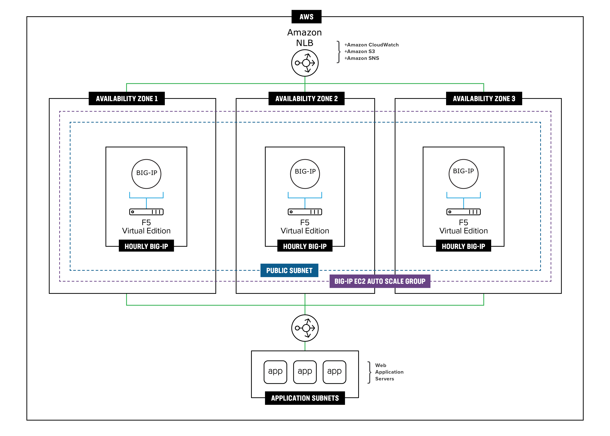

# Deploying BIG-IP VEs in AWS - Auto Scale (Active/Active): 2-NIC

## Notes
 - VERY EXPERIMENTAL!!
 - AWS autoscale group requires multi-nic VM to have NICs in same subnet
 - BIG-IP not supported when running multiple NICs in same subnet
 - This folder does some hack work to move mgmt IP to self IP
 - Upon first reboot, BIG-IP will lose license (bug ID# 1013065) due to not reaching AWS API server
 - This deployment attemps to bypass limitations of single NIC BIG-IP devices. Reference supported platform table and speeds (https://clouddocs.f5.com/cloud/public/v1/matrix.html#amazon-web-services)

## Contents

- [Introduction](#introduction)
- [Prerequisites](#prerequisites)
- [Important Configuration Notes](#important-configuration-notes)
- [BIG-IQ License Manager](#big-iq-license-manager)
- [Installation Example](#installation-example)
- [Configuration Example](#configuration-example)

## Introduction

This solution uses a Terraform template to launch a 2-NIC deployment of a cloud-focused BIG-IP VE cluster (Active/Active) in Amazon AWS. It uses [AWS Autoscaling Groups (ASG)](https://docs.aws.amazon.com/autoscaling/ec2/userguide/AutoScalingGroup.html) to allow auto scaling and auto healing of the BIG-IP VE devices. Traffic flows from an AWS Network Load Balancer (NLB) to the BIG-IP VE which then processes the traffic to application servers. The BIG-IP VE instance is running with multiple interfaces: management, external. NIC0 is associated with the external network and used in ASGs. **NOTE: NIC-SWAP happens on mgmt interface**

This solution leverages more traditional Auto Scale configuration management practices where each instance is created with an identical configuration as defined in the Scale Set's "model". Scale Set sizes are no longer restricted to the small limitations of the cluster. The BIG-IP's configuration, now defined in a single convenient YAML or JSON [F5 BIG-IP Runtime Init](https://github.com/F5Networks/f5-bigip-runtime-init) configuration file, leverages [F5 Automation Tool Chain](https://www.f5.com/pdf/products/automation-toolchain-overview.pdf) declarations which are easier to author, validate and maintain as code. For instance, if you need to change the configuration on the BIG-IPs in the deployment, you update the instance model by passing a new config file (which references the updated Automation Toolchain declarations) via template's runtimeConfig input parameter. New instances will be deployed with the updated configurations.


## Prerequisites

- This template requires programmatic API credentials to deploy the Terraform AWS provider and build out all the neccessary AWS objects
  - See the [Terraform "AWS Provider"](https://registry.terraform.io/providers/hashicorp/aws/latest/docs#authentication) for details
  - You will require at minimum `AWS_ACCESS_KEY_ID` and `AWS_SECRET_ACCESS_KEY`
  - ***Note***: Make sure to [practice least privilege](https://docs.aws.amazon.com/IAM/latest/UserGuide/best-practices.html)
- This templates deploys into an *EXISTING* networking stack. You are required to have an existing VPC network and subnets
  - A NAT gateway is also required for outbound Internet traffic
  - If you require a new network first, see the [Infrastructure Only folder](../Infrastructure-only) to get started


## Important Configuration Notes

- Variables are configured in variables.tf
- Sensitive variables like AWS SSH keys are configured in terraform.tfvars
  - ***Note***: Other items like BIG-IP password are stored in AWS Secrets Manager. Refer to the [Prerequisites](#prerequisites).
- Files
  - main.tf - resources for provider, versions
  - bigip.tf - resources for BIG-IP autoscaling group, launch template, security groups
  - main.tf - resources for provider, versions
  - nlb.tf - resources for AWS NLB
  - f5_onboard.tmpl - onboarding script which is run by user-data. This script is responsible for downloading the neccessary F5 Automation Toolchain RPM files, installing them, and then executing the onboarding REST calls.
  - do.json - contains the L1-L3 BIG-IP configurations used by DO for items like VLANs, IPs, and routes
  - as3.json - contains the L4-L7 BIG-IP configurations used by AS3 for items like pool members, virtual server listeners, security policies, and more
  - ts.json - contains the BIG-IP configurations used by TS for items like telemetry streaming, CPU, memory, application statistics, and more

## BIG-IQ License Manager
This template uses PayGo BIG-IP image for the deployment (as default). If you would like to use BYOL/ELA/Subscription licenses from [BIG-IQ License Manager (LM)](https://devcentral.f5.com/s/articles/managing-big-ip-licensing-with-big-iq-31944), then these following steps are needed:
1. In the "variables.tf", modify *f5_ami_search_name* value with a BYOL filter in the name. Example below...
  ```
          # BIGIP Image
          variable "f5_ami_search_name" { default = "F5 BIGIP-15.1.2.1* BYOL-All* 2Boot*" }
  ```
2. In the "variables.tf", modify the BIG-IQ license section to match your environment
3. In the "do.json", add the "myLicense" block under the "Common" declaration ([full declaration example here](https://clouddocs.f5.com/products/extensions/f5-declarative-onboarding/latest/bigiq-examples.html#licensing-with-big-iq-regkey-pool-route-to-big-ip))
  ```
        "myLicense": {
            "class": "License",
            "licenseType": "${bigIqLicenseType}",
            "bigIqHost": "${bigIqHost}",
            "bigIqUsername": "${bigIqUsername}",
            "bigIqPassword": "$${bigIqPassword}",
            "licensePool": "${bigIqLicensePool}",
            "skuKeyword1": "${bigIqSkuKeyword1}",
            "skuKeyword2": "${bigIqSkuKeyword2}",
            "unitOfMeasure": "${bigIqUnitOfMeasure}",
            "reachable": false,
            "hypervisor": "${bigIqHypervisor}",
            "overwrite": true
        },
  ```

<!-- markdownlint-disable no-inline-html -->
<!-- BEGINNING OF PRE-COMMIT-TERRAFORM DOCS HOOK -->
## Requirements

| Name | Version |
|------|---------|
| <a name="requirement_terraform"></a> [terraform](#requirement\_terraform) | >= 0.14 |
| <a name="requirement_aws"></a> [aws](#requirement\_aws) | >= 4 |

## Providers

| Name | Version |
|------|---------|
| <a name="provider_aws"></a> [aws](#provider\_aws) | 4.15.0 |
| <a name="provider_random"></a> [random](#provider\_random) | 3.2.0 |

## Modules

| Name | Source | Version |
|------|--------|---------|
| <a name="module_external-security-group"></a> [external-security-group](#module\_external-security-group) | terraform-aws-modules/security-group/aws | n/a |

## Resources

| Name | Type |
|------|------|
| [aws_autoscaling_group.bigip-asg](https://registry.terraform.io/providers/hashicorp/aws/latest/docs/resources/autoscaling_group) | resource |
| [aws_launch_template.bigip-lt](https://registry.terraform.io/providers/hashicorp/aws/latest/docs/resources/launch_template) | resource |
| [random_id.buildSuffix](https://registry.terraform.io/providers/hashicorp/random/latest/docs/resources/id) | resource |
| [aws_ami.f5_ami](https://registry.terraform.io/providers/hashicorp/aws/latest/docs/data-sources/ami) | data source |

## Inputs

| Name | Description | Type | Default | Required |
|------|-------------|------|---------|:--------:|
| <a name="input_f5_ssh_publickey"></a> [f5\_ssh\_publickey](#input\_f5\_ssh\_publickey) | public key used for authentication in ssh-rsa format | `string` | n/a | yes |
| <a name="input_allowedIps"></a> [allowedIps](#input\_allowedIps) | Trusted source network for admin access | `list(any)` | <pre>[<br>  "0.0.0.0/0"<br>]</pre> | no |
| <a name="input_asg_desired_capacity"></a> [asg\_desired\_capacity](#input\_asg\_desired\_capacity) | AWS autoscailng desired capacity | `number` | `1` | no |
| <a name="input_asg_max_size"></a> [asg\_max\_size](#input\_asg\_max\_size) | AWS autoscailng minimum size | `number` | `2` | no |
| <a name="input_asg_min_size"></a> [asg\_min\_size](#input\_asg\_min\_size) | AWS autoscailng minimum size | `number` | `1` | no |
| <a name="input_awsRegion"></a> [awsRegion](#input\_awsRegion) | aws region | `string` | `"us-west-2"` | no |
| <a name="input_bigIqHost"></a> [bigIqHost](#input\_bigIqHost) | This is the BIG-IQ License Manager host name or IP address | `string` | `""` | no |
| <a name="input_bigIqHypervisor"></a> [bigIqHypervisor](#input\_bigIqHypervisor) | BIG-IQ hypervisor | `string` | `"aws"` | no |
| <a name="input_bigIqLicensePool"></a> [bigIqLicensePool](#input\_bigIqLicensePool) | BIG-IQ license pool name | `string` | `""` | no |
| <a name="input_bigIqLicenseType"></a> [bigIqLicenseType](#input\_bigIqLicenseType) | BIG-IQ license type | `string` | `"licensePool"` | no |
| <a name="input_bigIqPassword"></a> [bigIqPassword](#input\_bigIqPassword) | Admin Password for BIG-IQ | `string` | `"Default12345!"` | no |
| <a name="input_bigIqSkuKeyword1"></a> [bigIqSkuKeyword1](#input\_bigIqSkuKeyword1) | BIG-IQ license SKU keyword 1 | `string` | `"key1"` | no |
| <a name="input_bigIqSkuKeyword2"></a> [bigIqSkuKeyword2](#input\_bigIqSkuKeyword2) | BIG-IQ license SKU keyword 2 | `string` | `"key2"` | no |
| <a name="input_bigIqUnitOfMeasure"></a> [bigIqUnitOfMeasure](#input\_bigIqUnitOfMeasure) | BIG-IQ license unit of measure | `string` | `"hourly"` | no |
| <a name="input_bigIqUsername"></a> [bigIqUsername](#input\_bigIqUsername) | Admin name for BIG-IQ | `string` | `"azureuser"` | no |
| <a name="input_ec2_instance_type"></a> [ec2\_instance\_type](#input\_ec2\_instance\_type) | AWS instance type for the BIG-IP | `string` | `"m5.xlarge"` | no |
| <a name="input_extSubnetAz1"></a> [extSubnetAz1](#input\_extSubnetAz1) | ID of External subnet AZ1 | `string` | `null` | no |
| <a name="input_extSubnetAz2"></a> [extSubnetAz2](#input\_extSubnetAz2) | ID of External subnet AZ2 | `string` | `null` | no |
| <a name="input_f5_ami_search_name"></a> [f5\_ami\_search\_name](#input\_f5\_ami\_search\_name) | AWS AMI search filter to find correct BIG-IP VE for region | `string` | `"F5 BIGIP-16.1.2.2* PAYG-Best 200Mbps*"` | no |
| <a name="input_f5_password"></a> [f5\_password](#input\_f5\_password) | BIG-IP Password | `string` | `"Default12345!"` | no |
| <a name="input_f5_username"></a> [f5\_username](#input\_f5\_username) | User name for the BIG-IP (Note: currenlty not used. Defaults to 'admin' based on AMI | `string` | `"admin"` | no |
| <a name="input_ntp_server"></a> [ntp\_server](#input\_ntp\_server) | Leave the default NTP server the BIG-IP uses, or replace the default NTP server with the one you want to use | `string` | `"0.us.pool.ntp.org"` | no |
| <a name="input_onboard_log"></a> [onboard\_log](#input\_onboard\_log) | Directory on the BIG-IP to store the cloud-init logs | `string` | `"/var/log/cloud/startup-script.log"` | no |
| <a name="input_projectPrefix"></a> [projectPrefix](#input\_projectPrefix) | prefix for resources | `string` | `"myDemo"` | no |
| <a name="input_resourceOwner"></a> [resourceOwner](#input\_resourceOwner) | owner of the deployment, for tagging purposes | `string` | `"myName"` | no |
| <a name="input_timezone"></a> [timezone](#input\_timezone) | If you would like to change the time zone the BIG-IP uses, enter the time zone you want to use. This is based on the tz database found in /usr/share/zoneinfo (see the full list [here](https://github.com/F5Networks/f5-azure-arm-templates/blob/master/azure-timezone-list.md)). Example values: UTC, US/Pacific, US/Eastern, Europe/London or Asia/Singapore. | `string` | `"UTC"` | no |
| <a name="input_vpcId"></a> [vpcId](#input\_vpcId) | The AWS network VPC ID | `string` | `null` | no |

## Outputs

| Name | Description |
|------|-------------|
| <a name="output_asg_name"></a> [asg\_name](#output\_asg\_name) | AWS autoscaling group name of BIG-IP devices |
<!-- END OF PRE-COMMIT-TERRAFORM DOCS HOOK -->
<!-- markdownlint-enable no-inline-html -->

## Installation Example

To run this Terraform template, perform the following steps:
  1. Clone the repo to your favorite location
  2. Modify terraform.tfvars with the required information
  ```
      # BIG-IP Environment
      allowedIps       = ["0.0.0.0/0"]
      vpcId            = "vpc-1234"
      extSubnetAz1     = "subnet-1234"
      extSubnetAz2     = "subnet-5678"
      f5_ssh_publickey = "ssh-rsa AAABC123....."
      f5_username      = "admin"
      f5_password      = "Default12345!"

      # AWS Environment
      awsRegion     = "us-west-2"
      projectPrefix = "mydemo"
      resourceOwner = "myname"
  ```
  3. Initialize the directory
  ```
      terraform init
  ```
  4. Test the plan and validate errors
  ```
      terraform plan
  ```
  5. Finally, apply and deploy
  ```
      terraform apply
  ```
  6. When done with everything, don't forget to clean up!
  ```
      terraform destroy
  ```

## Configuration Example

The following is an example configuration diagram for this solution deployment. In this scenario, all access to the BIG-IP VE cluster (Active/Active) is via a bastion host. The IP addresses in this example may be different in your implementation.



## Documentation

For more information on F5 solutions for AWS, including manual configuration procedures for some deployment scenarios, see the AWS section of [F5 CloudDocs](https://clouddocs.f5.com/cloud/public/v1/aws_index.html). Also check out the [Using Cloud Templates for BIG-IP in AWS](https://devcentral.f5.com/s/articles/Using-Cloud-Templates-to-Change-BIG-IP-Versions-AWS) on DevCentral.
