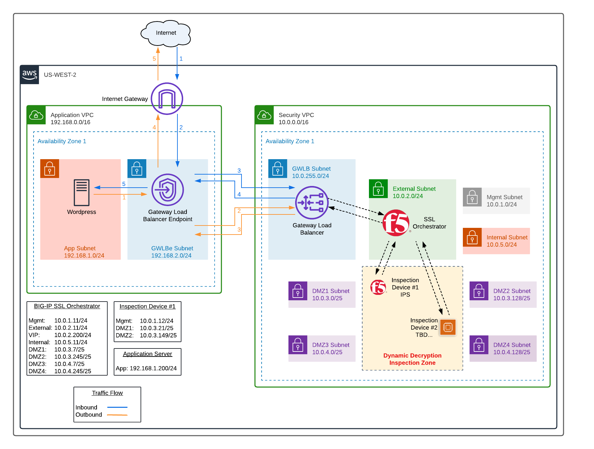

# Description
AWS Gateway Load Balancer and BIG-IP SSL Orchestrator Infrastructure Deployment using Terraform

## To Do
- Community support only. Not F5 supported.

## Issues
- Find an issue? Fork, clone, create branch, fix and PR. I'll review and merge into the main branch. Or submit a GitHub issue with all necessary details and logs.

## Contents

- [Introduction](#introduction)
- [Configuration Example](#configuration-example)
- [Prerequisites](#prerequisites)
- [Important Configuration Notes](#important-configuration-notes)
- [Installation Example](#installation-example)
- [Troubleshooting](#troubleshooting)

## Introduction

This solution uses a Terraform template to launch a 7-NIC deployment of a BIG-IP device running [F5 SSL Orchestrator](https://www.f5.com/products/security/ssl-orchestrator) in AWS with [Gateway Load Balancer (GWLB)](https://aws.amazon.com/elasticloadbalancing/gateway-load-balancer/). The AWS GWLB helps to scale and manage third-party virtual appliances like F5 BIG-IP. Traffic flows to AWS Cloud, routes through AWS GWLB, and it is directed towards the BIG-IP devices running SSL Orchestrator. The BIG-IP SSL Orchestrator processes the traffic, sends it to various security inspection devices, then the traffic is routed back through BIG-IP and AWS GWLB to the final destination.

Note: There are many types of security inspection devices. This demo uses a second BIG-IP device to perform IPS functionality. This is purely for demo purposes.

The resulting deployment will consist of the following:

- Security VPC and subnets
  - 1x BIG-IP SSL Orchestrator
  - 1x Inspection device running IPS (part of [BIG-IP Advanced Firewall Manager module](https://www.f5.com/solutions/service-providers/big-ip-afm-ips-solution-overview))
  - AWS GWLB
- Application VPC and subnets
  - 1x Wordpress application server
  - AWS GWLB endpoint

## Configuration Example

The following is an example configuration diagram for this solution deployment.



## Prerequisites

- ***Important***: When you configure the admin password for the BIG-IP VE in the template, you cannot use the character **#**.  Additionally, there are a number of other special characters that you should avoid using for F5 product user accounts.  See [K2873](https://support.f5.com/csp/article/K2873) for details.
- This template requires one or more service accounts for the BIG-IP instance to perform various tasks:
  - AWS Secrets Manager - requires IAM Profile to retrieve secrets (see [IAM policy examples for secrets in AWS Secrets Manager](https://docs.aws.amazon.com/mediaconnect/latest/ug/iam-policy-examples-asm-secrets.html))
    - Performed by VM instance during onboarding to retrieve passwords and private keys
- This template requires programmatic API credentials to deploy the Terraform AWS provider and build out all the neccessary AWS objects
  - See the [Terraform "AWS Provider"](https://registry.terraform.io/providers/hashicorp/aws/latest/docs#authentication) for details
  - You will require at minimum `AWS_ACCESS_KEY_ID` and `AWS_SECRET_ACCESS_KEY`
  - ***Note***: Make sure to [practice least privilege](https://docs.aws.amazon.com/IAM/latest/UserGuide/best-practices.html)
- Passwords and secrets can be located in [AWS Secrets Manager](https://docs.aws.amazon.com/secretsmanager/latest/userguide/intro.html).
  - Set *aws_secretmanager_auth* to 'true'
  - A new IAM profile (aka role and permissions) is created with permissions to list secrets (see iam.tf)
  - If *aws_secretmanager_auth* is 'true', then 'f5_password' should be the ARN of the AWS Secrets Manager secret. The secret needs to contain ONLY the password as 'plain text' type.
- You must subscribe to the following AWS Marketplace offerings:
  - F5 BIG-IP (BYOL, 2boot) - https://aws.amazon.com/marketplace/pp?sku=5f5a1994-65df-4235-b79c-a3ea049dc1db
    - used by BIG-IP SSL Orchestrator device
    - used by BIG-IP IPS inspection device
  - WordPress - https://aws.amazon.com/marketplace/pp?sku=78b1d030-4c7d-4ade-b8e6-f8dc86941303
    - used by demo application server


## Important Configuration Notes

- Variables are configured in variables.tf
- Sensitive variables like AWS SSH keys are configured in terraform.tfvars or AWS Secrets Manager
  - ***Note***: Other items like BIG-IP password can be stored in AWS Secrets Manager. Refer to the [Prerequisites](#prerequisites).
- This template uses BIG-IP Runtime Init for the initial configuration. As part of the onboarding script, it will download the F5 Toolchain RPMs automatically. See the [AS3 documentation](http://f5.com/AS3Docs) and [DO documentation](http://f5.com/DODocs) for details on how to use AS3 and Declarative Onboarding on your BIG-IP VE(s).
  - Terraform does not configure the initial SSL Orchestrator Topology configuration
    - Ansible variables file is automatically generated
    - Ansible playbook is used to deploy an Inbound Layer 3 Topology
    - You can also manually configure and deploy the Topology instead
- Files
  - bigip-sslo.tf - resources for BIG-IP SSL Orchestrator, NICs, public IPs
  - bigip-ips.tf - resources for BIG-IP IPS inspection devices, NICs
  - gwlb.tf - resources for AWS Gateway Load Balancer
  - iam.tf - resources to create IAM roles and permissions
  - network.tf - resources for AWS VPC, subnets, and networking
  - main.tf - resources for provider, versions
  - f5_onboard_sslo.tmpl - onboarding script for the SSLO device which is run by user-data. This script is responsible for downloading the neccessary F5 Automation Toolchain RPM files, installing them, and then executing the onboarding REST calls via the [BIG-IP Runtime Init tool](https://github.com/F5Networks/f5-bigip-runtime-init).
  - f5_onboard_ips.tmpl - onboarding script for the IPS device which is run by user-data. This script is responsible for downloading the neccessary F5 Automation Toolchain RPM files, installing them, and then executing the onboarding REST calls via the [BIG-IP Runtime Init tool](https://github.com/F5Networks/f5-bigip-runtime-init).

## Installation Example

To run this Terraform template, perform the following steps:
  1. Clone the repo to your favorite location
  2. Modify terraform.tfvars with the required information
  ```
      # BIG-IP Environment
      adminSrcAddr  = "0.0.0.0/0"
      ssh_key       = "ssh-rsa AAABC123....."
      f5_username   = "admin"
      f5_password   = "Default12345!"

      # AWS Environment
      awsRegion     = "us-west-2"
      projectPrefix = "mydemo"
      resourceOwner = "myname"
  ```
  3. Initialize the directory
  ```
      terraform init
  ```
  4. Test the plan and validate errors
  ```
      terraform plan
  ```
  5. Finally, apply and deploy
  ```
      terraform apply
  ```
  6. When done with everything, don't forget to clean up!
  ```
      terraform destroy
  ```

## Steps for Manual SSL Orchestrator Topology Configuration

- [optional] Upload a trusted SSL certificate and key before entering the SSL Orchestrator guide configuration UI

- Create an L3 Inbound topology

- Define SSL settings (using either the default or the previously uploaded certificate and key)

- Create the first inspection service
  - Enter a name for the service
  - Select a Layer 3 type from the service catalog
  - De-select automatic network configuration
  - Use **dmz1** as the To-Service VLAN
  - Enter the IP address of the inspection service (from Terraform outputs)
  - Use **dmz2** as the From-Service VLAN
  - Enable Port remapping (e.g., 8000)

- Create a Service Chain (service_chain_1) and add the first inspection service to it.

- In the Egress settings, use SNAT automap and network default route

- In the Security Policy rules:

  - Add the Service Chain to the Default rule.

- Deploy the Topology configuration.

## Redeploy BIG-IP for Replacement or Upgrade
This example illustrates how to replace or upgrade the BIG-IP VE.
  1. Change the *f5_ami_search_name* variable to the desired release
  2. Revoke the problematic BIG-IP VE's license (if BYOL)
  3. Run command
```
terraform taint module.bigipSslO.aws_instance.f5_bigip
```
  3. Run command
```
terraform apply
```

## Troubleshooting

### Serial Logs
Review the serial logs for the Google virtual machine. Login to the AWS portal, open "EC2", then locate your instance...click it. Hit Actions > Monitor and Troubleshoot > Get stem log. Then review the serial logs for errors.

### Onboard Logs
Depending on where onboard fails, you can attempt SSH login and try to troubleshoot further. Inspect the /config/cloud directory for correct runtime init YAML files. Inspec the /var/log/cloud location for error logs.

### F5 Automation Toolchain Components
F5 BIG-IP Runtime Init uses the F5 Automation Toolchain for configuration of BIG-IP instances.  Any errors thrown from these components will be surfaced in the bigIpRuntimeInit.log (or a custom log location as specified below).

Help with troubleshooting individual Automation Toolchain components can be found at F5's [Public Cloud Docs](http://clouddocs.f5.com/cloud/public/v1/):
- DO: https://clouddocs.f5.com/products/extensions/f5-declarative-onboarding/latest/troubleshooting.html
- AS3: https://clouddocs.f5.com/products/extensions/f5-appsvcs-extension/latest/userguide/troubleshooting.html
- FAST: https://clouddocs.f5.com/products/extensions/f5-appsvcs-templates/latest/userguide/troubleshooting.html
- TS: https://clouddocs.f5.com/products/extensions/f5-telemetry-streaming/latest/userguide/troubleshooting.html
- CFE: https://clouddocs.f5.com/products/extensions/f5-cloud-failover/latest/userguide/troubleshooting.html

### Inspection Devices
This configuration uses "inspection" devices sitting in separate service chains to simulate real world deployments. These are BIG-IP devices running the Advanced Firewall Manager module with IPS functionality. Basic configuration is applied in this demo so that packets traverse the inspection zone and return to the SSL Orchestrator interfaces.

If the config fails, you should check where traffic is stopping. A good place to start is at the BIG-IP SSL Orchestrator device first.

- Run a tcpdump on the dmz1 and dmz3 interfaces. Do you see traffic?
  - No: Inspection devices are not configured properly in the SSL Orchestrator Service configuration, Service Chain, or Security Policy. Review your SSL Orchestrator configuration.

  - Yes: Run a tcpdump on the dmz2/dmz4 interface. Do you see traffic?

    - No: The routes on the inspection devices are not set up correctly (possibly due to bootstrap issues).

      - SSH to the inspection device(s) and check the route table.

      - Does the table contain a route for 10.0.2.0/24? If not, validate if cloud-init was successful on BIG-IP inpection devivice. See [Troubleshooting](#troubleshooting) and check logs for onboard delcaration errors.

      - Try to re-run the onboarding scripts and watch logs

        - inspection_device_1:

          ```bash
          f5-bigip-runtime-init --config-file /config/cloud/runtime-init-conf.yaml
          ```

<!-- markdownlint-disable no-inline-html -->
<!-- BEGINNING OF PRE-COMMIT-TERRAFORM DOCS HOOK -->
## Requirements

| Name | Version |
|------|---------|
| <a name="requirement_terraform"></a> [terraform](#requirement\_terraform) | >= 1.2.0 |
| <a name="requirement_aws"></a> [aws](#requirement\_aws) | >= 4.59.0 |

## Providers

| Name | Version |
|------|---------|
| <a name="provider_aws"></a> [aws](#provider\_aws) | 4.59.0 |
| <a name="provider_random"></a> [random](#provider\_random) | 3.4.3 |

## Modules

| Name | Source | Version |
|------|--------|---------|
| <a name="module_applicationVpc"></a> [applicationVpc](#module\_applicationVpc) | terraform-aws-modules/vpc/aws | 3.19.0 |
| <a name="module_bigipSslO"></a> [bigipSslO](#module\_bigipSslO) | F5Networks/bigip-module/aws | 1.1.11 |
| <a name="module_securityVpc"></a> [securityVpc](#module\_securityVpc) | terraform-aws-modules/vpc/aws | 3.19.0 |
| <a name="module_webapp"></a> [webapp](#module\_webapp) | terraform-aws-modules/ec2-instance/aws | 4.3.0 |

## Resources

| Name | Type |
|------|------|
| [aws_key_pair.bigip](https://registry.terraform.io/providers/hashicorp/aws/latest/docs/resources/key_pair) | resource |
| [aws_lb.gwlb](https://registry.terraform.io/providers/hashicorp/aws/latest/docs/resources/lb) | resource |
| [aws_lb_listener.gwlb](https://registry.terraform.io/providers/hashicorp/aws/latest/docs/resources/lb_listener) | resource |
| [aws_lb_target_group.bigipSslO](https://registry.terraform.io/providers/hashicorp/aws/latest/docs/resources/lb_target_group) | resource |
| [aws_lb_target_group_attachment.bigipSslO](https://registry.terraform.io/providers/hashicorp/aws/latest/docs/resources/lb_target_group_attachment) | resource |
| [aws_route.fromAppAz1](https://registry.terraform.io/providers/hashicorp/aws/latest/docs/resources/route) | resource |
| [aws_route.fromAppAz2](https://registry.terraform.io/providers/hashicorp/aws/latest/docs/resources/route) | resource |
| [aws_route_table.dmz1Az1](https://registry.terraform.io/providers/hashicorp/aws/latest/docs/resources/route_table) | resource |
| [aws_route_table.dmz1Az2](https://registry.terraform.io/providers/hashicorp/aws/latest/docs/resources/route_table) | resource |
| [aws_route_table.dmz2Az1](https://registry.terraform.io/providers/hashicorp/aws/latest/docs/resources/route_table) | resource |
| [aws_route_table.dmz2Az2](https://registry.terraform.io/providers/hashicorp/aws/latest/docs/resources/route_table) | resource |
| [aws_route_table.dmz3Az1](https://registry.terraform.io/providers/hashicorp/aws/latest/docs/resources/route_table) | resource |
| [aws_route_table.dmz3Az2](https://registry.terraform.io/providers/hashicorp/aws/latest/docs/resources/route_table) | resource |
| [aws_route_table.dmz4Az1](https://registry.terraform.io/providers/hashicorp/aws/latest/docs/resources/route_table) | resource |
| [aws_route_table.dmz4Az2](https://registry.terraform.io/providers/hashicorp/aws/latest/docs/resources/route_table) | resource |
| [aws_route_table.igwRtb](https://registry.terraform.io/providers/hashicorp/aws/latest/docs/resources/route_table) | resource |
| [aws_route_table_association.dmz1Az1](https://registry.terraform.io/providers/hashicorp/aws/latest/docs/resources/route_table_association) | resource |
| [aws_route_table_association.dmz1Az2](https://registry.terraform.io/providers/hashicorp/aws/latest/docs/resources/route_table_association) | resource |
| [aws_route_table_association.dmz2Az1](https://registry.terraform.io/providers/hashicorp/aws/latest/docs/resources/route_table_association) | resource |
| [aws_route_table_association.dmz2Az2](https://registry.terraform.io/providers/hashicorp/aws/latest/docs/resources/route_table_association) | resource |
| [aws_route_table_association.dmz3Az1](https://registry.terraform.io/providers/hashicorp/aws/latest/docs/resources/route_table_association) | resource |
| [aws_route_table_association.dmz3Az2](https://registry.terraform.io/providers/hashicorp/aws/latest/docs/resources/route_table_association) | resource |
| [aws_route_table_association.dmz4Az1](https://registry.terraform.io/providers/hashicorp/aws/latest/docs/resources/route_table_association) | resource |
| [aws_route_table_association.dmz4Az2](https://registry.terraform.io/providers/hashicorp/aws/latest/docs/resources/route_table_association) | resource |
| [aws_route_table_association.igwRtb](https://registry.terraform.io/providers/hashicorp/aws/latest/docs/resources/route_table_association) | resource |
| [aws_route_table_association.mgmtAz1](https://registry.terraform.io/providers/hashicorp/aws/latest/docs/resources/route_table_association) | resource |
| [aws_route_table_association.mgmtAz2](https://registry.terraform.io/providers/hashicorp/aws/latest/docs/resources/route_table_association) | resource |
| [aws_security_group.external](https://registry.terraform.io/providers/hashicorp/aws/latest/docs/resources/security_group) | resource |
| [aws_security_group.inspectionZone](https://registry.terraform.io/providers/hashicorp/aws/latest/docs/resources/security_group) | resource |
| [aws_security_group.internal](https://registry.terraform.io/providers/hashicorp/aws/latest/docs/resources/security_group) | resource |
| [aws_security_group.management](https://registry.terraform.io/providers/hashicorp/aws/latest/docs/resources/security_group) | resource |
| [aws_security_group.webapp](https://registry.terraform.io/providers/hashicorp/aws/latest/docs/resources/security_group) | resource |
| [aws_subnet.dmz1Az1](https://registry.terraform.io/providers/hashicorp/aws/latest/docs/resources/subnet) | resource |
| [aws_subnet.dmz1Az2](https://registry.terraform.io/providers/hashicorp/aws/latest/docs/resources/subnet) | resource |
| [aws_subnet.dmz2Az1](https://registry.terraform.io/providers/hashicorp/aws/latest/docs/resources/subnet) | resource |
| [aws_subnet.dmz2Az2](https://registry.terraform.io/providers/hashicorp/aws/latest/docs/resources/subnet) | resource |
| [aws_subnet.dmz3Az1](https://registry.terraform.io/providers/hashicorp/aws/latest/docs/resources/subnet) | resource |
| [aws_subnet.dmz3Az2](https://registry.terraform.io/providers/hashicorp/aws/latest/docs/resources/subnet) | resource |
| [aws_subnet.dmz4Az1](https://registry.terraform.io/providers/hashicorp/aws/latest/docs/resources/subnet) | resource |
| [aws_subnet.dmz4Az2](https://registry.terraform.io/providers/hashicorp/aws/latest/docs/resources/subnet) | resource |
| [aws_subnet.mgmtAz1](https://registry.terraform.io/providers/hashicorp/aws/latest/docs/resources/subnet) | resource |
| [aws_subnet.mgmtAz2](https://registry.terraform.io/providers/hashicorp/aws/latest/docs/resources/subnet) | resource |
| [aws_vpc_endpoint.applicationGwlbeAz1](https://registry.terraform.io/providers/hashicorp/aws/latest/docs/resources/vpc_endpoint) | resource |
| [aws_vpc_endpoint.applicationGwlbeAz2](https://registry.terraform.io/providers/hashicorp/aws/latest/docs/resources/vpc_endpoint) | resource |
| [aws_vpc_endpoint.securityGwlbeAz1](https://registry.terraform.io/providers/hashicorp/aws/latest/docs/resources/vpc_endpoint) | resource |
| [aws_vpc_endpoint.securityGwlbeAz2](https://registry.terraform.io/providers/hashicorp/aws/latest/docs/resources/vpc_endpoint) | resource |
| [aws_vpc_endpoint_service.gwlb](https://registry.terraform.io/providers/hashicorp/aws/latest/docs/resources/vpc_endpoint_service) | resource |
| [random_id.buildSuffix](https://registry.terraform.io/providers/hashicorp/random/latest/docs/resources/id) | resource |
| [aws_ami.webapp](https://registry.terraform.io/providers/hashicorp/aws/latest/docs/data-sources/ami) | data source |
| [aws_secretsmanager_secret.password](https://registry.terraform.io/providers/hashicorp/aws/latest/docs/data-sources/secretsmanager_secret) | data source |
| [aws_secretsmanager_secret_version.current](https://registry.terraform.io/providers/hashicorp/aws/latest/docs/data-sources/secretsmanager_secret_version) | data source |

## Inputs

| Name | Description | Type | Default | Required |
|------|-------------|------|---------|:--------:|
| <a name="input_ssh_key"></a> [ssh\_key](#input\_ssh\_key) | public key used for authentication in ssh-rsa format | `string` | n/a | yes |
| <a name="input_AS3_URL"></a> [AS3\_URL](#input\_AS3\_URL) | URL to download the BIG-IP Application Service Extension 3 (AS3) module | `string` | `"https://github.com/F5Networks/f5-appsvcs-extension/releases/download/v3.43.0/f5-appsvcs-3.43.0-2.noarch.rpm"` | no |
| <a name="input_DO_URL"></a> [DO\_URL](#input\_DO\_URL) | URL to download the BIG-IP Declarative Onboarding module | `string` | `"https://github.com/F5Networks/f5-declarative-onboarding/releases/download/v1.36.1/f5-declarative-onboarding-1.36.1-1.noarch.rpm"` | no |
| <a name="input_FAST_URL"></a> [FAST\_URL](#input\_FAST\_URL) | URL to download the BIG-IP FAST module | `string` | `"https://github.com/F5Networks/f5-appsvcs-templates/releases/download/v1.24.0/f5-appsvcs-templates-1.24.0-1.noarch.rpm"` | no |
| <a name="input_INIT_URL"></a> [INIT\_URL](#input\_INIT\_URL) | URL to download the BIG-IP runtime init | `string` | `"https://cdn.f5.com/product/cloudsolutions/f5-bigip-runtime-init/v1.6.0/dist/f5-bigip-runtime-init-1.6.0-1.gz.run"` | no |
| <a name="input_TS_URL"></a> [TS\_URL](#input\_TS\_URL) | URL to download the BIG-IP Telemetry Streaming module | `string` | `"https://github.com/F5Networks/f5-telemetry-streaming/releases/download/v1.32.0/f5-telemetry-1.32.0-2.noarch.rpm"` | no |
| <a name="input_adminSrcAddr"></a> [adminSrcAddr](#input\_adminSrcAddr) | Allowed Admin source IP prefix | `string` | `"0.0.0.0/0"` | no |
| <a name="input_applicationGwlbeSubnets"></a> [applicationGwlbeSubnets](#input\_applicationGwlbeSubnets) | GWLB endpoint subnet address prefixes | `list(any)` | <pre>[<br>  "192.168.2.0/25",<br>  "192.168.2.128/25"<br>]</pre> | no |
| <a name="input_applicationPrivateSubnets"></a> [applicationPrivateSubnets](#input\_applicationPrivateSubnets) | Private subnet address prefixes | `list(any)` | <pre>[<br>  "192.168.1.0/24",<br>  "192.168.101.0/24"<br>]</pre> | no |
| <a name="input_applicationVpcCidr"></a> [applicationVpcCidr](#input\_applicationVpcCidr) | CIDR IP Address range of the application VPC | `string` | `"192.168.0.0/16"` | no |
| <a name="input_awsAz1"></a> [awsAz1](#input\_awsAz1) | Availability zone, will dynamically choose one if left empty | `string` | `"us-west-2a"` | no |
| <a name="input_awsAz2"></a> [awsAz2](#input\_awsAz2) | Availability zone, will dynamically choose one if left empty | `string` | `"us-west-2b"` | no |
| <a name="input_awsRegion"></a> [awsRegion](#input\_awsRegion) | aws region | `string` | `"us-west-2"` | no |
| <a name="input_aws_secretmanager_auth"></a> [aws\_secretmanager\_auth](#input\_aws\_secretmanager\_auth) | Whether to use secret manager to pass authentication | `bool` | `false` | no |
| <a name="input_ec2_instance_type"></a> [ec2\_instance\_type](#input\_ec2\_instance\_type) | AWS instance type for the BIG-IP. Ensure that you use an instance type that supports the 7 ENIs required for this deployment. This will usually be some variant of a **4xlarge** instance type. | `string` | `"m5.4xlarge"` | no |
| <a name="input_f5_ami_search_name"></a> [f5\_ami\_search\_name](#input\_f5\_ami\_search\_name) | AWS AMI search filter to find correct BIG-IP VE for region | `string` | `"F5 BIGIP-16.1.3.3* BYOL-All* 2Boot*"` | no |
| <a name="input_f5_password"></a> [f5\_password](#input\_f5\_password) | BIG-IP Password or Secret ARN (value should be ARN of secret when aws\_secretmanager\_auth = true, ex. arn:aws:secretsmanager:us-west-2:1234:secret:bigip-secret-abcd) | `string` | `"Default12345!"` | no |
| <a name="input_f5_username"></a> [f5\_username](#input\_f5\_username) | User name for the BIG-IP (Note: currenlty not used. Defaults to 'admin' based on AMI | `string` | `"admin"` | no |
| <a name="input_libs_dir"></a> [libs\_dir](#input\_libs\_dir) | Directory on the BIG-IP to download the A&O Toolchain into | `string` | `"/config/cloud/aws/node_modules"` | no |
| <a name="input_license_ips"></a> [license\_ips](#input\_license\_ips) | The license token for the BIG-IP IPS Insepection device (BYOL) | `string` | `""` | no |
| <a name="input_license_sslo"></a> [license\_sslo](#input\_license\_sslo) | The license token for the BIG-IP SSL Orchestrator (BYOL) | `string` | `""` | no |
| <a name="input_projectPrefix"></a> [projectPrefix](#input\_projectPrefix) | This value is inserted at the beginning of each AWS object (alpha-numeric, no special character) | `string` | `"demo"` | no |
| <a name="input_resourceOwner"></a> [resourceOwner](#input\_resourceOwner) | owner of the deployment, for tagging purposes | `string` | `"myName"` | no |
| <a name="input_securityDmz1Subnets"></a> [securityDmz1Subnets](#input\_securityDmz1Subnets) | DMZ1 subnet address prefixes for decryption zone | `list(any)` | <pre>[<br>  "10.0.3.0/25",<br>  "10.0.103.0/25"<br>]</pre> | no |
| <a name="input_securityDmz2Subnets"></a> [securityDmz2Subnets](#input\_securityDmz2Subnets) | DMZ2 subnet address prefixes for decryption zone | `list(any)` | <pre>[<br>  "10.0.3.128/25",<br>  "10.0.103.128/25"<br>]</pre> | no |
| <a name="input_securityDmz3Subnets"></a> [securityDmz3Subnets](#input\_securityDmz3Subnets) | DMZ3 subnet address prefixes for decryption zone | `list(any)` | <pre>[<br>  "10.0.4.0/25",<br>  "10.0.104.0/25"<br>]</pre> | no |
| <a name="input_securityDmz4Subnets"></a> [securityDmz4Subnets](#input\_securityDmz4Subnets) | DMZ4 subnet address prefixes for decryption zone | `list(any)` | <pre>[<br>  "10.0.4.128/25",<br>  "10.0.104.128/25"<br>]</pre> | no |
| <a name="input_securityExternalSubnets"></a> [securityExternalSubnets](#input\_securityExternalSubnets) | External subnet address prefixes | `list(any)` | <pre>[<br>  "10.0.2.0/24",<br>  "10.0.102.0/24"<br>]</pre> | no |
| <a name="input_securityGwlbSubnets"></a> [securityGwlbSubnets](#input\_securityGwlbSubnets) | GWLB subnet address prefixes | `list(any)` | <pre>[<br>  "10.0.255.0/25",<br>  "10.0.255.128/25"<br>]</pre> | no |
| <a name="input_securityInternalSubnets"></a> [securityInternalSubnets](#input\_securityInternalSubnets) | Internal subnet address prefixes | `list(any)` | <pre>[<br>  "10.0.5.0/24",<br>  "10.0.105.0/24"<br>]</pre> | no |
| <a name="input_securityMgmtSubnets"></a> [securityMgmtSubnets](#input\_securityMgmtSubnets) | Management subnet address prefixes | `list(any)` | <pre>[<br>  "10.0.1.0/24",<br>  "10.0.101.0/24"<br>]</pre> | no |
| <a name="input_securityVpcCidr"></a> [securityVpcCidr](#input\_securityVpcCidr) | CIDR IP Address range of the security VPC | `string` | `"10.0.0.0/16"` | no |
| <a name="input_sslo_pkg_name"></a> [sslo\_pkg\_name](#input\_sslo\_pkg\_name) | SSL Orchestrator built-in RPM package name (dependent on BIG-IP version) | `string` | `"f5-iappslx-ssl-orchestrator-16.1.3-9.3.41.noarch.rpm"` | no |
| <a name="input_webapp_ami_search_name"></a> [webapp\_ami\_search\_name](#input\_webapp\_ami\_search\_name) | AWS AMI search filter to find correct web app (Wordpress) for region | `string` | `"bitnami-wordpress-6.1.1-53-r54-linux-debian-11*"` | no |

## Outputs

| Name | Description |
|------|-------------|
| <a name="output_sslo_dmz1"></a> [sslo\_dmz1](#output\_sslo\_dmz1) | f5vm01 dmz1 primary IP address (self IP) |
| <a name="output_sslo_dmz2"></a> [sslo\_dmz2](#output\_sslo\_dmz2) | f5vm01 dmz2 primary IP address (self IP) |
| <a name="output_sslo_dmz3"></a> [sslo\_dmz3](#output\_sslo\_dmz3) | f5vm01 dmz3 primary IP address (self IP) |
| <a name="output_sslo_dmz4"></a> [sslo\_dmz4](#output\_sslo\_dmz4) | f5vm01 dmz4 primary IP address (self IP) |
| <a name="output_sslo_external"></a> [sslo\_external](#output\_sslo\_external) | f5vm01 external primary IP address (self IP) |
| <a name="output_sslo_internal"></a> [sslo\_internal](#output\_sslo\_internal) | f5vm01 internal primary IP address |
| <a name="output_sslo_management"></a> [sslo\_management](#output\_sslo\_management) | f5vm01 management private IP address |
| <a name="output_sslo_management_public_dns"></a> [sslo\_management\_public\_dns](#output\_sslo\_management\_public\_dns) | f5vm01 management public DNS |
| <a name="output_sslo_management_public_ip"></a> [sslo\_management\_public\_ip](#output\_sslo\_management\_public\_ip) | f5vm01 management public IP address |
| <a name="output_sslo_vip"></a> [sslo\_vip](#output\_sslo\_vip) | Public IP for the BIG-IP listener (VIP) |
| <a name="output_webapp_private_ip"></a> [webapp\_private\_ip](#output\_webapp\_private\_ip) | Private IP address of the web app server |
| <a name="output_webapp_public_ip"></a> [webapp\_public\_ip](#output\_webapp\_public\_ip) | Public IP address of the web app server |
<!-- END OF PRE-COMMIT-TERRAFORM DOCS HOOK -->
<!-- markdownlint-enable no-inline-html -->
