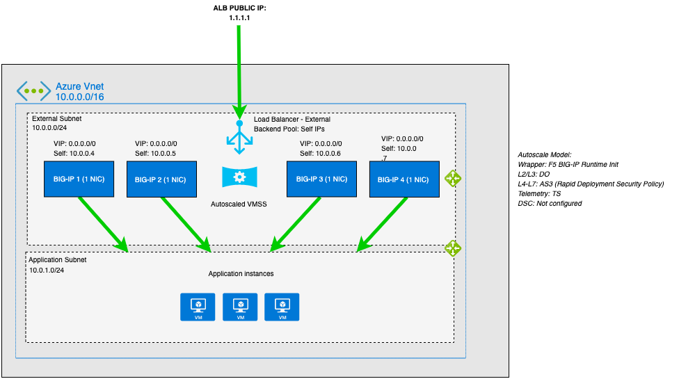

# Deploying BIG-IP VEs in Azure - Auto Scale (Active/Active): 3-NICs

## To Do
- Community support only. Template is not F5 supported.

## Issues
- Find an issue? Fork, clone, create branch, fix and PR. I'll review and merge into the main branch. Or submit a GitHub issue with all necessary details and logs.

## Contents

- [Introduction](#introduction)
- [Prerequisites](#prerequisites)
- [Important Configuration Notes](#important-configuration-notes)
- [BIG-IQ License Manager](#big-iq-license-manager)
- [Installation Example](#installation-example)
- [Configuration Example](#configuration-example)
- [Service Principal Authentication](#service-principal-authentication)
- [Troubleshooting](#troubleshooting)

## Introduction

This solution uses a Terraform template to launch a 3-NIC deployment of a cloud-focused BIG-IP VE cluster (Active/Active) in Microsoft Azure. It uses [Azure VM Scale Sets (VMSS)](https://docs.microsoft.com/en-us/azure/virtual-machine-scale-sets/overview) to allow auto scaling and auto healing of the BIG-IP VE devices. Traffic flows from an ALB to the BIG-IP VE which then processes the traffic to application servers. The BIG-IP VE instance is running with multiple interfaces: management, external, internal. NIC1 is associated with the external network.

The BIG-IP VEs have the [Local Traffic Manager (LTM)](https://f5.com/products/big-ip/local-traffic-manager-ltm) module enabled to provide advanced traffic management functionality. In addition, the [Application Security Module (ASM)](https://www.f5.com/pdf/products/big-ip-application-security-manager-overview.pdf) can be enabled to provide F5's L4/L7 security features for web application firewall (WAF) and bot protection.

The BIG-IP's configuration, now defined in a single convenient YAML or JSON [F5 BIG-IP Runtime Init](https://github.com/F5Networks/f5-bigip-runtime-init) configuration file, leverages [F5 Automation Tool Chain](https://www.f5.com/pdf/products/automation-toolchain-overview.pdf) declarations which are easier to author, validate and maintain as code. For instance, if you need to change the configuration on the BIG-IPs in the deployment, you update the instance model by passing a new config file (which references the updated Automation Toolchain declarations) via template's runtimeConfig input parameter. New instances will be deployed with the updated configurations.

This template deploys each BIG-IP in an Azure VMSS as a standalone device and NOT in a [BIG-IP Device Service Cluster (DSC)](https://www.youtube.com/watch?v=NEguvpkmteM). As a result, there is no traditional BIG-IP clustering in regards to config sync and/or network failover. Each device is standalone, each device retreives its onboarding from custom-data, and each device is treated as [immutable](https://www.f5.com/company/blog/you-cant-do-immutable-infrastructure-without-a-per-app-architecture). If changes are required to the network/application config of the BIG-IP device, then you do this in custom-data via changes to Terraform TF files. The Azure VMSS will perform a rolling upgrade (aka replacement) of each BIG-IP device.


## Prerequisites

- ***Important***: When you configure the admin password for the BIG-IP VE in the template, you cannot use the character **#**.  Additionally, there are a number of other special characters that you should avoid using for F5 product user accounts.  See [K2873](https://support.f5.com/csp/article/K2873) for details.
- This template requires one or more service accounts for the BIG-IP instance to perform various tasks:
  - Azure Key Vault secrets - requires user identity with access to key vault [Provide Access to Key Vaults](https://docs.microsoft.com/en-us/azure/key-vault/general/rbac-guide?tabs=azure-cli))
    - Performed by VM instance during onboarding to retrieve passwords and private keys
  - Backend pool service discovery - requires "Reader"
    - Performed by F5 Application Services AS3
  - Permissions will depend on the objects you are creating
  - ***Note***: Make sure to [practice least privilege](https://docs.microsoft.com/en-us/azure/security/fundamentals/identity-management-best-practices#lower-exposure-of-privileged-accounts)
- Passwords and secrets can be located in [Azure Key Vault](https://docs.microsoft.com/en-us/azure/key-vault/general/overview).
  - Set *az_keyvault_authentication* to 'true'
  - Set *keyvault_rg* to the Azure Resource Group containing the Key Vault
  - Set *keyvault_name* to the Azure Key Vault name
  - Set *keyvault_secret* to the Key Vault secret name. The secret contents should contain ONLY the password as plain text.
- This templates deploys into an *EXISTING* networking stack. You are required to have an existing VNet, subnets, and security groups.
  - You must have a VNET with three (3) subnets: management, external, internal
  - Firewall rules are required to pass traffic to the application
    - BIG-IP will require tcp/22 and tcp/443 on the mgmt network
    - Application access will require tcp/80 and tcp/443 on the external network
  - If you require a new network first, see the [Infrastructure Only folder](../Infrastructure-only) to get started.
- If this is the first time to deploy the F5 image, the subscription used in this deployment needs to be enabled to programatically deploy. For more information, please refer to [Configure Programatic Deployment](https://azure.microsoft.com/en-us/blog/working-with-marketplace-images-on-azure-resource-manager/)
- You must accept the the legal terms of the F5 BIG-IP image in the Azure marketplace (see [az vm image accept-terms](https://docs.microsoft.com/en-us/cli/azure/vm/image?view=azure-cli-latest#az-vm-image-accept-terms))
  - example = *az vm image terms accept --urn f5-networks:f5-big-ip-best:f5-big-best-plus-hourly-25mbps:16.1.303000*

## Important Configuration Notes

- Variables are configured in variables.tf
- Sensitive variables like Azure SSH keys are configured in terraform.tfvars or Azure Key Vault
  - ***Note***: Other items like BIG-IP password can be stored in Azure Key Vault. Refer to the [Prerequisites](#prerequisites).
  - The BIG-IP instance will then use the managed user-identity to query Azure Metadata API and dynamically retrieve the password for device onboarding
- This template uses BIG-IP Runtime Init for the initial configuration. As part of the onboarding script, it will download the F5 Toolchain RPMs automatically. See the [AS3 documentation](http://f5.com/AS3Docs) and [DO documentation](http://f5.com/DODocs) for details on how to use AS3 and Declarative Onboarding on your BIG-IP VE(s). The [Telemetry Streaming](http://f5.com/TSDocs) extension is also downloaded and can be configured to point to [F5 Beacon](https://f5.com/beacon-get-started), Azure Log Analytics, or many other consumers.
- Files
  - alb.tf - resources for Azure LB
  - bigip.tf - resources for BIG-IP, NICs, public IPs
  - main.tf - resources for provider, versions, resource group
  - network.tf - data for existing subnets and existing network security groups
  - f5_onboard.tmpl - onboarding script which is run by commandToExecute (user data). It will be copied to /var/lib/waagent/CustomData upon bootup. This script is responsible for downloading the neccessary F5 Automation Toolchain RPM files, installing them, and then executing the onboarding REST calls via the [BIG-IP Runtime Init tool](https://github.com/F5Networks/f5-bigip-runtime-init).

## BIG-IQ License Manager
This template uses PayGo BIG-IP image for the deployment (as default). If you would like to use BYOL/ELA/Subscription licenses from [BIG-IQ License Manager (LM)](https://community.f5.com/t5/technical-articles/managing-big-ip-licensing-with-big-iq/ta-p/279797), then these following steps are needed:
1. Find available images/versions with "byol" in SKU name using Azure CLI:
  ```
          az vm image list -f BIG-IP --all

          # example output...

          {
            "offer": "f5-big-ip-byol",
            "publisher": "f5-networks",
            "sku": "f5-big-ltm-2slot-byol",
            "urn": "f5-networks:f5-big-ip-byol:f5-big-ltm-2slot-byol:16.1.301000",
            "version": "16.1.301000"
          },
  ```
2. In the "variables.tf", modify *image_name* and *product* with the SKU and offer from AZ CLI results
  ```
          # BIGIP Image
          variable product { default = "f5-big-ip-byol" }
          variable image_name { default = "f5-big-ltm-2slot-byol" }
  ```
3. In the "variables.tf", modify the BIG-IQ license section to match your environment
4. In the "f5_onboard.tmpl", add the "myLicense" block under the "Common" declaration ([example here](https://github.com/F5Networks/f5-azure-arm-templates-v2/blob/main/examples/autoscale/bigip-configurations/runtime-init-conf-bigiq-with-app.yaml))
  ```
          myLicense:
            class: License
            licenseType: ${bigIqLicenseType}
            bigIqHost: ${bigIqHost}
            bigIqUsername: ${bigIqUsername}
            bigIqPassword: ${bigIqPassword}
            licensePool: ${bigIqLicensePool}
            skuKeyword1: ${bigIqSkuKeyword1}
            skuKeyword2: ${bigIqSkuKeyword2}
            unitOfMeasure: ${bigIqUnitOfMeasure}
            reachable: false
            hypervisor: ${bigIqHypervisor}
            overwrite: true
  ```

<!-- markdownlint-disable no-inline-html -->
<!-- BEGINNING OF PRE-COMMIT-TERRAFORM DOCS HOOK -->
## Requirements

| Name | Version |
|------|---------|
| <a name="requirement_terraform"></a> [terraform](#requirement\_terraform) | >= 1.2.0 |
| <a name="requirement_azurerm"></a> [azurerm](#requirement\_azurerm) | >= 3.48.0 |

## Providers

| Name | Version |
|------|---------|
| <a name="provider_azurerm"></a> [azurerm](#provider\_azurerm) | >= 3.48.0 |
| <a name="provider_random"></a> [random](#provider\_random) | n/a |

## Modules

No modules.

## Resources

| Name | Type |
|------|------|
| [azurerm_key_vault_access_policy.main](https://registry.terraform.io/providers/hashicorp/azurerm/latest/docs/resources/key_vault_access_policy) | resource |
| [azurerm_lb.lb](https://registry.terraform.io/providers/hashicorp/azurerm/latest/docs/resources/lb) | resource |
| [azurerm_lb_backend_address_pool.backend_pool](https://registry.terraform.io/providers/hashicorp/azurerm/latest/docs/resources/lb_backend_address_pool) | resource |
| [azurerm_lb_probe.lb_probe](https://registry.terraform.io/providers/hashicorp/azurerm/latest/docs/resources/lb_probe) | resource |
| [azurerm_lb_rule.lb_rule1](https://registry.terraform.io/providers/hashicorp/azurerm/latest/docs/resources/lb_rule) | resource |
| [azurerm_linux_virtual_machine_scale_set.f5vmss](https://registry.terraform.io/providers/hashicorp/azurerm/latest/docs/resources/linux_virtual_machine_scale_set) | resource |
| [azurerm_log_analytics_workspace.main](https://registry.terraform.io/providers/hashicorp/azurerm/latest/docs/resources/log_analytics_workspace) | resource |
| [azurerm_public_ip.lbpip](https://registry.terraform.io/providers/hashicorp/azurerm/latest/docs/resources/public_ip) | resource |
| [azurerm_resource_group.main](https://registry.terraform.io/providers/hashicorp/azurerm/latest/docs/resources/resource_group) | resource |
| [random_id.buildSuffix](https://registry.terraform.io/providers/hashicorp/random/latest/docs/resources/id) | resource |
| [azurerm_key_vault.main](https://registry.terraform.io/providers/hashicorp/azurerm/latest/docs/data-sources/key_vault) | data source |
| [azurerm_network_security_group.external](https://registry.terraform.io/providers/hashicorp/azurerm/latest/docs/data-sources/network_security_group) | data source |
| [azurerm_network_security_group.internal](https://registry.terraform.io/providers/hashicorp/azurerm/latest/docs/data-sources/network_security_group) | data source |
| [azurerm_network_security_group.mgmt](https://registry.terraform.io/providers/hashicorp/azurerm/latest/docs/data-sources/network_security_group) | data source |
| [azurerm_subnet.external](https://registry.terraform.io/providers/hashicorp/azurerm/latest/docs/data-sources/subnet) | data source |
| [azurerm_subnet.internal](https://registry.terraform.io/providers/hashicorp/azurerm/latest/docs/data-sources/subnet) | data source |
| [azurerm_subnet.mgmt](https://registry.terraform.io/providers/hashicorp/azurerm/latest/docs/data-sources/subnet) | data source |
| [azurerm_subscription.main](https://registry.terraform.io/providers/hashicorp/azurerm/latest/docs/data-sources/subscription) | data source |
| [azurerm_user_assigned_identity.main](https://registry.terraform.io/providers/hashicorp/azurerm/latest/docs/data-sources/user_assigned_identity) | data source |

## Inputs

| Name | Description | Type | Default | Required |
|------|-------------|------|---------|:--------:|
| <a name="input_ssh_key"></a> [ssh\_key](#input\_ssh\_key) | public key used for authentication in /path/file format (e.g. /.ssh/id\_rsa.pub) | `string` | n/a | yes |
| <a name="input_AS3_URL"></a> [AS3\_URL](#input\_AS3\_URL) | URL to download the BIG-IP Application Service Extension 3 (AS3) module | `string` | `"https://github.com/F5Networks/f5-appsvcs-extension/releases/download/v3.43.0/f5-appsvcs-3.43.0-2.noarch.rpm"` | no |
| <a name="input_DO_URL"></a> [DO\_URL](#input\_DO\_URL) | URL to download the BIG-IP Declarative Onboarding module | `string` | `"https://github.com/F5Networks/f5-declarative-onboarding/releases/download/v1.36.1/f5-declarative-onboarding-1.36.1-1.noarch.rpm"` | no |
| <a name="input_FAST_URL"></a> [FAST\_URL](#input\_FAST\_URL) | URL to download the BIG-IP FAST module | `string` | `"https://github.com/F5Networks/f5-appsvcs-templates/releases/download/v1.24.0/f5-appsvcs-templates-1.24.0-1.noarch.rpm"` | no |
| <a name="input_INIT_URL"></a> [INIT\_URL](#input\_INIT\_URL) | URL to download the BIG-IP runtime init | `string` | `"https://cdn.f5.com/product/cloudsolutions/f5-bigip-runtime-init/v1.6.0/dist/f5-bigip-runtime-init-1.6.0-1.gz.run"` | no |
| <a name="input_TS_URL"></a> [TS\_URL](#input\_TS\_URL) | URL to download the BIG-IP Telemetry Streaming module | `string` | `"https://github.com/F5Networks/f5-telemetry-streaming/releases/download/v1.32.0/f5-telemetry-1.32.0-2.noarch.rpm"` | no |
| <a name="input_az_keyvault_authentication"></a> [az\_keyvault\_authentication](#input\_az\_keyvault\_authentication) | Whether to use key vault to pass authentication | `bool` | `false` | no |
| <a name="input_bigIqHost"></a> [bigIqHost](#input\_bigIqHost) | This is the BIG-IQ License Manager host name or IP address | `string` | `""` | no |
| <a name="input_bigIqHypervisor"></a> [bigIqHypervisor](#input\_bigIqHypervisor) | BIG-IQ hypervisor | `string` | `"azure"` | no |
| <a name="input_bigIqLicensePool"></a> [bigIqLicensePool](#input\_bigIqLicensePool) | BIG-IQ license pool name | `string` | `""` | no |
| <a name="input_bigIqLicenseType"></a> [bigIqLicenseType](#input\_bigIqLicenseType) | BIG-IQ license type | `string` | `"licensePool"` | no |
| <a name="input_bigIqPassword"></a> [bigIqPassword](#input\_bigIqPassword) | Admin Password for BIG-IQ | `string` | `"Default12345!"` | no |
| <a name="input_bigIqSkuKeyword1"></a> [bigIqSkuKeyword1](#input\_bigIqSkuKeyword1) | BIG-IQ license SKU keyword 1 | `string` | `"key1"` | no |
| <a name="input_bigIqSkuKeyword2"></a> [bigIqSkuKeyword2](#input\_bigIqSkuKeyword2) | BIG-IQ license SKU keyword 2 | `string` | `"key2"` | no |
| <a name="input_bigIqUnitOfMeasure"></a> [bigIqUnitOfMeasure](#input\_bigIqUnitOfMeasure) | BIG-IQ license unit of measure | `string` | `"hourly"` | no |
| <a name="input_bigIqUsername"></a> [bigIqUsername](#input\_bigIqUsername) | Admin name for BIG-IQ | `string` | `"azureuser"` | no |
| <a name="input_bigip_version"></a> [bigip\_version](#input\_bigip\_version) | BIG-IP Version | `string` | `"16.1.303000"` | no |
| <a name="input_dns_server"></a> [dns\_server](#input\_dns\_server) | Leave the default DNS server the BIG-IP uses, or replace the default DNS server with the one you want to use | `string` | `"8.8.8.8"` | no |
| <a name="input_dns_suffix"></a> [dns\_suffix](#input\_dns\_suffix) | DNS suffix for your domain in the GCP project | `string` | `"example.com"` | no |
| <a name="input_extNsg"></a> [extNsg](#input\_extNsg) | Name of external network security group | `string` | `null` | no |
| <a name="input_extSubnet"></a> [extSubnet](#input\_extSubnet) | Name of external subnet | `string` | `null` | no |
| <a name="input_f5_password"></a> [f5\_password](#input\_f5\_password) | BIG-IP Password or Key Vault secret name (value should be Key Vault secret name when az\_key\_vault\_authentication = true, ex. my-bigip-secret) | `string` | `"Default12345!"` | no |
| <a name="input_f5_username"></a> [f5\_username](#input\_f5\_username) | User name for the BIG-IP | `string` | `"azureuser"` | no |
| <a name="input_image_name"></a> [image\_name](#input\_image\_name) | F5 SKU (image) to deploy. Note: The disk size of the VM will be determined based on the option you select.  **Important**: If intending to provision multiple modules, ensure the appropriate value is selected, such as ****AllTwoBootLocations or AllOneBootLocation****. | `string` | `"f5-big-best-plus-hourly-25mbps"` | no |
| <a name="input_instance_type"></a> [instance\_type](#input\_instance\_type) | Azure instance type to be used for the BIG-IP VE | `string` | `"Standard_DS4_v2"` | no |
| <a name="input_intNsg"></a> [intNsg](#input\_intNsg) | Name of internal network security group | `string` | `null` | no |
| <a name="input_intSubnet"></a> [intSubnet](#input\_intSubnet) | Name of internal subnet | `string` | `null` | no |
| <a name="input_keyvault_name"></a> [keyvault\_name](#input\_keyvault\_name) | Name of Key Vault | `string` | `null` | no |
| <a name="input_keyvault_rg"></a> [keyvault\_rg](#input\_keyvault\_rg) | The name of the resource group in which the Azure Key Vault exists | `string` | `""` | no |
| <a name="input_keyvault_secret"></a> [keyvault\_secret](#input\_keyvault\_secret) | Name of Key Vault secret with BIG-IP password | `string` | `null` | no |
| <a name="input_libs_dir"></a> [libs\_dir](#input\_libs\_dir) | Directory on the BIG-IP to download the A&O Toolchain into | `string` | `"/config/cloud/azure/node_modules"` | no |
| <a name="input_location"></a> [location](#input\_location) | Azure Location of the deployment | `string` | `"westus2"` | no |
| <a name="input_mgmtNsg"></a> [mgmtNsg](#input\_mgmtNsg) | Name of management network security group | `string` | `null` | no |
| <a name="input_mgmtSubnet"></a> [mgmtSubnet](#input\_mgmtSubnet) | Name of management subnet | `string` | `null` | no |
| <a name="input_ntp_server"></a> [ntp\_server](#input\_ntp\_server) | Leave the default NTP server the BIG-IP uses, or replace the default NTP server with the one you want to use | `string` | `"0.us.pool.ntp.org"` | no |
| <a name="input_product"></a> [product](#input\_product) | Azure BIG-IP VE Offer | `string` | `"f5-big-ip-best"` | no |
| <a name="input_projectPrefix"></a> [projectPrefix](#input\_projectPrefix) | This value is inserted at the beginning of each Azure object (alpha-numeric, no special character) | `string` | `"demo"` | no |
| <a name="input_resourceOwner"></a> [resourceOwner](#input\_resourceOwner) | This is a tag used for object creation. Example is last name. | `string` | `null` | no |
| <a name="input_timezone"></a> [timezone](#input\_timezone) | If you would like to change the time zone the BIG-IP uses, enter the time zone you want to use. This is based on the tz database found in /usr/share/zoneinfo (see the full list [here](https://github.com/F5Networks/f5-azure-arm-templates/blob/master/azure-timezone-list.md)). Example values: UTC, US/Pacific, US/Eastern, Europe/London or Asia/Singapore. | `string` | `"UTC"` | no |
| <a name="input_user_identity"></a> [user\_identity](#input\_user\_identity) | The ID of the managed user identity to assign to the BIG-IP instance | `string` | `null` | no |
| <a name="input_vm_name"></a> [vm\_name](#input\_vm\_name) | Prefix for BIG-IP autoscale instance name. If empty, default is 'bigip' string + prefix + random\_id | `string` | `""` | no |
| <a name="input_vnet_name"></a> [vnet\_name](#input\_vnet\_name) | Name of existing VNET | `string` | `null` | no |
| <a name="input_vnet_rg"></a> [vnet\_rg](#input\_vnet\_rg) | Resource group name for existing VNET | `string` | `null` | no |

## Outputs

| Name | Description |
|------|-------------|
| <a name="output_ALB_app1_pip"></a> [ALB\_app1\_pip](#output\_ALB\_app1\_pip) | Public VIP IP for application |
| <a name="output_HTTP_Link"></a> [HTTP\_Link](#output\_HTTP\_Link) | Public VIP URL for application |
<!-- END OF PRE-COMMIT-TERRAFORM DOCS HOOK -->
<!-- markdownlint-enable no-inline-html -->

## Installation Example

To run this Terraform template, perform the following steps:
  1. Clone the repo to your favorite location
  2. Modify terraform.tfvars with the required information
  ```
      # BIG-IP Environment
      f5_username = "azureuser"
      f5_password = "Default12345!"
      ssh_key     = "~/.ssh/id_rsa.pub"
      vnet_rg     = "myVnetRg"
      vnet_name   = "myVnet123"
      mgmtSubnet  = "mgmt"
      extSubnet   = "external"
      intSubnet   = "internal"
      mgmtNsg     = "mgmtNsg"
      extNsg      = "extNsg"
      intNsg      = "intNsg"

      # Azure Environment
      location      = "westus2"
      projectPrefix = "mylab123"
      resourceOwner = "myLastName"

      # Key Vault - Uncomment to use Key Vault integration
      #az_keyvault_authentication = true
      #keyvault_rg                = "myKv-rg-123"
      #keyvault_name              = "myKv-123"
      #user_identity              = "/subscriptions/xxxx/resourceGroups/myRg123/providers/Microsoft.ManagedIdentity/userAssignedIdentities/myManagedId123"

  ```
  3. Initialize the directory
  ```
      terraform init
  ```
  4. Test the plan and validate errors
  ```
      terraform plan
  ```
  5. Finally, apply and deploy
  ```
      terraform apply
  ```
  6. When done with everything, don't forget to clean up!
  ```
      terraform destroy
  ```

## Configuration Example

The following is an example configuration diagram for this solution deployment. In this scenario, all access to the BIG-IP VE cluster (Active/Active) is direct to each BIG-IP via the management interface. The IP addresses in this example may be different in your implementation.



## Documentation

For more information on F5 solutions for Azure, including manual configuration procedures for some deployment scenarios, see the Azure section of [F5 CloudDocs](https://clouddocs.f5.com/cloud/public/v1/azure_index.html). Also check out the [Azure BIG-IP Lightboard Lessons](https://community.f5.com/t5/technical-articles/lightboard-lessons-big-ip-deployments-in-azure-cloud/ta-p/284445) on DevCentral. This particular auto scale example is based on the [BIG-IP Auto Scale F5 ARM Cloud Template on GitHub](https://github.com/F5Networks/f5-azure-arm-templates-v2/tree/main/examples/autoscale/payg).

## Creating Virtual Servers on the BIG-IP VE

In order to pass traffic from your clients to the servers through the BIG-IP system, you must create a virtual server on the BIG-IP VE. In this template, the AS3 declaration creates 1 VIP listening on 0.0.0.0/0:80 as an example.

***Note:*** These next steps illustrate the manual way in the GUI to create a virtual server
1. Open the BIG-IP VE Configuration utility
2. Click **Local Traffic > Virtual Servers**
3. Click the **Create** button
4. Type a name in the **Name** field
4. Type an address (ex. 0.0.0.0/0) in the **Destination/Mask** field
5. Type a port (ex. 80) in the **Service Port**
6. Configure the rest of the virtual server as appropriate
7. Select a pool name from the **Default Pool** list
8. Click the **Finished** button
9. Repeat as necessary for other applications by using different ports (ex. 0.0.0.0/0:9443, 0.0.0.0/0:8444)

## Redeploy BIG-IP for Replacement or Upgrade
This example illustrates how to replace or upgrade the BIG-IP VE.
  1. Change the *bigip_version* variable to the desired release
  2. Revoke the problematic BIG-IP VE's license (if BYOL)
  3. Run command to apply plan and Azure VMSS will perform rolling upgrade
```
terraform apply
```

## Service Principal Authentication
This solution might require access to the Azure API to query pool member key:value. If F5 AS3 is used with pool member dynamic service discovery, then you will need an service principal (SP). The current demo repo as-is does NOT need an SP. The following provides information/links on the options for configuring a service principal within Azure.

As another reference...head over to F5 CloudDocs to see an example in one of the awesome lab guides. Pay attention to the [Setting Up a Service Principal Account](https://clouddocs.f5.com/training/community/big-iq-cloud-edition/html/class2/module5/lab1.html#setting-up-a-service-principal-account) section and then head back over here!

1. Login to az cli and set default subscription:

```bash
# Login
az login

# Show subscriptions
az account show

# Set default
az account set -s <subscriptionId>
```

2. Create service principal account. Copy the JSON output starting with "{" ending with "}".

***Note:*** Keep this safe. This credential enables read/write access to your Azure Subscription.
```
  $ az ad sp create-for-rbac -n "http://[unique-name]-demo-cc" --role contributor
  {
    "appId": "xxx-xxxx",
    "displayName": "[unique-name]-demo-cc",
    "name": "http://[unique-name]-demo-cc",
    "password": "[password]",
    "tenant": "yyy-yyy"
  }
```

3. Retrieve Azure subscription ID
```
  $ az account show  --query [name,id,isDefault]
  [
    "f5-AZR_xxxx", <-- name
    "xxx-xxx-xxx", <-- subscription id
    true           <-- is this the default subscription
  ]
```
## Troubleshooting

### Serial Logs
Review the serial logs for the Azure virtual machine. Login to the Azure portal, open "Virtual Machines", then locate your instance...click it. Hit Serial Console. Then review the serial logs for errors.

### Onboard Logs
Depending on where onboard fails, you can attempt SSH login and try to troubleshoot further. Inspect the /config/cloud directory for correct runtime init YAML files. Inspect the /var/log/cloud location for error logs.

### F5 Automation Toolchain Components
F5 BIG-IP Runtime Init uses the F5 Automation Toolchain for configuration of BIG-IP instances.  Any errors thrown from these components will be surfaced in the bigIpRuntimeInit.log (or a custom log location as specified below).

Help with troubleshooting individual Automation Toolchain components can be found at F5's [Public Cloud Docs](http://clouddocs.f5.com/cloud/public/v1/):
- DO: https://clouddocs.f5.com/products/extensions/f5-declarative-onboarding/latest/troubleshooting.html
- AS3: https://clouddocs.f5.com/products/extensions/f5-appsvcs-extension/latest/userguide/troubleshooting.html
- FAST: https://clouddocs.f5.com/products/extensions/f5-appsvcs-templates/latest/userguide/troubleshooting.html
- TS: https://clouddocs.f5.com/products/extensions/f5-telemetry-streaming/latest/userguide/troubleshooting.html
- CFE: https://clouddocs.f5.com/products/extensions/f5-cloud-failover/latest/userguide/troubleshooting.html
