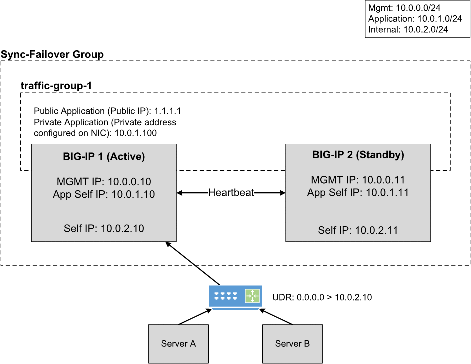

# Deploying BIG-IP VEs in Azure - High Availability (Active/Standby): Two NICs

## Contents

- [Introduction](#introduction)
- [Prerequisites](#prerequisites)
- [Important Configuration Notes](#important-configuration-notes)
- [BYOL Licensing](#byol-licensing)
- [Installation Example](#installation-example)
- [Configuration Example](#configuration-example)

## Introduction

This solution uses a Terraform template to launch a two NIC deployment of a cloud-focused BIG-IP VE cluster (Active/Standby) in Microsoft Azure. Traffic flows to the BIG-IP VE which then processes the traffic to application servers. This is the standard cloud design where the BIG-IP VE instance is running with a dual interface. Management traffic is processed on NIC 1, and data plane traffic is processed NIC 2.

The BIG-IP VEs have the [Local Traffic Manager (LTM)](https://f5.com/products/big-ip/local-traffic-manager-ltm) module enabled to provide advanced traffic management functionality. In addition, the [Application Security Module (ASM)](https://www.f5.com/pdf/products/big-ip-application-security-manager-overview.pdf) can be enabled to provide F5's L4/L7 security features for web application firewall (WAF) and bot protection.

Terraform is beneficial as it allows composing resources a bit differently to account for dependencies into Immutable/Mutable elements. For example, mutable includes items you would typically frequently change/mutate, such as traditional configs on the BIG-IP. Once the template is deployed, there are certain resources (network infrastructure) that are fixed while others (BIG-IP VMs and configurations) can be changed.

Example...

-> Run once
- Deploy the entire infrastructure with all the neccessary resources, then use Declarative Onboarding (DO) to configure the BIG-IP cluster, Application Services (AS3) to create a sample app proxy, then lastly use Service Discovery to automatically add the DVWA container app to the BIG-IP pool.

-> Run many X
- [Redeploy BIG-IP for Replacement or Upgrade](#Redeploy-BIG-IP-for-replacement-or-upgrade)
- [Reconfigure BIG-IP L1-L3 Configurations (DO)](#Rerun-Declarative-Onboarding-on-the-BIG-IP-VE)
- [Reconfigure BIG-IP L4-L7 Configurations (AS3)](#Rerun-Application-Services-AS3-on-the-BIG-IP-VE)
- [Reconfigure BIG-IP Telemetry Streaming (TS)](#Rerun-Telemetry-Streaming-on-the-BIG-IP-VE)
- [Reconfigure BIG-IP Cloud Failover Extension (CFE)](#Rerun-Cloud-Failover-Extension-on-the-BIG-IP-VE)

**Networking Stack Type:** This solution deploys into a new networking stack, which is created along with the solution.

## Version
This template is tested and worked in the following version
Terraform v0.14.10
+ provider.azurerm v2.72
+ provider.local v2.1
+ provider.null v3.1
+ provider.template v2.2

## Prerequisites

- ***Important***: When you configure the admin password for the BIG-IP VE in the template, you cannot use the character **#**.  Additionally, there are a number of other special characters that you should avoid using for F5 product user accounts.  See [K2873](https://support.f5.com/csp/article/K2873) for details.
- This template requires one or more service accounts for the BIG-IP instance to perform various tasks:
  - Azure Key Vault secrets - requires (TBD...not tested yet)
    - Performed by VM instance during onboarding to retrieve passwords and private keys
  - Backend pool service discovery - requires "Reader"
    - Performed by F5 Application Services AS3
- The HA BIG-IP VMs use Azure RBAC role for the failover instead of using Service Prinicipal.
- These BIG-IP VMs are deployed across different Availability Zones. Please ensure the region you've chosen can support AZ.
- This deployment will be using the Terraform Azurerm provider to build out all the neccessary Azure objects. Therefore, Azure CLI is required. For installation, please follow this [Microsoft link](https://docs.microsoft.com/en-us/cli/azure/install-azure-cli-apt?view=azure-cli-latest)
- If this is the first time to deploy the F5 image, the subscription used in this deployment needs to be enabled to programatically deploy. For more information, please refer to [Configure Programatic Deployment](https://azure.microsoft.com/en-us/blog/working-with-marketplace-images-on-azure-resource-manager/)
- This template requires a service account to deploy with the Terraform Azure provider and build out all the neccessary Azure objects
  - See the [Terraform Azure Provider "Authenticating Using a Service Principal"](https://www.terraform.io/docs/providers/azurerm/guides/service_principal_client_secret.html) for details. Also, review the [available Azure built-in roles](https://docs.microsoft.com/en-gb/azure/role-based-access-control/built-in-roles) too.
  - Permissions will depend on the objects you are creating
  - My service account for Terraform deployments in Azure uses the following roles:
    - Contributor
  - ***Note***: Make sure to [practice least privilege](https://docs.microsoft.com/en-us/azure/security/fundamentals/identity-management-best-practices#lower-exposure-of-privileged-accounts)
- This template deploys into an existing network
  - You must have a VNET with three (3) subnets: management, external, internal
  - Firewall rules are required to pass traffic to the application
    - BIG-IP will require tcp/22 and tcp/443 on the mgmt network
    - Application access will require tcp/80 and tcp/443 on the external network
  - If you require a new network first, see the [Infrastructure Only folder](../Infrastructure-only) to get started.


## Important Configuration Notes

- Variables are configured in variables.tf
- Sensitive variables like Azure Subscription and Service Principal are configured in terraform.tfvars
  - ***Note***: Passwords and secrets will be moved to Azure Key Vault in the future
  - (TBD) The BIG-IP instance will query Azure Metadata API to retrieve the service account's token for authentication
  - (TBD) The BIG-IP instance will then use the secret name and the service account's token to query Azure Metadata API and dynamically retrieve the password for device onboarding
- This template uses Declarative Onboarding (DO), Application Services 3 (AS3), and Cloud Failover Extension packages for the initial configuration. As part of the onboarding script, it will download the RPMs automatically. See the [AS3 documentation](http://f5.com/AS3Docs) and [DO documentation](http://f5.com/DODocs) for details on how to use AS3 and Declarative Onboarding on your BIG-IP VE(s). The [Telemetry Streaming](http://f5.com/TSDocs) extension is also downloaded and can be configured to point to Azure Log Analytics. The [Cloud Failover Extension](http://f5.com/CFEDocs) documentation is also available.
- Files
  - bigip.tf - resources for BIG-IP, NICs, public IPs
  - main.tf - resources for provider, versions, resource group
  - network.tf - data for existing subnets
  - onboard.tpl - onboarding script which is run by commandToExecute (user data). It will be copied to /var/lib/waagent/CustomData upon bootup. This script is responsible for downloading the neccessary F5 Automation Toolchain RPM files, installing them, and then executing the onboarding REST calls.
  - do.json - contains the L1-L3 BIG-IP configurations used by DO for items like VLANs, IPs, and routes
  - as3.json - contains the L4-L7 BIG-IP configurations used by AS3 for items like pool members, virtual server listeners, security policies, and more
  - ts.json - contains the BIG-IP configurations used by TS for items like telemetry streaming, CPU, memory, application statistics, and more
  - failover.json - contains the BIG-IP configurations used by CFE for failover of cloud objects (IPs, routes)

## BYOL Licensing
This template uses PayGo BIG-IP image for the deployment (as default). If you would like to use BYOL licenses, then these following steps are needed:
1. Find available images/versions with "byol" in SKU name using Azure CLI:
  ```
          az vm image list -f BIG-IP --all

          # example output...

          {
            "offer": "f5-big-ip-byol",
            "publisher": "f5-networks",
            "sku": "f5-big-ltm-2slot-byol",
            "urn": "f5-networks:f5-big-ip-byol:f5-big-ltm-2slot-byol:15.1.201000",
            "version": "15.1.201000"
          },
  ```
2. In the "variables.tf", modify *image_name* and *product* with the SKU and offer from AZ CLI results
  ```
          # BIGIP Image
          variable product { default = "f5-big-ip-byol" }
          variable image_name { default = "f5-big-ltm-2slot-byol" }
  ```
3. In the "variables.tf", modify *license1* and *license2* with valid regkeys
  ```
          # BIGIP Setup
          variable license1 { default = "" }
          variable license2 { default = "" }
  ```
4. In the "do.json", add the "myLicense" block under the "Common" declaration ([full declaration example here](https://clouddocs.f5.com/products/extensions/f5-declarative-onboarding/latest/bigip-examples.html#standalone-declaration))
  ```
        "myLicense": {
            "class": "License",
            "licenseType": "regKey",
            "regKey": "${regKey}"
        },
  ```

## BIG-IQ License Manager
This template uses PayGo BIG-IP image for the deployment (as default). If you would like to use BYOL/ELA/Subscription licenses from [BIG-IQ License Manager (LM)](https://devcentral.f5.com/s/articles/managing-big-ip-licensing-with-big-iq-31944), then these following steps are needed:
1. Find BYOL image. Reference [BYOL Licensing](#byol-licensing) step #1.
2. Replace BIG-IP *image_name* and *product* in "variables.tf". Reference [BYOL Licensing](#byol-licensing) step #2.
3. In the "variables.tf", modify the BIG-IQ license section to match your environment
4. In the "do.json", add the "myLicense" block under the "Common" declaration ([full declaration example here](https://clouddocs.f5.com/products/extensions/f5-declarative-onboarding/latest/bigiq-examples.html#licensing-with-big-iq-regkey-pool-route-to-big-ip))
  ```
        "myLicense": {
            "class": "License",
            "licenseType": "${bigIqLicenseType}",
            "bigIqHost": "${bigIqHost}",
            "bigIqUsername": "${bigIqUsername}",
            "bigIqPassword": "$${bigIqPassword}",
            "licensePool": "${bigIqLicensePool}",
            "skuKeyword1": "${bigIqSkuKeyword1}",
            "skuKeyword2": "${bigIqSkuKeyword2}",
            "unitOfMeasure": "${bigIqUnitOfMeasure}",
            "reachable": false,
            "hypervisor": "${bigIqHypervisor}",
            "overwrite": true
        },
  ```
  ***Note***: The [onboard.tpl](./onboard.tpl) startup script will use the same 'usecret' payload value (aka password) for BIG-IP password AND the BIG-IQ password. In the onboard.tpl file, this happens in the 'passwd' variable. You can use a separate password for BIG-IQ by creating a new Google Secret Manager secret for the BIG-IQ password, then add a new variable for the secret in [variables.tf](./variables.tf), modify [bigip.tf](./bigip.tf) to include the secret in the local templatefile section similar to 'usecret', then update [onboard.tpl](./onboard.tpl) to query Secret Manager for the BIG-IQ secret name. Reference code example *usecret='${usecret}'*.

## Template Parameters

| Parameter | Required | Description |
| --- | --- | --- |
| prefix | Yes | This value is inserted at the beginning of each Azure object (alpha-numeric, no special character) |
| rest_do_uri | Yes | URI of the Declarative Onboarding REST call |
| rest_as3_uri | Yes | URI of the AS3 REST call |
| rest_do_method | Yes | Available options are GET, POST, and DELETE |
| rest_AS3_method | Yes | Available options are GET, POST, and DELETE |
| rest_vm01_do_file | Yes | Terraform will generate the vm01 DO json file, where you can manually run it again for debugging |
| rest_vm02_do_file | Yes | Terraform will generate the vm02 DO json file, where you can manually run it again for debugging |
| rest_vm_as3_file | Yes | Terraform will generate the AS3 json file, where you can manually run it again for debugging |
| rest_cf_uri | Yes | URI of the Cloud Failover REST call |
| rest_vm_cf_file | Yes | Terraform will generate the Cloud Failover json file |
| sp_subscription_id | Yes | This is the service principal subscription ID |
| sp_client_id | Yes | This is the service principal application/client ID |
| sp_client_secret | Yes | This is the service principal secret |
| sp_tenant_id | Yes | This is the service principal tenant ID |
| uname | Yes | User name for the Virtual Machine |
| upassword | Yes | Password for the Virtual Machine |
| location | Yes | Location of the deployment |
| vnet_rg | Yes | Resource group name for existing VNET |
| vnet_name | Yes | Name of existing VNET |
| mgmtSubnet | Yes | Name of management subnet |
| extSubnet | Yes | Name of external subnet |
| intSubnet | Yes | Name of internal subnet |
| managed_route1 | Yes | A UDR route can used for testing managed-route failover. Enter address prefix like x.x.x.x/x. |
| f5vm01mgmt | Yes | IP address for 1st BIG-IP's management interface |
| f5vm02mgmt | Yes | IP address for 2nd BIG-IP's management interface |
| f5vm01ext | Yes | IP address for 1st BIG-IP's external interface |
| f5vm02ext | Yes | IP address for 2nd BIG-IP's external interface |
| f5privatevip | Yes | Secondary Private IP address for BIG-IP virtual server (internal) |
| f5publicvip | Yes | Secondary Private IP address for BIG-IP virtual server (external) |
| instance_type | Yes | Azure instance to be used for the BIG-IP VE |
| product | Yes | Azure BIG-IP VE Offer |
| bigip_version | Yes | BIG-IP Version |
| image_name | Yes | F5 SKU (image) to deploy. Note: The disk size of the VM will be determined based on the option you select.  **Important**: If intending to provision multiple modules, ensure the appropriate value is selected, such as ****AllTwoBootLocations or AllOneBootLocation****. |
| license1 | No | The license token for the F5 BIG-IP VE (BYOL) |
| license2 | No | The license token for the F5 BIG-IP VE (BYOL) |
| host1_name | Yes | Hostname for the 1st BIG-IP |
| host2_name | Yes | Hostname for the 2nd BIG-IP |
| ntp_server | Yes | Leave the default NTP server the BIG-IP uses, or replace the default NTP server with the one you want to use |
| timezone | Yes | If you would like to change the time zone the BIG-IP uses, enter the time zone you want to use. This is based on the tz database found in /usr/share/zoneinfo (see the full list [here](https://github.com/F5Networks/f5-azure-arm-templates/blob/master/azure-timezone-list.md)). Example values: UTC, US/Pacific, US/Eastern, Europe/London or Asia/Singapore. |
| dns_server | Yes | Leave the default DNS server the BIG-IP uses, or replace the default DNS server with the one you want to use | 
| DO_URL | Yes | This is the raw github URL for downloading the Declarative Onboarding RPM |
| AS3_URL | Yes | This is the raw github URL for downloading the AS3 RPM |
| TS_URL | Yes | This is the raw github URL for downloading the Telemetry RPM |
| CF_URL | Yes | This is the raw github URL for downloading the Cloud-Failover RPM |
| libs_dir | Yes | This is where all the temporary libs and RPM will be store in BIG-IP |
| onboard_log | Yes | This is where the onboarding script logs all the events |
| f5_cloud_failover_label | Yes | This is a tag used for failover. |
| f5_cloud_failover_nic_map | Yes | This is a tag used for failover NIC. |

## Installation Example

To run this Terraform template, perform the following steps:
  1. Clone the repo to your favorite location
  2. Modify terraform.tfvars with the required information
  ```
      # BIG-IP Environment
      uname      = "azureuser"
      upassword  = "Default12345!"
      vnet_rg    = "myVnetRg"
      vnet_name  = "myVnet123"
      mgmtSubnet = "mgmt"
      extSubnet  = "external"
      intSubnet  = "internal"

      # Azure Environment
      location           = "westus2"
      storage_name       = "mystorage"

      # Prefix for objects being created
      prefix = "mylab123"
  ```
  3. Initialize the directory
  ```
      terraform init
  ```
  4. Test the plan and validate errors
  ```
      terraform plan
  ```
  5. Finally, apply and deploy
  ```
      terraform apply
  ```
  6. When done with everything, don't forget to clean up!
  ```
      terraform destroy
  ```

## Configuration Example

The following is an example configuration diagram for this solution deployment. In this scenario, all access to the BIG-IP VE cluster (Active/Standby) is direct to each BIG-IP via the management interface. The IP addresses in this example may be different in your implementation.



## Documentation

For more information on F5 solutions for Azure, including manual configuration procedures for some deployment scenarios, see the Azure section of [F5 CloudDocs](https://clouddocs.f5.com/cloud/public/v1/azure_index.html). Also check out the [Azure BIG-IP Lightboard Lessons](https://devcentral.f5.com/s/articles/Lightboard-Lessons-BIG-IP-Deployments-in-Azure-Cloud) on DevCentral. This particular HA example is based on the [BIG-IP "HA Failover via LB" F5 ARM Cloud Template on GitHub](https://github.com/F5Networks/f5-azure-arm-templates/tree/master/supported/failover/same-net/via-lb/3nic/new-stack/payg).

## Creating Virtual Servers on the BIG-IP VE

In order to pass traffic from your clients to the servers through the BIG-IP system, you must create a virtual server on the BIG-IP VE. In this template, the AS3 declaration creates 2 VIPs: one for public internet facing, and one for private internal usage. It is preconfigured as an example.

***Note:*** These next steps illustrate the manual way in the GUI to create a virtual server
1. Open the BIG-IP VE Configuration utility
2. Click **Local Traffic > Virtual Servers**
3. Click the **Create** button
4. Type a name in the **Name** field
4. Type an address (ex. x.x.x.x/x) in the **Destination/Mask** field
5. Type a port (ex. 443) in the **Service Port**
6. Configure the rest of the virtual server as appropriate
7. Select a pool name from the **Default Pool** list
8. Click the **Finished** button
9. Repeat as necessary for other applications

## Redeploy BIG-IP for Replacement or Upgrade
This example illustrates how to replace or upgrade the BIG-IP VE.
  1. Change the *bigip_version* variable to the desired release 
  2. Revoke the problematic BIG-IP VE's license (if BYOL)
  3. Run command
```
terraform destroy -target azurerm_linux_virtual_machine.f5vm01
```
  3. Run command
```
terraform apply
```
  4. Repeat steps 1-3 on the other BIG-IP VE in order to establish Device Trust.


## Rerun Declarative Onboarding on the BIG-IP VE
This example illustrates how to re-configure the BIG-IP instances with DO. If you need to make changes to the L1-L3 settings of the BIG-IP device or run HA setup again, you can follow these steps.
  1. Update do.json as needed
  2. Taint resources and apply
```
terraform taint template_file.vm01_do_json
terraform taint template_file.vm02_do_json
terraform taint null_resource.f5vm01_DO
terraform taint null_resource.f5vm02_DO
terraform apply
```

## Rerun Application Services AS3 on the BIG-IP VE
This example illustrates how to run your own custom AS3 (aka application). You can have a catalog of AS3 apps/templates and repeat these steps as many times as desired.
  1. Update as3.json as needed
  2. Taint resources and apply
```
terraform taint template_file.as3_json
terraform taint null_resource.f5vm_AS3
terraform apply
```

## Rerun Telemetry Streaming on the BIG-IP VE
This example illustrates how to re-configure the BIG-IP instances with TS. If you need to make changes to the push consumers (ex. Azure Log Analytics, Splunk, etc) or other telemetry configs of the BIG-IP device, you can follow these steps.
  1. Update ts.json as needed
  2. Taint resources and apply
```
terraform taint template_file.vm_ts_file
terraform taint null_resource.f5vm01_TS
terraform taint null_resource.f5vm02_TS
terraform apply
```

## Rerun Cloud Failover Extension on the BIG-IP VE
This example illustrates how to re-configure the BIG-IP instances with Cloud Failover Extention. If you need to make changes to the BIG-IP declaration specifying failover objects (NICs, storage, routes, tags), you can follow these steps.
  1. Update failover.json as needed
  2. Taint resources and apply
```
terraform taint null_resource.f5vm01_CF
terraform taint null_resource.f5vm02_CF
terraform apply
```

## Service Principal Authentication
This solution might require access to the Azure API to query pool member key:value. If F5 AS3 is used with pool member dynamic service discovery, then you will need an SP. The current demo repo as-is does NOT need an SP. The following provides information/links on the options for configuring a service principal within Azure.

As another reference...head over to F5 CloudDocs to see an example in one of the awesome lab guides. Pay attention to the [Setting Up a Service Principal Account](https://clouddocs.f5.com/training/community/big-iq-cloud-edition/html/class2/module5/lab1.html#setting-up-a-service-principal-account) section and then head back over here!

1. Login to az cli and set default subscription:

```bash
# Login
az login

# Show subscriptions
az account show

# Set default
az account set -s <subscriptionId>
```

2. Create service principal account. Copy the JSON output starting with "{" ending with "}".

***Note:*** Keep this safe. This credential enables read/write access to your Azure Subscription.
```
  $ az ad sp create-for-rbac -n "http://[unique-name]-demo-cc" --role contributor
  {
    "appId": "xxx-xxxx",
    "displayName": "[unique-name]-demo-cc",
    "name": "http://[unique-name]-demo-cc",
    "password": "[password]",
    "tenant": "yyy-yyy"
  }
```

3. Retrieve Azure subscription ID
```
  $ az account show  --query [name,id,isDefault]
  [
    "f5-AZR_xxxx", <-- name
    "xxx-xxx-xxx", <-- subscription id
    true           <-- is this the default subscription 
  ]
```