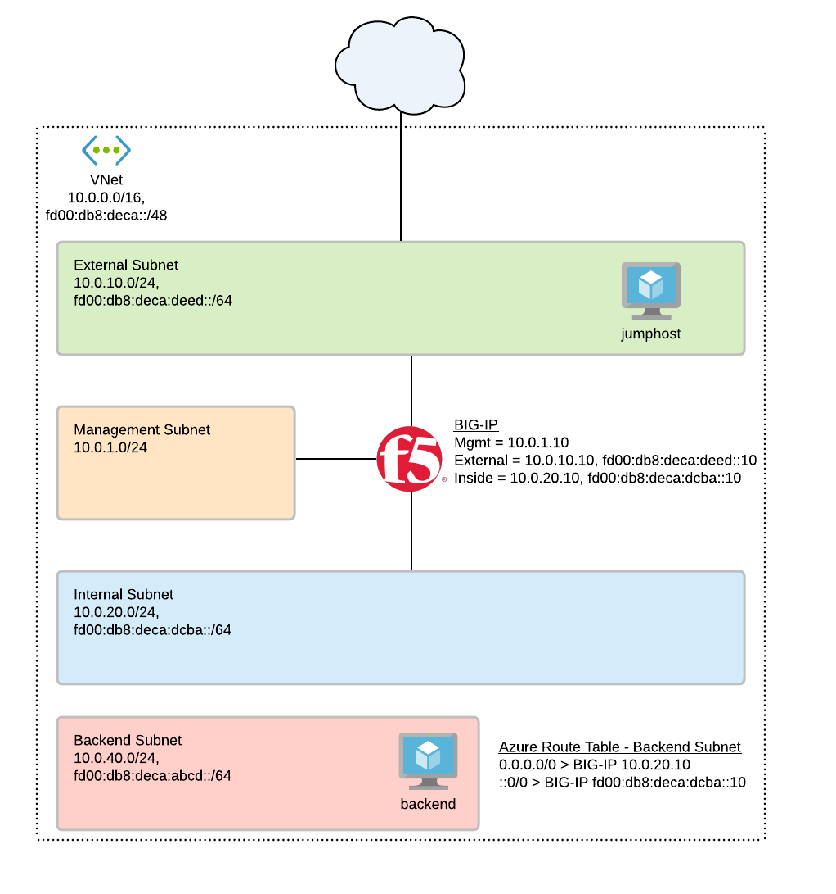

# Deploying BIG-IP VE in Azure with IPv6 - Standalone: 3-NIC

## To Do
1. update readme
2. update diagram
3. more details in scenario
4. need access to easily test from backend

## Contents

- [Introduction](#introduction)
- [Prerequisites](#prerequisites)
- [Important Configuration Notes](#important-configuration-notes)
- [BYOL Licensing](#byol-licensing)
- [BIG-IQ License Manager](#big-iq-license-manager)
- [Installation Example](#installation-example)
- [Configuration Example](#configuration-example)

## Introduction

This solution uses a Terraform template to launch a 3-NIC deployment of a cloud-focused BIG-IP VE standalone device in Microsoft Azure. Traffic flows to the BIG-IP VE which then processes the traffic to application servers. The BIG-IP VE instance is running with multiple interfaces: management, external, internal. NIC1 is associated with the external network.

**Scenario:** This also shows the use case of BIG-IP as the outbound default gateway for the 'backend' subnet.

The BIG-IP VEs have the [Local Traffic Manager (LTM)](https://f5.com/products/big-ip/local-traffic-manager-ltm) module enabled to provide advanced traffic management functionality. In addition, the [Application Security Module (ASM)](https://www.f5.com/pdf/products/big-ip-application-security-manager-overview.pdf) can be enabled to provide F5's L4/L7 security features for web application firewall (WAF) and bot protection.

Terraform is beneficial as it allows composing resources a bit differently to account for dependencies into Immutable/Mutable elements. For example, mutable includes items you would typically frequently change/mutate, such as traditional configs on the BIG-IP. Once the template is deployed, there are certain resources (network infrastructure) that are fixed while others (BIG-IP VMs and configurations) can be changed.

**Networking Stack Type:** This solution deploys into a new networking stack, which is created along with the solution.


## Prerequisites

- ***Important***: When you configure the admin password for the BIG-IP VE in the template, you cannot use the character **#**.  Additionally, there are a number of other special characters that you should avoid using for F5 product user accounts.  See [K2873](https://support.f5.com/csp/article/K2873) for details.
- This template requires one or more service accounts for the BIG-IP instance to perform various tasks:
  - Azure Key Vault secrets - requires (TBD...not tested yet)
    - Performed by VM instance during onboarding to retrieve passwords and private keys
  - Backend pool service discovery - requires "Reader"
    - Performed by F5 Application Services AS3
- If this is the first time to deploy the F5 image, the subscription used in this deployment needs to be enabled to programatically deploy. For more information, please refer to [Configure Programatic Deployment](https://azure.microsoft.com/en-us/blog/working-with-marketplace-images-on-azure-resource-manager/)
- This template requires a service account to deploy with the Terraform Azure provider and build out all the neccessary Azure objects
  - See the [Terraform Azure Provider "Authenticating Using a Service Principal"](https://www.terraform.io/docs/providers/azurerm/guides/service_principal_client_secret.html) for details. Also, review the [available Azure built-in roles](https://docs.microsoft.com/en-gb/azure/role-based-access-control/built-in-roles) too.
  - Permissions will depend on the objects you are creating
  - My service account for Terraform deployments in Azure uses the following roles:
    - Contributor
  - ***Note***: Make sure to [practice least privilege](https://docs.microsoft.com/en-us/azure/security/fundamentals/identity-management-best-practices#lower-exposure-of-privileged-accounts)


## Important Configuration Notes

- Variables are configured in variables.tf
- Sensitive variables like Azure Subscription and Service Principal are configured in terraform.tfvars
  - ***Note***: Passwords and secrets will be moved to Azure Key Vault in the future
  - (TBD) The BIG-IP instance will query Azure Metadata API to retrieve the service account's token for authentication
  - (TBD) The BIG-IP instance will then use the secret name and the service account's token to query Azure Metadata API and dynamically retrieve the password for device onboarding
- This template uses Declarative Onboarding (DO) and Application Services 3 (AS3) for the initial configuration. As part of the onboarding script, it will download the RPMs automatically. See the [AS3 documentation](http://f5.com/AS3Docs) and [DO documentation](http://f5.com/DODocs) for details on how to use AS3 and Declarative Onboarding on your BIG-IP VE(s). The [Telemetry Streaming](http://f5.com/TSDocs) extension is also downloaded and can be configured to point to Azure Log Analytics.
- Files
  - bigip.tf - resources for BIG-IP, NICs, public IPs
  - main.tf - resources for provider, versions, resource group, networks
  - f5_onboard.tpl - onboarding script which is run by commandToExecute (user data). It will be copied to /var/lib/waagent/CustomData upon bootup. This script is responsible for downloading the neccessary F5 Automation Toolchain RPM files, installing them, and then executing the onboarding REST calls via the [BIG-IP Runtime Init tool](https://github.com/F5Networks/f5-bigip-runtime-init).

## BYOL Licensing
This template uses PayGo BIG-IP image for the deployment (as default). If you would like to use BYOL licenses, then these following steps are needed:
1. Find available images/versions with "byol" in SKU name using Azure CLI:
  ```
          az vm image list -f BIG-IP --all

          # example output...

          {
            "offer": "f5-big-ip-byol",
            "publisher": "f5-networks",
            "sku": "f5-big-ltm-2slot-byol",
            "urn": "f5-networks:f5-big-ip-byol:f5-big-ltm-2slot-byol:15.1.201000",
            "version": "15.1.201000"
          },
  ```
2. In the "variables.tf", modify *image_name* and *product* with the SKU and offer from AZ CLI results
  ```
          # BIGIP Image
          variable product { default = "f5-big-ip-byol" }
          variable image_name { default = "f5-big-ltm-2slot-byol" }
  ```
3. In the "variables.tf", modify *license1* with a valid regkey
  ```
          # BIGIP Setup
          variable license1 { default = "" }
  ```
4. In the "do.json", add the "myLicense" block under the "Common" declaration ([full declaration example here](https://clouddocs.f5.com/products/extensions/f5-declarative-onboarding/latest/bigip-examples.html#standalone-declaration))
  ```
        "myLicense": {
            "class": "License",
            "licenseType": "regKey",
            "regKey": "${regKey}"
        },
  ```

## BIG-IQ License Manager
This template uses PayGo BIG-IP image for the deployment (as default). If you would like to use BYOL/ELA/Subscription licenses from [BIG-IQ License Manager (LM)](https://devcentral.f5.com/s/articles/managing-big-ip-licensing-with-big-iq-31944), then these following steps are needed:
1. Find BYOL image. Reference [BYOL Licensing](#byol-licensing) step #1.
2. Replace BIG-IP *image_name* and *product* in "variables.tf". Reference [BYOL Licensing](#byol-licensing) step #2.
3. In the "variables.tf", modify the BIG-IQ license section to match your environment
4. In the "do.json", add the "myLicense" block under the "Common" declaration ([full declaration example here](https://clouddocs.f5.com/products/extensions/f5-declarative-onboarding/latest/bigiq-examples.html#licensing-with-big-iq-regkey-pool-route-to-big-ip))
  ```
        "myLicense": {
            "class": "License",
            "licenseType": "${bigIqLicenseType}",
            "bigIqHost": "${bigIqHost}",
            "bigIqUsername": "${bigIqUsername}",
            "bigIqPassword": "$${bigIqPassword}",
            "licensePool": "${bigIqLicensePool}",
            "skuKeyword1": "${bigIqSkuKeyword1}",
            "skuKeyword2": "${bigIqSkuKeyword2}",
            "unitOfMeasure": "${bigIqUnitOfMeasure}",
            "reachable": false,
            "hypervisor": "${bigIqHypervisor}",
            "overwrite": true
        },
  ```

## Installation Example

To run this Terraform template, perform the following steps:
  1. Clone the repo to your favorite location
  2. Modify terraform.tfvars with the required information
  ```
      # BIG-IP Environment
      uname      = "azureuser"
      upassword  = "Default12345!"
      ssh_key    = "ssh-rsa REDACTED me@my.email"

      # Azure Environment
      location      = "westus2"
      projectPrefix = "mylab123"
      owner         = "your@email"
  ```
  3. Initialize the directory
  ```
      terraform init
  ```
  4. Test the plan and validate errors
  ```
      terraform plan
  ```
  5. Apply
  ```
      terraform apply
  ```
  6. When done with everything, don't forget to clean up!
  ```
      terraform destroy
  ```

## Testing
Access the BIG-IP or jumphost (TBD) via public IP address, then SSH to the backend machine. From bachend machine, perform the following quick tests...then check the BIG-IP stats.

```
# Testing IPv6 Outbound SMTP
# Will test port translation from 1701 to 25
# This should hit vs=forwarder_tcp_ipv6_1701-to-25
telnet 2a01:111:f400:7e56::10 1701

# Testing IPv4 Outbound SMTP
# Will test port translation from 1701 to 25
# This should hit vs=forwarder_tcp_ipv4_1701-to-25
telnet smtp.gmail.com 1701

# Testing IPv4 HTTP outbound
# This should hit vs=forwarder_ipv4
curl google.com

# Testing IPv6 HTTP outbound
# This should hit vs=forwarder_ipv6
curl ipv6.google.com
```

## Configuration Example

The following is an example configuration diagram for this solution deployment. In this scenario, all access to the BIG-IP VE device is direct to the BIG-IP via the management interface. The IP addresses in this example may be different in your implementation.



## Documentation

For more information on F5 solutions for Azure, including manual configuration procedures for some deployment scenarios, see the Azure section of [F5 CloudDocs](https://clouddocs.f5.com/cloud/public/v1/azure_index.html). Also check out the [Azure BIG-IP Lightboard Lessons](https://devcentral.f5.com/s/articles/Lightboard-Lessons-BIG-IP-Deployments-in-Azure-Cloud) on DevCentral. This particular standalone example is based on the [BIG-IP Standalone F5 ARM Cloud Template on GitHub](https://github.com/F5Networks/f5-azure-arm-templates/tree/master/supported/standalone/3nic/existing-stack/payg).

## Creating Virtual Servers on the BIG-IP VE

In order to pass traffic from your clients to the servers through the BIG-IP system, you must create a virtual server on the BIG-IP VE. In this template, the AS3 declaration creates 2 VIPs: one for public internet facing, and one for private internal usage. It is preconfigured as an example.

***Note:*** These next steps illustrate the manual way in the GUI to create a virtual server
1. Open the BIG-IP VE Configuration utility
2. Click **Local Traffic > Virtual Servers**
3. Click the **Create** button
4. Type a name in the **Name** field
4. Type an address (ex. x.x.x.x/x) in the **Destination/Mask** field
5. Type a port (ex. 443) in the **Service Port**
6. Configure the rest of the virtual server as appropriate
7. Select a pool name from the **Default Pool** list
8. Click the **Finished** button
9. Repeat as necessary for other applications


## Service Principal Authentication
This solution might require access to the Azure API to query pool member key:value. If F5 AS3 is used with pool member dynamic service discovery, then you will need an SP. The current demo repo as-is does NOT need an SP. The following provides information/links on the options for configuring a service principal within Azure.

As another reference...head over to F5 CloudDocs to see an example in one of the awesome lab guides. Pay attention to the [Setting Up a Service Principal Account](https://clouddocs.f5.com/training/community/big-iq-cloud-edition/html/class2/module5/lab1.html#setting-up-a-service-principal-account) section and then head back over here!

1. Login to az cli and set default subscription:

```bash
# Login
az login

# Show subscriptions
az account show

# Set default
az account set -s <subscriptionId>
```

2. Create service principal account. Copy the JSON output starting with "{" ending with "}".

***Note:*** Keep this safe. This credential enables read/write access to your Azure Subscription.
```
  $ az ad sp create-for-rbac -n "http://[unique-name]-demo-cc" --role contributor
  {
    "appId": "xxx-xxxx",
    "displayName": "[unique-name]-demo-cc",
    "name": "http://[unique-name]-demo-cc",
    "password": "[password]",
    "tenant": "yyy-yyy"
  }
```

3. Retrieve Azure subscription ID
```
  $ az account show  --query [name,id,isDefault]
  [
    "f5-AZR_xxxx", <-- name
    "xxx-xxx-xxx", <-- subscription id
    true           <-- is this the default subscription
  ]
```

<!-- markdownlint-disable no-inline-html -->
<!-- BEGINNING OF PRE-COMMIT-TERRAFORM DOCS HOOK -->
## Requirements

| Name | Version |
|------|---------|
| <a name="requirement_terraform"></a> [terraform](#requirement\_terraform) | >= 0.14.11 |
| <a name="requirement_azurerm"></a> [azurerm](#requirement\_azurerm) | >= 2.81 |

## Providers

| Name | Version |
|------|---------|
| <a name="provider_azurerm"></a> [azurerm](#provider\_azurerm) | 2.81.0 |
| <a name="provider_random"></a> [random](#provider\_random) | 3.1.0 |

## Modules

No modules.

## Resources

| Name | Type |
|------|------|
| [azurerm_linux_virtual_machine.backend](https://registry.terraform.io/providers/hashicorp/azurerm/latest/docs/resources/linux_virtual_machine) | resource |
| [azurerm_linux_virtual_machine.bigip](https://registry.terraform.io/providers/hashicorp/azurerm/latest/docs/resources/linux_virtual_machine) | resource |
| [azurerm_network_interface.backend](https://registry.terraform.io/providers/hashicorp/azurerm/latest/docs/resources/network_interface) | resource |
| [azurerm_network_interface.bigipExtNic](https://registry.terraform.io/providers/hashicorp/azurerm/latest/docs/resources/network_interface) | resource |
| [azurerm_network_interface.bigipIntNic](https://registry.terraform.io/providers/hashicorp/azurerm/latest/docs/resources/network_interface) | resource |
| [azurerm_network_interface.bigipMgmtNic](https://registry.terraform.io/providers/hashicorp/azurerm/latest/docs/resources/network_interface) | resource |
| [azurerm_network_security_group.backend](https://registry.terraform.io/providers/hashicorp/azurerm/latest/docs/resources/network_security_group) | resource |
| [azurerm_network_security_group.external](https://registry.terraform.io/providers/hashicorp/azurerm/latest/docs/resources/network_security_group) | resource |
| [azurerm_network_security_group.internal](https://registry.terraform.io/providers/hashicorp/azurerm/latest/docs/resources/network_security_group) | resource |
| [azurerm_network_security_group.mgmt](https://registry.terraform.io/providers/hashicorp/azurerm/latest/docs/resources/network_security_group) | resource |
| [azurerm_public_ip.bigipMgmtPip](https://registry.terraform.io/providers/hashicorp/azurerm/latest/docs/resources/public_ip) | resource |
| [azurerm_public_ip.bigipSelfPip](https://registry.terraform.io/providers/hashicorp/azurerm/latest/docs/resources/public_ip) | resource |
| [azurerm_public_ip.bigipSelfPipV6](https://registry.terraform.io/providers/hashicorp/azurerm/latest/docs/resources/public_ip) | resource |
| [azurerm_public_ip.bigipVipPip](https://registry.terraform.io/providers/hashicorp/azurerm/latest/docs/resources/public_ip) | resource |
| [azurerm_resource_group.main](https://registry.terraform.io/providers/hashicorp/azurerm/latest/docs/resources/resource_group) | resource |
| [azurerm_route_table.backend](https://registry.terraform.io/providers/hashicorp/azurerm/latest/docs/resources/route_table) | resource |
| [azurerm_subnet.backend](https://registry.terraform.io/providers/hashicorp/azurerm/latest/docs/resources/subnet) | resource |
| [azurerm_subnet.external](https://registry.terraform.io/providers/hashicorp/azurerm/latest/docs/resources/subnet) | resource |
| [azurerm_subnet.internal](https://registry.terraform.io/providers/hashicorp/azurerm/latest/docs/resources/subnet) | resource |
| [azurerm_subnet.mgmt](https://registry.terraform.io/providers/hashicorp/azurerm/latest/docs/resources/subnet) | resource |
| [azurerm_subnet_network_security_group_association.backend](https://registry.terraform.io/providers/hashicorp/azurerm/latest/docs/resources/subnet_network_security_group_association) | resource |
| [azurerm_subnet_network_security_group_association.external](https://registry.terraform.io/providers/hashicorp/azurerm/latest/docs/resources/subnet_network_security_group_association) | resource |
| [azurerm_subnet_network_security_group_association.internal](https://registry.terraform.io/providers/hashicorp/azurerm/latest/docs/resources/subnet_network_security_group_association) | resource |
| [azurerm_subnet_network_security_group_association.mgmt](https://registry.terraform.io/providers/hashicorp/azurerm/latest/docs/resources/subnet_network_security_group_association) | resource |
| [azurerm_subnet_route_table_association.backend](https://registry.terraform.io/providers/hashicorp/azurerm/latest/docs/resources/subnet_route_table_association) | resource |
| [azurerm_virtual_machine_extension.bigip-startup](https://registry.terraform.io/providers/hashicorp/azurerm/latest/docs/resources/virtual_machine_extension) | resource |
| [azurerm_virtual_network.main](https://registry.terraform.io/providers/hashicorp/azurerm/latest/docs/resources/virtual_network) | resource |
| [random_id.buildSuffix](https://registry.terraform.io/providers/hashicorp/random/latest/docs/resources/id) | resource |

## Inputs

| Name | Description | Type | Default | Required |
|------|-------------|------|---------|:--------:|
| <a name="input_ssh_key"></a> [ssh\_key](#input\_ssh\_key) | public key used for authentication in ssh-rsa format | `string` | n/a | yes |
| <a name="input_AS3_URL"></a> [AS3\_URL](#input\_AS3\_URL) | URL to download the BIG-IP Application Service Extension 3 (AS3) module | `string` | `"https://github.com/F5Networks/f5-appsvcs-extension/releases/download/v3.31.0/f5-appsvcs-3.31.0-6.noarch.rpm"` | no |
| <a name="input_DO_URL"></a> [DO\_URL](#input\_DO\_URL) | URL to download the BIG-IP Declarative Onboarding module | `string` | `"https://github.com/F5Networks/f5-declarative-onboarding/releases/download/v1.24.0/f5-declarative-onboarding-1.24.0-6.noarch.rpm"` | no |
| <a name="input_FAST_URL"></a> [FAST\_URL](#input\_FAST\_URL) | URL to download the BIG-IP FAST module | `string` | `"https://github.com/F5Networks/f5-appsvcs-templates/releases/download/v1.12.0/f5-appsvcs-templates-1.12.0-1.noarch.rpm"` | no |
| <a name="input_INIT_URL"></a> [INIT\_URL](#input\_INIT\_URL) | URL to download the BIG-IP runtime init | `string` | `"https://cdn.f5.com/product/cloudsolutions/f5-bigip-runtime-init/v1.3.2/dist/f5-bigip-runtime-init-1.3.2-1.gz.run"` | no |
| <a name="input_TS_URL"></a> [TS\_URL](#input\_TS\_URL) | URL to download the BIG-IP Telemetry Streaming module | `string` | `"https://github.com/F5Networks/f5-telemetry-streaming/releases/download/v1.23.0/f5-telemetry-1.23.0-4.noarch.rpm"` | no |
| <a name="input_backendInstanceType"></a> [backendInstanceType](#input\_backendInstanceType) | Azure instance type to be used for the backend machine | `string` | `"Standard_B2ms"` | no |
| <a name="input_backendPrivateIp4"></a> [backendPrivateIp4](#input\_backendPrivateIp4) | The private IPv4 address for the backend machine | `string` | `"10.0.40.50"` | no |
| <a name="input_backendPrivateIp6"></a> [backendPrivateIp6](#input\_backendPrivateIp6) | The private IPv6 address for the backend machine | `string` | `"fd00:db8:deca:abcd::50"` | no |
| <a name="input_backendSubnetPrefix"></a> [backendSubnetPrefix](#input\_backendSubnetPrefix) | The address prefix to use for the backend subnet | `list(any)` | <pre>[<br>  "10.0.40.0/24",<br>  "fd00:db8:deca:abcd::/64"<br>]</pre> | no |
| <a name="input_bigIqHost"></a> [bigIqHost](#input\_bigIqHost) | This is the BIG-IQ License Manager host name or IP address | `string` | `""` | no |
| <a name="input_bigIqHypervisor"></a> [bigIqHypervisor](#input\_bigIqHypervisor) | BIG-IQ hypervisor | `string` | `"azure"` | no |
| <a name="input_bigIqLicensePool"></a> [bigIqLicensePool](#input\_bigIqLicensePool) | BIG-IQ license pool name | `string` | `""` | no |
| <a name="input_bigIqLicenseType"></a> [bigIqLicenseType](#input\_bigIqLicenseType) | BIG-IQ license type | `string` | `"licensePool"` | no |
| <a name="input_bigIqPassword"></a> [bigIqPassword](#input\_bigIqPassword) | Admin Password for BIG-IQ | `string` | `"Default12345!"` | no |
| <a name="input_bigIqSkuKeyword1"></a> [bigIqSkuKeyword1](#input\_bigIqSkuKeyword1) | BIG-IQ license SKU keyword 1 | `string` | `"key1"` | no |
| <a name="input_bigIqSkuKeyword2"></a> [bigIqSkuKeyword2](#input\_bigIqSkuKeyword2) | BIG-IQ license SKU keyword 2 | `string` | `"key2"` | no |
| <a name="input_bigIqUnitOfMeasure"></a> [bigIqUnitOfMeasure](#input\_bigIqUnitOfMeasure) | BIG-IQ license unit of measure | `string` | `"hourly"` | no |
| <a name="input_bigIqUsername"></a> [bigIqUsername](#input\_bigIqUsername) | Admin name for BIG-IQ | `string` | `"azureuser"` | no |
| <a name="input_bigipExtPrivateIp4"></a> [bigipExtPrivateIp4](#input\_bigipExtPrivateIp4) | The private self IPv4 address for the BIG-IP external NIC | `string` | `"10.0.10.10"` | no |
| <a name="input_bigipExtPrivateIp6"></a> [bigipExtPrivateIp6](#input\_bigipExtPrivateIp6) | The private self IPv6 address for the BIG-IP external NIC | `string` | `"fd00:db8:deca:deed::10"` | no |
| <a name="input_bigipExtSecondaryIp4"></a> [bigipExtSecondaryIp4](#input\_bigipExtSecondaryIp4) | The private (secondary) IPv4 address for the BIG-IP external NIC used for the VIP (aka application) | `string` | `"10.0.10.11"` | no |
| <a name="input_bigipIntPrivateIp4"></a> [bigipIntPrivateIp4](#input\_bigipIntPrivateIp4) | The private self IPv4 address for the BIG-IP internal NIC | `string` | `"10.0.20.10"` | no |
| <a name="input_bigipIntPrivateIp6"></a> [bigipIntPrivateIp6](#input\_bigipIntPrivateIp6) | The private self IPv6 address for the BIG-IP internal NIC | `string` | `"fd00:db8:deca:dcba::10"` | no |
| <a name="input_bigipIntSecondaryIp4"></a> [bigipIntSecondaryIp4](#input\_bigipIntSecondaryIp4) | The private (secondary) IPv4 address for the BIG-IP internal NIC | `string` | `"10.0.20.11"` | no |
| <a name="input_bigipMgmtPrivateIp4"></a> [bigipMgmtPrivateIp4](#input\_bigipMgmtPrivateIp4) | The private IPv4 address for the BIG-IP management NIC | `string` | `"10.0.1.10"` | no |
| <a name="input_bigip_version"></a> [bigip\_version](#input\_bigip\_version) | BIG-IP Version | `string` | `"15.1.201000"` | no |
| <a name="input_cidr"></a> [cidr](#input\_cidr) | Azure CIDR address space that is used by the virtual network | `list(any)` | <pre>[<br>  "10.0.0.0/16",<br>  "fd00:db8:deca::/48"<br>]</pre> | no |
| <a name="input_dns_server"></a> [dns\_server](#input\_dns\_server) | Leave the default DNS server the BIG-IP uses, or replace the default DNS server with the one you want to use | `string` | `"8.8.8.8"` | no |
| <a name="input_externalSubnetPrefix"></a> [externalSubnetPrefix](#input\_externalSubnetPrefix) | The address prefix to use for the external subnet | `list(any)` | <pre>[<br>  "10.0.10.0/24",<br>  "fd00:db8:deca:deed::/64"<br>]</pre> | no |
| <a name="input_image_name"></a> [image\_name](#input\_image\_name) | F5 SKU (image) to deploy. Note: The disk size of the VM will be determined based on the option you select.  **Important**: If intending to provision multiple modules, ensure the appropriate value is selected, such as ****AllTwoBootLocations or AllOneBootLocation****. | `string` | `"f5-bigip-virtual-edition-1g-best-hourly"` | no |
| <a name="input_instance_type"></a> [instance\_type](#input\_instance\_type) | Azure instance type to be used for the BIG-IP VE | `string` | `"Standard_DS4_v2"` | no |
| <a name="input_internalSubnetPrefix"></a> [internalSubnetPrefix](#input\_internalSubnetPrefix) | The address prefix to use for the internal subnet | `list(any)` | <pre>[<br>  "10.0.20.0/24",<br>  "fd00:db8:deca:dcba::/64"<br>]</pre> | no |
| <a name="input_libs_dir"></a> [libs\_dir](#input\_libs\_dir) | Directory on the BIG-IP to download the A&O Toolchain into | `string` | `"/config/cloud/azure/node_modules"` | no |
| <a name="input_license1"></a> [license1](#input\_license1) | The license token for the 1st F5 BIG-IP VE (BYOL) | `string` | `""` | no |
| <a name="input_linkLocalRouterAddress"></a> [linkLocalRouterAddress](#input\_linkLocalRouterAddress) | The link local address RA for IPv6 default gateway in Azure. The link local default gateway for IPv6 routing to work in Azure. Note: The RA from the Azure routers are not installed into the BIG-IP route table. See https://support.f5.com/csp/article/K12529 for reference. | `string` | `"fe80::1234:5678:9abc"` | no |
| <a name="input_location"></a> [location](#input\_location) | Azure Location of the deployment | `string` | `"westus2"` | no |
| <a name="input_mgmtSubnetPrefix"></a> [mgmtSubnetPrefix](#input\_mgmtSubnetPrefix) | The address prefix to use for the managment subnet | `list(any)` | <pre>[<br>  "10.0.1.0/24"<br>]</pre> | no |
| <a name="input_ntp_server"></a> [ntp\_server](#input\_ntp\_server) | Leave the default NTP server the BIG-IP uses, or replace the default NTP server with the one you want to use | `string` | `"0.us.pool.ntp.org"` | no |
| <a name="input_onboard_log"></a> [onboard\_log](#input\_onboard\_log) | Directory on the BIG-IP to store the cloud-init logs | `string` | `"/var/log/startup-script.log"` | no |
| <a name="input_owner"></a> [owner](#input\_owner) | This is a tag used for object creation. Example is last name. | `string` | `null` | no |
| <a name="input_product"></a> [product](#input\_product) | Azure BIG-IP VE Offer | `string` | `"f5-big-ip-best"` | no |
| <a name="input_projectPrefix"></a> [projectPrefix](#input\_projectPrefix) | This value is inserted at the beginning of each Azure object (alpha-numeric, no special character) | `string` | `"demo"` | no |
| <a name="input_sp_client_id"></a> [sp\_client\_id](#input\_sp\_client\_id) | This is the service principal application/client ID | `string` | `""` | no |
| <a name="input_sp_client_secret"></a> [sp\_client\_secret](#input\_sp\_client\_secret) | This is the service principal secret | `string` | `""` | no |
| <a name="input_sp_subscription_id"></a> [sp\_subscription\_id](#input\_sp\_subscription\_id) | This is the service principal subscription ID | `string` | `""` | no |
| <a name="input_sp_tenant_id"></a> [sp\_tenant\_id](#input\_sp\_tenant\_id) | This is the service principal tenant ID | `string` | `""` | no |
| <a name="input_subnetNames"></a> [subnetNames](#input\_subnetNames) | The name to use for the subnet | `list(any)` | <pre>[<br>  "mgmt",<br>  "external",<br>  "internal",<br>  "backend"<br>]</pre> | no |
| <a name="input_timezone"></a> [timezone](#input\_timezone) | If you would like to change the time zone the BIG-IP uses, enter the time zone you want to use. This is based on the tz database found in /usr/share/zoneinfo (see the full list [here](https://github.com/F5Networks/f5-azure-arm-templates/blob/master/azure-timezone-list.md)). Example values: UTC, US/Pacific, US/Eastern, Europe/London or Asia/Singapore. | `string` | `"UTC"` | no |
| <a name="input_uname"></a> [uname](#input\_uname) | User name for the Virtual Machine | `string` | `"azureuser"` | no |
| <a name="input_upassword"></a> [upassword](#input\_upassword) | Password for the Virtual Machine | `string` | `"Default12345!"` | no |

## Outputs

| Name | Description |
|------|-------------|
| <a name="output_backend_private_ip"></a> [backend\_private\_ip](#output\_backend\_private\_ip) | Private IP address (v4 and v6) for backend |
| <a name="output_bigip_VIP_public_ip"></a> [bigip\_VIP\_public\_ip](#output\_bigip\_VIP\_public\_ip) | Public VIP IPv4 for application |
| <a name="output_bigip_ext_private_ip"></a> [bigip\_ext\_private\_ip](#output\_bigip\_ext\_private\_ip) | External NIC private IPv4 address (v4 and v6) for BIG-IP 1 |
| <a name="output_bigip_ext_public_ip"></a> [bigip\_ext\_public\_ip](#output\_bigip\_ext\_public\_ip) | External NIC public IPv4 address for BIG-IP 1 |
| <a name="output_bigip_ext_public_ipv6"></a> [bigip\_ext\_public\_ipv6](#output\_bigip\_ext\_public\_ipv6) | External NIC public IPv6 address for BIG-IP 1 |
| <a name="output_bigip_int_private_ip"></a> [bigip\_int\_private\_ip](#output\_bigip\_int\_private\_ip) | Internal NIC private IP address (v4 and v6) for BIG-IP 1 |
| <a name="output_bigip_mgmt_private_ip"></a> [bigip\_mgmt\_private\_ip](#output\_bigip\_mgmt\_private\_ip) | Management NIC private IP address for BIG-IP 1 |
| <a name="output_bigip_mgmt_public_ip"></a> [bigip\_mgmt\_public\_ip](#output\_bigip\_mgmt\_public\_ip) | Management NIC public IP address for BIG-IP 1 |
| <a name="output_resource_group"></a> [resource\_group](#output\_resource\_group) | Resource group name |
<!-- END OF PRE-COMMIT-TERRAFORM DOCS HOOK -->
<!-- markdownlint-enable no-inline-html -->
