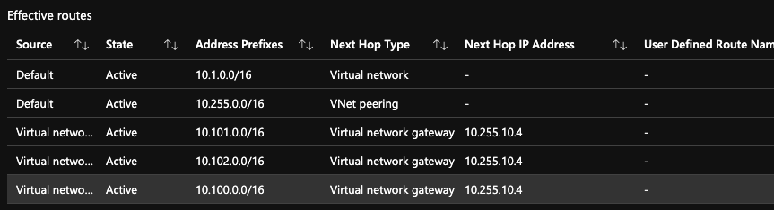
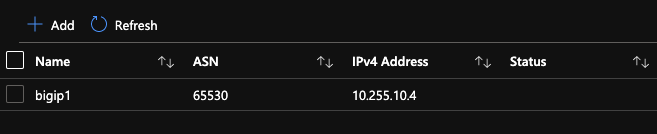

# Description
Azure Route Server and BIG-IP using BGP and eCMP for traffic distribution

## To Do
- Community support only. Not F5 supported.
- Document Azure Vault usage
- Telemtry Streaming not used (see example folder)
- Tested only during Azure Route Server Preview (need to test with GA release)
- Finish BIG-IP setup with test app
- Remove test network virtuals (10.100, 10.101, 10.102)...testing only
- More README, more how-to steps


## Issues
- Find an issue? Fork, clone, create branch, fix and PR. I'll review and merge into the main branch. Or submit a GitHub issue with all necessary details and logs.

## Diagram


## Requirements

- Azure CLI
- Terraform
- Azure Subscription
- Azure User with 'Owner' role

## Login to Azure Environment

```bash
# Login
az login

# Show subscriptions
az account show

# Set default
az account set -s <subscriptionId>
```

## Usage example

- Clone the repo and open the solution's directory
```bash
git clone https://github.com/JeffGiroux/f5_terraform.git
cd f5_terraform/Azure/Route_Server/
```

- Create the tfvars file and update it with your settings

```bash
cp admin.auto.tfvars.example admin.auto.tfvars
# MODIFY TO YOUR SETTINGS
vi admin.auto.tfvars
```

- Run the setup script to deploy all of the components into your Azure account (remember that you are responsible for the cost of those components)

```bash
./setup.sh
```

## Test your setup

- View the created objects in Azure Portal. Choose a VM instance or NIC from a spoke VNet and view "Effective Routes". You will see BIG-IP advertised routes via BGP across the VNet peering. This deployment will launch a single BIG-IP instance, but if you modified 'instanceCountBigIp' then you will see identical network prefixes advertised from multiple BIG-IP devices (aka BGP peers) like the screenshot below. The 10.255.10.4 is BIG-IP #1 and 10.255.10.6 is BIG-IP #2.



- View BPG peering on the Azure Route Server object in the portal - https://aka.ms/routeserver



- Validate BGP peering on BIG-IP using tmsh
```bash
(tmos)# show net routing bgp
------------------------------------------
Net::BGP Instance (route-domain: 0)
------------------------------------------
  Name                               myBGP
  Local AS                           65530

  ----------------------------------------------------------------------------
  | Net::BGP Neighbor - 10.255.255.5 via 10.255.10.4
  ----------------------------------------------------------------------------
  | Remote AS                   0
  | State                       established   0:06:24
  | Notification                Cease/Administratively Shutdown.
  | Address Family              IPv4 Unicast  IPv6 Unicast
  |  Prefix
  |   Accepted                  3
  |   Announced                 6
  |  Table Version
  |   Local                     6
  |   Neighbor                  6
  | Message/Notification/Queue  Sent          Received
  |  Message                    27            26
  |  Notification               0             2
  |  Queued                     0             0
  | Route Refresh               0             0
```

- View running config on BIG-IP using imish
```bash
(tmos)# imish
f5vm01.example.com[0]#show running-config
!
service password-encryption
!
bgp extended-asn-cap
!
router bgp 65530
 bgp graceful-restart restart-time 120
 aggregate-address 10.100.0.0/16 summary-only
 aggregate-address 10.101.0.0/16 summary-only
 aggregate-address 10.102.0.0/16 summary-only
 redistribute kernel
 neighbor Neighbor peer-group
 neighbor Neighbor remote-as 65515
 neighbor Neighbor ebgp-multihop 2
 no neighbor Neighbor capability route-refresh
 neighbor Neighbor soft-reconfiguration inbound
 neighbor Neighbor prefix-list /Common/myPrefixList1 out
 neighbor 10.255.255.4 peer-group Neighbor
 neighbor 10.255.255.5 peer-group Neighbor
 !
 address-family ipv6
 neighbor Neighbor activate
 no neighbor 10.255.255.4 activate
 no neighbor 10.255.255.4 capability graceful-restart
 no neighbor 10.255.255.5 activate
 no neighbor 10.255.255.5 capability graceful-restart
 exit-address-family
!
ip route 0.0.0.0/0 10.255.10.1
!
ip prefix-list /Common/myPrefixList1 seq 10 permit 10.0.0.0/8 ge 16
!
line con 0
 login
line vty 0 39
 login
!
end
```

- Validate BGP on BIG-IP using imish
```bash
f5vm01.example.com[0]>show ip bgp summary
BGP router identifier 10.255.20.4, local AS number 65530
BGP table version is 6
2 BGP AS-PATH entries
0 BGP community entries

Neighbor        V    AS MsgRcvd MsgSent   TblVer  InQ OutQ Up/Down  State/PfxRcd
10.255.255.4    4 65515      20      17        6    0    0 00:02:38        3
10.255.255.5    4 65515      19      20        6    0    0 00:02:38        3

Total number of neighbors 2

##
f5vm01.example.com[0]>show ip bgp
BGP table version is 6, local router ID is 10.255.20.4
Status codes: s suppressed, d damped, h history, * valid, > best, i - internal, l - labeled
              S Stale
Origin codes: i - IGP, e - EGP, ? - incomplete

   Network          Next Hop            Metric     LocPrf     Weight Path
*  10.1.0.0/16      10.255.255.5             0                     0 65515 i
*>                  10.255.255.4             0                     0 65515 i
*  10.2.0.0/16      10.255.255.5             0                     0 65515 i
*>                  10.255.255.4             0                     0 65515 i
*> 10.100.0.0/16    0.0.0.0                                    32768 ?
*> 10.101.0.0/16    0.0.0.0                                    32768 ?
*> 10.102.0.0/16    0.0.0.0                                    32768 ?
*  10.255.0.0/16    10.255.255.5             0                     0 65515 i
*>                  10.255.255.4             0                     0 65515 i

Total number of prefixes 6
```

## Troubleshooting
If you don't see routes in the spoke VNets, then try deleting the VNet peering and re-run Terraform to have it create the peer again. If you happen to run into this issue, open an issue directly with Azure support to provide feedback.

You can view BIG-IP onboard logs in /var/log/cloud. Review logs for failure message.

You can view BIG-IP onboard config files in /config/cloud. Review the declarative onboarding JSON file as well as the runtime init YAML file for accuracy. Did the variables render correctly?

If BIG-IP imish commands do not provide results to "show ip bgp" or "show run" but you do see "tmsh list net routing", then something happen in the preview tmsh BGP/routing feature. You should simply delete and recreate the device.
```bash
# taint BIG-IP resource
terraform taint module.bigip[0].azurerm_virtual_machine.f5vm01
terraform taint module.bigip[0].azurerm_virtual_machine_extension.vmext
# re-run terraform
./setup.sh
```

You can manually re-run BIG-IP Runtime init and force declarations to re-run. SSH to the BIG-IP, enter 'bash' mode and run this command.
```bash
f5-bigip-runtime-init --config-file /config/cloud/runtime-init-conf.yaml
```

## Cleanup
Use the following command to destroy all of the resources

```bash
./destroy.sh
```

<!-- markdownlint-disable no-inline-html -->
<!-- BEGINNING OF PRE-COMMIT-TERRAFORM DOCS HOOK -->
## Requirements

| Name | Version |
|------|---------|
| <a name="requirement_terraform"></a> [terraform](#requirement\_terraform) | ~> 0.14 |
| <a name="requirement_azurerm"></a> [azurerm](#requirement\_azurerm) | ~> 2 |

## Providers

| Name | Version |
|------|---------|
| <a name="provider_azurerm"></a> [azurerm](#provider\_azurerm) | 2.77.0 |
| <a name="provider_local"></a> [local](#provider\_local) | 2.1.0 |
| <a name="provider_null"></a> [null](#provider\_null) | 3.1.0 |
| <a name="provider_random"></a> [random](#provider\_random) | 3.1.0 |

## Modules

| Name | Source | Version |
|------|--------|---------|
| <a name="module_app"></a> [app](#module\_app) | Azure/compute/azurerm | n/a |
| <a name="module_bigip"></a> [bigip](#module\_bigip) | github.com/JeffGiroux/terraform-azure-bigip-module | n/a |
| <a name="module_client"></a> [client](#module\_client) | Azure/compute/azurerm | n/a |
| <a name="module_network"></a> [network](#module\_network) | Azure/vnet/azurerm | n/a |
| <a name="module_nsg-external"></a> [nsg-external](#module\_nsg-external) | Azure/network-security-group/azurerm | n/a |
| <a name="module_nsg-internal"></a> [nsg-internal](#module\_nsg-internal) | Azure/network-security-group/azurerm | n/a |
| <a name="module_nsg-mgmt"></a> [nsg-mgmt](#module\_nsg-mgmt) | Azure/network-security-group/azurerm | n/a |

## Resources

| Name | Type |
|------|------|
| [azurerm_resource_group.rg](https://registry.terraform.io/providers/hashicorp/azurerm/latest/docs/resources/resource_group) | resource |
| [azurerm_route_table.rt](https://registry.terraform.io/providers/hashicorp/azurerm/latest/docs/resources/route_table) | resource |
| [azurerm_virtual_hub.routeServer](https://registry.terraform.io/providers/hashicorp/azurerm/latest/docs/resources/virtual_hub) | resource |
| [azurerm_virtual_hub_bgp_connection.bigip](https://registry.terraform.io/providers/hashicorp/azurerm/latest/docs/resources/virtual_hub_bgp_connection) | resource |
| [azurerm_virtual_hub_ip.routeServerIp](https://registry.terraform.io/providers/hashicorp/azurerm/latest/docs/resources/virtual_hub_ip) | resource |
| [azurerm_virtual_network_peering.hubToSpoke](https://registry.terraform.io/providers/hashicorp/azurerm/latest/docs/resources/virtual_network_peering) | resource |
| [azurerm_virtual_network_peering.spokeToHub](https://registry.terraform.io/providers/hashicorp/azurerm/latest/docs/resources/virtual_network_peering) | resource |
| [null_resource.clusterDO](https://registry.terraform.io/providers/hashicorp/null/latest/docs/resources/resource) | resource |
| [random_id.buildSuffix](https://registry.terraform.io/providers/hashicorp/random/latest/docs/resources/id) | resource |
| [azurerm_subnet.externalSubnetHub](https://registry.terraform.io/providers/hashicorp/azurerm/latest/docs/data-sources/subnet) | data source |
| [azurerm_subnet.internalSubnetHub](https://registry.terraform.io/providers/hashicorp/azurerm/latest/docs/data-sources/subnet) | data source |
| [azurerm_subnet.mgmtSubnetHub](https://registry.terraform.io/providers/hashicorp/azurerm/latest/docs/data-sources/subnet) | data source |
| [azurerm_subnet.routeServerSubnetHub](https://registry.terraform.io/providers/hashicorp/azurerm/latest/docs/data-sources/subnet) | data source |
| [local_file.appOnboard](https://registry.terraform.io/providers/hashicorp/local/latest/docs/data-sources/file) | data source |

## Inputs

| Name | Description | Type | Default | Required |
|------|-------------|------|---------|:--------:|
| <a name="input_azureLocation"></a> [azureLocation](#input\_azureLocation) | location where Azure resources are deployed (abbreviated Azure Region name) | `string` | n/a | yes |
| <a name="input_keyName"></a> [keyName](#input\_keyName) | instance key pair name | `string` | n/a | yes |
| <a name="input_resourceOwner"></a> [resourceOwner](#input\_resourceOwner) | name of the person or customer running the solution | `string` | n/a | yes |
| <a name="input_adminSrcAddr"></a> [adminSrcAddr](#input\_adminSrcAddr) | Allowed Admin source IP prefix | `string` | `"0.0.0.0/0"` | no |
| <a name="input_availabilityZones"></a> [availabilityZones](#input\_availabilityZones) | If you want the VM placed in an Azure Availability Zone, and the Azure region you are deploying to supports it, specify the numbers of the existing Availability Zone you want to use. | `list(any)` | <pre>[<br>  1<br>]</pre> | no |
| <a name="input_f5UserName"></a> [f5UserName](#input\_f5UserName) | The admin username of the F5 BIG-IP that will be deployed | `string` | `"azureuser"` | no |
| <a name="input_f5Version"></a> [f5Version](#input\_f5Version) | The BIG-IP version | `string` | `"15.1.201000"` | no |
| <a name="input_instanceCountBigIp"></a> [instanceCountBigIp](#input\_instanceCountBigIp) | Number of BIG-IP instances to deploy | `number` | `1` | no |
| <a name="input_projectPrefix"></a> [projectPrefix](#input\_projectPrefix) | prefix for resources | `string` | `"demo"` | no |

## Outputs

| Name | Description |
|------|-------------|
| <a name="output_appPrivateIP"></a> [appPrivateIP](#output\_appPrivateIP) | The private ip address allocated for the webapp in Spoke 2 |
| <a name="output_appPublicIP"></a> [appPublicIP](#output\_appPublicIP) | The public ip address allocated for the app in Spoke 2 |
| <a name="output_bigipPassword"></a> [bigipPassword](#output\_bigipPassword) | The password for the BIG-IP (if dynamic\_password is choosen it will be random generated password or if azure\_keyvault is choosen it will be key vault secret name ) |
| <a name="output_bigipPublicIP"></a> [bigipPublicIP](#output\_bigipPublicIP) | The public ip address allocated for the BIG-IP |
| <a name="output_bigipUserName"></a> [bigipUserName](#output\_bigipUserName) | The user name for the BIG-IP |
| <a name="output_clientPrivateIP"></a> [clientPrivateIP](#output\_clientPrivateIP) | The private ip address allocated for the client/jumphost in Spoke 1 |
| <a name="output_clientPublicIP"></a> [clientPublicIP](#output\_clientPublicIP) | The public ip address allocated for the client/jumphost in Spoke 1 |
| <a name="output_vnetIdHub"></a> [vnetIdHub](#output\_vnetIdHub) | Hub VNet ID |
| <a name="output_vnetIdSpoke1"></a> [vnetIdSpoke1](#output\_vnetIdSpoke1) | Spoke1 VNet ID |
| <a name="output_vnetIdSpoke2"></a> [vnetIdSpoke2](#output\_vnetIdSpoke2) | Spoke2 VNet ID |
<!-- END OF PRE-COMMIT-TERRAFORM DOCS HOOK -->
<!-- markdownlint-enable no-inline-html -->


## How to Contribute

Submit a pull request

# Authors
Jeff Giroux
