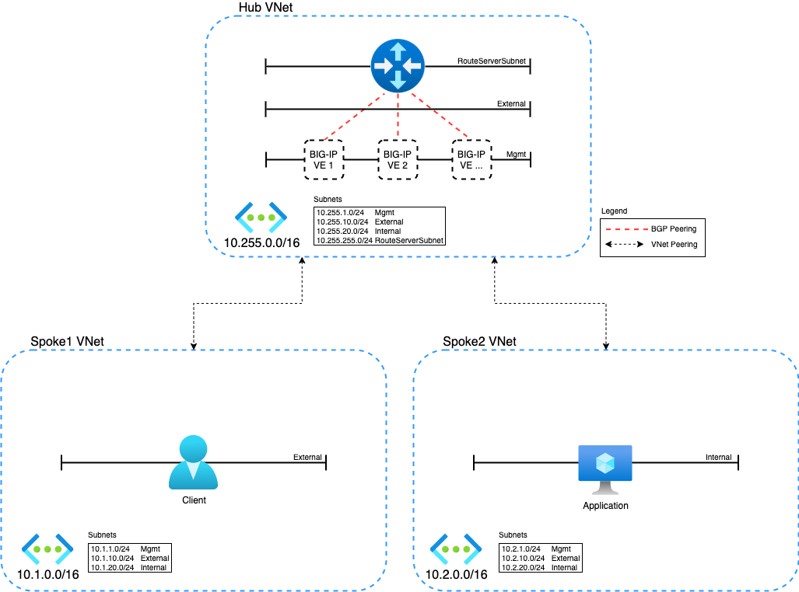

# Description
Azure Route Server and BIG-IP using BGP and eCMP for traffic distribution

## Diagram



## Requirements

- Azure CLI
- Terraform
- Azure Subscription
- Azure User with 'Owner' role

## Login to Azure Environment

```bash
# Login
az login

# Show subscriptions
az account show

# Set default
az account set -s <subscriptionId>
```

## Usage example

- Clone the repo and open the solution's directory
```bash
git clone https://github.com/JeffGiroux/f5_terraform.git
cd f5_terraform/Azure/Route_Server/
```

- Create the tfvars file and update it with your settings

```bash
cp admin.auto.tfvars.example admin.auto.tfvars
# MODIFY TO YOUR SETTINGS
vi admin.auto.tfvars
```

- Run the setup script to deploy all of the components into your Azure account (remember that you are responsible for the cost of those components)

```bash
./setup.sh
```

## TEST your setup:

View the created objects in Azure Portal.

View BPG peering on the Azure Route Server object in the portal - https://aka.ms/routeserver

Validate BGP peering on BIG-IP using tmsh or imish.
```bash
# TMSH
tmsh list net routing

# TMSH Output
net routing bgp 65530 {
    address-family {
        ipv4 {
            aggregate-address {
                10.3.0.0/16 {
                    summary-only enabled
                }
and so on...

# IMISH
imish
show ip bgp summary 

# IMISH Output
BGP router identifier 10.255.20.4, local AS number 65530
BGP table version is 2
1 BGP AS-PATH entries
0 BGP community entries

Neighbor        V    AS MsgRcvd MsgSent   TblVer  InQ OutQ Up/Down  State/PfxRcd
10.255.255.4    4 65515      16      13        2    0    0 00:05:51        1
10.255.255.5    4 65515      16      14        2    0    0 00:05:39        1

Total number of neighbors 2
```

## Cleanup
Use the following command to destroy all of the resources

```bash
./destroy.sh
```

## How to Contribute

Submit a pull request

# Authors
Jeff Giroux
