# F5 Secure Enclave for Azure Public DMZ

## Contents

- [Introduction](#introduction)
- [Prerequisites](#prerequisites)
- [Important Configuration Notes](#important-configuration-notes)
- [BYOL Licensing](#byol-licensing)
- [BIG-IQ License Manager](#big-iq-license-manager)
- [Installation Example](#installation-example)
- [Configuration Example](#configuration-example)
- [Running BIG-IPs in Active/Active](#running-big-ips-in-activeactive)
- [Azure Sentinel and Log Analytics Integration](#azure-sentinel-and-log-analytics-integration)

## Introduction

This solution uses a Terraform template to launch a two NIC deployment of a cloud-focused BIG-IP VE cluster (Active/Standby) in Microsoft Azure. Traffic flows from an ALB to the BIG-IP VE which then processes the traffic to application servers. This is the standard cloud design where the BIG-IP VE instance is running with a dual interface. Management traffic is processed on NIC 1, and data plane traffic is processed NIC 2.

The BIG-IP VEs have the [Local Traffic Manager (LTM)](https://f5.com/products/big-ip/local-traffic-manager-ltm) module enabled to provide advanced traffic management functionality. In addition, the [Application Security Module (ASM)](https://www.f5.com/pdf/products/big-ip-application-security-manager-overview.pdf) is enabled to provide F5's L4/L7 security features for web application firewall (WAF) and bot protection.

Terraform is beneficial as it allows composing resources a bit differently to account for dependencies into Immutable/Mutable elements. For example, mutable includes items you would typically frequently change/mutate, such as traditional configs on the BIG-IP. Once the template is deployed, there are certain resources (network infrastructure) that are fixed while others (BIG-IP VMs and configurations) can be changed.

Example...

-> Run once
- Deploy the entire infrastructure with all the neccessary resources, then use Declarative Onboarding (DO) to configure the BIG-IP cluster, Application Services (AS3) to create a sample app proxy, then lastly use Service Discovery to automatically add the DVWA container app to the BIG-IP pool.

-> Run many X
- [Redeploy BIG-IP for Replacement or Upgrade](#Redeploy-BIG-IP-for-replacement-or-upgrade)
- [Reconfigure BIG-IP L1-L3 Configurations (DO)](#Rerun-Declarative-Onboarding-on-the-BIG-IP-VE)
- [Reconfigure BIG-IP L4-L7 Configurations (AS3)](#Rerun-Application-Services-AS3-on-the-BIG-IP-VE)
- [Reconfigure BIG-IP Telemetry Streaming (TS)](#Rerun-Telemetry-Streaming-on-the-BIG-IP-VE)

**Networking Stack Type:** This solution deploys into a new networking stack, which is created along with the solution.


## Prerequisites

- ***Important***: When you configure the admin password for the BIG-IP VE in the template, you cannot use the character **#**.  Additionally, there are a number of other special characters that you should avoid using for F5 product user accounts.  See [K2873](https://support.f5.com/csp/article/K2873) for details.
- This template requires one or more service accounts for the BIG-IP instance to perform various tasks:
  - Azure Key Vault secrets - requires (TBD...not tested yet)
    - Performed by VM instance during onboarding to retrieve passwords and private keys
  - Backend pool service discovery - requires "Reader"
    - Performed by F5 Application Services AS3
- If this is the first time to deploy the F5 image, the subscription used in this deployment needs to be enabled to programatically deploy. For more information, please refer to [Configure Programatic Deployment](https://azure.microsoft.com/en-us/blog/working-with-marketplace-images-on-azure-resource-manager/)

***Note:*** This template is currently using a static pool member IP instead of service discovery. Refer to [AS3 issue #215 on GitHub](https://github.com/F5Networks/f5-appsvcs-extension/issues/215) for more info. If you still want to use service discovery to auto populate pool members, then reference the *as3-svcdiscovery.json* file as example, rename it to *as3.json*, deploy, then restart the restnoded service. Restarting the restnoded service is a workaround.

## Important Configuration Notes

- Variables are configured in variables.tf
- Sensitive variables like Azure Subscription and Service Principal are configured in terraform.tfvars
  - ***Note***: Passwords and secrets will be moved to Azure Key Vault in the future
  - (TBD) The BIG-IP instance will query Azure Metadata API to retrieve the service account's token for authentication
  - (TBD) The BIG-IP instance will then use the secret name and the service account's token to query Azure Metadata API and dynamically retrieve the password for device onboarding
- This template uses Declarative Onboarding (DO) and Application Services 3 (AS3) for the initial configuration. As part of the onboarding script, it will download the RPMs automatically. See the [AS3 documentation](http://f5.com/AS3Docs) and [DO documentation](http://f5.com/DODocs) for details on how to use AS3 and Declarative Onboarding on your BIG-IP VE(s). The [Telemetry Streaming](http://f5.com/TSDocs) extension is also downloaded and can be configured to point to [F5 Beacon](https://f5.com/beacon-get-started), Azure Log Analytics, or many other consumers.
- Files
  - alb.tf - resources for Azure LB
  - appserver.tf - resources for backend web server running DVWA
  - bigip.tf - resources for BIG-IP, NICs, public IPs, network security group
  - main.tf - resources for provider, versions, resource group
  - network.tf - resources for VNET and subnets
  - onboard.tpl - onboarding script which is run by commandToExecute (user data). It will be copied to /var/lib/waagent/CustomData upon bootup. This script is responsible for downloading the neccessary F5 Automation Toolchain RPM files, installing them, and then executing the onboarding REST calls.
  - do.json - contains the L1-L3 BIG-IP configurations used by DO for items like VLANs, IPs, and routes
  - as3.json - contains the L4-L7 BIG-IP configurations used by AS3 for items like pool members, virtual server listeners, security policies, and more
  - ts.json - contains the BIG-IP configurations used by TS for items like telemetry streaming, CPU, memory, application statistics, and more

## BYOL Licensing
This template uses PayGo BIG-IP image for the deployment (as default). If you would like to use BYOL licenses, then these following steps are needed:
1. Find available images/versions with "byol" in SKU name using Azure CLI:
  ```
          az vm image list -f BIG-IP --all

          # example output...

          {
            "offer": "f5-big-ip-byol",
            "publisher": "f5-networks",
            "sku": "f5-big-ltm-2slot-byol",
            "urn": "f5-networks:f5-big-ip-byol:f5-big-ltm-2slot-byol:15.1.201000",
            "version": "15.1.201000"
          },
  ```
2. In the "variables.tf", modify *image_name* and *product* with the SKU and offer from AZ CLI results
  ```
          # BIGIP Image
          variable product { default = "f5-big-ip-byol" }
          variable image_name { default = "f5-big-ltm-2slot-byol" }
  ```
3. In the "variables.tf", modify *license1* and *license2* with valid regkeys
  ```
          # BIGIP Setup
          variable license1 { default = "" }
          variable license2 { default = "" }
  ```
4. In the "do.json", add the "myLicense" block under the "Common" declaration ([full declaration example here](https://clouddocs.f5.com/products/extensions/f5-declarative-onboarding/latest/bigip-examples.html#standalone-declaration))
  ```
        "myLicense": {
            "class": "License",
            "licenseType": "regKey",
            "regKey": "${regKey}"
        },
  ```

## BIG-IQ License Manager
This template uses PayGo BIG-IP image for the deployment (as default). If you would like to use BYOL/ELA/Subscription licenses from [BIG-IQ License Manager (LM)](https://devcentral.f5.com/s/articles/managing-big-ip-licensing-with-big-iq-31944), then these following steps are needed:
1. Find BYOL image. Reference [BYOL Licensing](#byol-licensing) step #1.
2. Replace BIG-IP *image_name* and *product* in "variables.tf". Reference [BYOL Licensing](#byol-licensing) step #2.
3. In the "variables.tf", modify the BIG-IQ license section to match your environment
4. In the "do.json", add the "myLicense" block under the "Common" declaration ([full declaration example here](https://clouddocs.f5.com/products/extensions/f5-declarative-onboarding/latest/bigiq-examples.html#licensing-with-big-iq-regkey-pool-route-to-big-ip))
  ```
        "myLicense": {
            "class": "License",
            "licenseType": "${bigIqLicenseType}",
            "bigIqHost": "${bigIqHost}",
            "bigIqUsername": "${bigIqUsername}",
            "bigIqPassword": "$${bigIqPassword}",
            "licensePool": "${bigIqLicensePool}",
            "skuKeyword1": "${bigIqSkuKeyword1}",
            "skuKeyword2": "${bigIqSkuKeyword2}",
            "unitOfMeasure": "${bigIqUnitOfMeasure}",
            "reachable": false,
            "hypervisor": "${bigIqHypervisor}",
            "overwrite": true
        },
  ```
  ***Note***: The [onboard.tpl](./onboard.tpl) startup script will use the same 'usecret' payload value (aka password) for BIG-IP password AND the BIG-IQ password. In the onboard.tpl file, this happens in the 'passwd' variable. You can use a separate password for BIG-IQ by creating a new Google Secret Manager secret for the BIG-IQ password, then add a new variable for the secret in [variables.tf](./variables.tf), modify [bigip.tf](./bigip.tf) to include the secret in the local templatefile section similar to 'usecret', then update [onboard.tpl](./onboard.tpl) to query Secret Manager for the BIG-IQ secret name. Reference code example *usecret='${usecret}'*.

<!-- markdownlint-disable no-inline-html -->
<!-- BEGINNING OF PRE-COMMIT-TERRAFORM DOCS HOOK -->
## Requirements

| Name | Version |
|------|---------|
| <a name="requirement_terraform"></a> [terraform](#requirement\_terraform) | ~> 0.14 |
| <a name="requirement_azurerm"></a> [azurerm](#requirement\_azurerm) | ~> 2 |

## Providers

| Name | Version |
|------|---------|
| <a name="provider_azurerm"></a> [azurerm](#provider\_azurerm) | ~> 2 |
| <a name="provider_local"></a> [local](#provider\_local) | n/a |
| <a name="provider_null"></a> [null](#provider\_null) | n/a |
| <a name="provider_template"></a> [template](#provider\_template) | n/a |

## Modules

No modules.

## Resources

| Name | Type |
|------|------|
| [azurerm_availability_set.avset](https://registry.terraform.io/providers/hashicorp/azurerm/latest/docs/resources/availability_set) | resource |
| [azurerm_lb.lb](https://registry.terraform.io/providers/hashicorp/azurerm/latest/docs/resources/lb) | resource |
| [azurerm_lb_backend_address_pool.backend_pool](https://registry.terraform.io/providers/hashicorp/azurerm/latest/docs/resources/lb_backend_address_pool) | resource |
| [azurerm_lb_probe.lb_probe](https://registry.terraform.io/providers/hashicorp/azurerm/latest/docs/resources/lb_probe) | resource |
| [azurerm_lb_rule.lb_rule1](https://registry.terraform.io/providers/hashicorp/azurerm/latest/docs/resources/lb_rule) | resource |
| [azurerm_lb_rule.lb_rule2](https://registry.terraform.io/providers/hashicorp/azurerm/latest/docs/resources/lb_rule) | resource |
| [azurerm_linux_virtual_machine.backendvm](https://registry.terraform.io/providers/hashicorp/azurerm/latest/docs/resources/linux_virtual_machine) | resource |
| [azurerm_linux_virtual_machine.f5vm01](https://registry.terraform.io/providers/hashicorp/azurerm/latest/docs/resources/linux_virtual_machine) | resource |
| [azurerm_linux_virtual_machine.f5vm02](https://registry.terraform.io/providers/hashicorp/azurerm/latest/docs/resources/linux_virtual_machine) | resource |
| [azurerm_log_analytics_workspace.law](https://registry.terraform.io/providers/hashicorp/azurerm/latest/docs/resources/log_analytics_workspace) | resource |
| [azurerm_network_interface.backend01-ext-nic](https://registry.terraform.io/providers/hashicorp/azurerm/latest/docs/resources/network_interface) | resource |
| [azurerm_network_interface.vm01-ext-nic](https://registry.terraform.io/providers/hashicorp/azurerm/latest/docs/resources/network_interface) | resource |
| [azurerm_network_interface.vm01-mgmt-nic](https://registry.terraform.io/providers/hashicorp/azurerm/latest/docs/resources/network_interface) | resource |
| [azurerm_network_interface.vm02-ext-nic](https://registry.terraform.io/providers/hashicorp/azurerm/latest/docs/resources/network_interface) | resource |
| [azurerm_network_interface.vm02-mgmt-nic](https://registry.terraform.io/providers/hashicorp/azurerm/latest/docs/resources/network_interface) | resource |
| [azurerm_network_interface_backend_address_pool_association.bpool_assc_vm01](https://registry.terraform.io/providers/hashicorp/azurerm/latest/docs/resources/network_interface_backend_address_pool_association) | resource |
| [azurerm_network_interface_backend_address_pool_association.bpool_assc_vm02](https://registry.terraform.io/providers/hashicorp/azurerm/latest/docs/resources/network_interface_backend_address_pool_association) | resource |
| [azurerm_network_interface_security_group_association.backend01-ext-nsg](https://registry.terraform.io/providers/hashicorp/azurerm/latest/docs/resources/network_interface_security_group_association) | resource |
| [azurerm_network_interface_security_group_association.vm01-ext-nsg](https://registry.terraform.io/providers/hashicorp/azurerm/latest/docs/resources/network_interface_security_group_association) | resource |
| [azurerm_network_interface_security_group_association.vm01-mgmt-nsg](https://registry.terraform.io/providers/hashicorp/azurerm/latest/docs/resources/network_interface_security_group_association) | resource |
| [azurerm_network_interface_security_group_association.vm02-ext-nsg](https://registry.terraform.io/providers/hashicorp/azurerm/latest/docs/resources/network_interface_security_group_association) | resource |
| [azurerm_network_interface_security_group_association.vm02-mgmt-nsg](https://registry.terraform.io/providers/hashicorp/azurerm/latest/docs/resources/network_interface_security_group_association) | resource |
| [azurerm_network_security_group.main](https://registry.terraform.io/providers/hashicorp/azurerm/latest/docs/resources/network_security_group) | resource |
| [azurerm_public_ip.lbpip](https://registry.terraform.io/providers/hashicorp/azurerm/latest/docs/resources/public_ip) | resource |
| [azurerm_public_ip.vm01mgmtpip](https://registry.terraform.io/providers/hashicorp/azurerm/latest/docs/resources/public_ip) | resource |
| [azurerm_public_ip.vm01selfpip](https://registry.terraform.io/providers/hashicorp/azurerm/latest/docs/resources/public_ip) | resource |
| [azurerm_public_ip.vm02mgmtpip](https://registry.terraform.io/providers/hashicorp/azurerm/latest/docs/resources/public_ip) | resource |
| [azurerm_public_ip.vm02selfpip](https://registry.terraform.io/providers/hashicorp/azurerm/latest/docs/resources/public_ip) | resource |
| [azurerm_resource_group.main](https://registry.terraform.io/providers/hashicorp/azurerm/latest/docs/resources/resource_group) | resource |
| [azurerm_subnet.App1](https://registry.terraform.io/providers/hashicorp/azurerm/latest/docs/resources/subnet) | resource |
| [azurerm_subnet.External](https://registry.terraform.io/providers/hashicorp/azurerm/latest/docs/resources/subnet) | resource |
| [azurerm_subnet.Mgmt](https://registry.terraform.io/providers/hashicorp/azurerm/latest/docs/resources/subnet) | resource |
| [azurerm_virtual_machine_extension.f5vm01-run-startup-cmd](https://registry.terraform.io/providers/hashicorp/azurerm/latest/docs/resources/virtual_machine_extension) | resource |
| [azurerm_virtual_machine_extension.f5vm02-run-startup-cmd](https://registry.terraform.io/providers/hashicorp/azurerm/latest/docs/resources/virtual_machine_extension) | resource |
| [azurerm_virtual_network.main](https://registry.terraform.io/providers/hashicorp/azurerm/latest/docs/resources/virtual_network) | resource |
| [azurerm_virtual_network.spoke](https://registry.terraform.io/providers/hashicorp/azurerm/latest/docs/resources/virtual_network) | resource |
| [azurerm_virtual_network_peering.HubToSpoke](https://registry.terraform.io/providers/hashicorp/azurerm/latest/docs/resources/virtual_network_peering) | resource |
| [azurerm_virtual_network_peering.SpokeToHub](https://registry.terraform.io/providers/hashicorp/azurerm/latest/docs/resources/virtual_network_peering) | resource |
| [local_file.vm01_do_file](https://registry.terraform.io/providers/hashicorp/local/latest/docs/resources/file) | resource |
| [local_file.vm02_do_file](https://registry.terraform.io/providers/hashicorp/local/latest/docs/resources/file) | resource |
| [local_file.vm_as3_file](https://registry.terraform.io/providers/hashicorp/local/latest/docs/resources/file) | resource |
| [local_file.vm_ts_file](https://registry.terraform.io/providers/hashicorp/local/latest/docs/resources/file) | resource |
| [null_resource.f5vm01_DO](https://registry.terraform.io/providers/hashicorp/null/latest/docs/resources/resource) | resource |
| [null_resource.f5vm01_TS](https://registry.terraform.io/providers/hashicorp/null/latest/docs/resources/resource) | resource |
| [null_resource.f5vm02_DO](https://registry.terraform.io/providers/hashicorp/null/latest/docs/resources/resource) | resource |
| [null_resource.f5vm02_TS](https://registry.terraform.io/providers/hashicorp/null/latest/docs/resources/resource) | resource |
| [null_resource.f5vm_AS3](https://registry.terraform.io/providers/hashicorp/null/latest/docs/resources/resource) | resource |
| [template_file.as3_json](https://registry.terraform.io/providers/hashicorp/template/latest/docs/data-sources/file) | data source |
| [template_file.ts_json](https://registry.terraform.io/providers/hashicorp/template/latest/docs/data-sources/file) | data source |
| [template_file.vm01_do_json](https://registry.terraform.io/providers/hashicorp/template/latest/docs/data-sources/file) | data source |
| [template_file.vm02_do_json](https://registry.terraform.io/providers/hashicorp/template/latest/docs/data-sources/file) | data source |
| [template_file.vm_onboard](https://registry.terraform.io/providers/hashicorp/template/latest/docs/data-sources/file) | data source |

## Inputs

| Name | Description | Type | Default | Required |
|------|-------------|------|---------|:--------:|
| <a name="input_AS3_URL"></a> [AS3\_URL](#input\_AS3\_URL) | URL to download the BIG-IP Application Service Extension 3 (AS3) module | `string` | `"https://github.com/F5Networks/f5-appsvcs-extension/releases/download/v3.30.0/f5-appsvcs-3.30.0-5.noarch.rpm"` | no |
| <a name="input_DO_URL"></a> [DO\_URL](#input\_DO\_URL) | URL to download the BIG-IP Declarative Onboarding module | `string` | `"https://github.com/F5Networks/f5-declarative-onboarding/releases/download/v1.23.0/f5-declarative-onboarding-1.23.0-4.noarch.rpm"` | no |
| <a name="input_TS_URL"></a> [TS\_URL](#input\_TS\_URL) | URL to download the BIG-IP Telemetry Streaming module | `string` | `"https://github.com/F5Networks/f5-telemetry-streaming/releases/download/v1.22.0/f5-telemetry-1.22.0-1.noarch.rpm"` | no |
| <a name="input_app-cidr"></a> [app-cidr](#input\_app-cidr) | CIDR IP Address range of the App Network (Spoke VNET) | `string` | `"10.80.0.0/16"` | no |
| <a name="input_app-subnets"></a> [app-subnets](#input\_app-subnets) | Subnet IP range of the app network (subnet1) | `map(any)` | <pre>{<br>  "subnet1": "10.80.1.0/24"<br>}</pre> | no |
| <a name="input_app1_gw"></a> [app1\_gw](#input\_app1\_gw) | Default gateway for app subnet | `string` | `"10.80.1.1"` | no |
| <a name="input_backend01ext"></a> [backend01ext](#input\_backend01ext) | IP address for backend origin server | `string` | `"10.90.2.101"` | no |
| <a name="input_bigIqHost"></a> [bigIqHost](#input\_bigIqHost) | This is the BIG-IQ License Manager host name or IP address | `string` | `""` | no |
| <a name="input_bigIqHypervisor"></a> [bigIqHypervisor](#input\_bigIqHypervisor) | BIG-IQ hypervisor | `string` | `"azure"` | no |
| <a name="input_bigIqLicensePool"></a> [bigIqLicensePool](#input\_bigIqLicensePool) | BIG-IQ license pool name | `string` | `""` | no |
| <a name="input_bigIqLicenseType"></a> [bigIqLicenseType](#input\_bigIqLicenseType) | BIG-IQ license type | `string` | `"licensePool"` | no |
| <a name="input_bigIqPassword"></a> [bigIqPassword](#input\_bigIqPassword) | Admin Password for BIG-IQ | `string` | `"Default12345!"` | no |
| <a name="input_bigIqSkuKeyword1"></a> [bigIqSkuKeyword1](#input\_bigIqSkuKeyword1) | BIG-IQ license SKU keyword 1 | `string` | `"key1"` | no |
| <a name="input_bigIqSkuKeyword2"></a> [bigIqSkuKeyword2](#input\_bigIqSkuKeyword2) | BIG-IQ license SKU keyword 2 | `string` | `"key2"` | no |
| <a name="input_bigIqUnitOfMeasure"></a> [bigIqUnitOfMeasure](#input\_bigIqUnitOfMeasure) | BIG-IQ license unit of measure | `string` | `"hourly"` | no |
| <a name="input_bigIqUsername"></a> [bigIqUsername](#input\_bigIqUsername) | Admin name for BIG-IQ | `string` | `"azureuser"` | no |
| <a name="input_bigip_version"></a> [bigip\_version](#input\_bigip\_version) | BIG-IP Version | `string` | `"15.1.201000"` | no |
| <a name="input_cidr"></a> [cidr](#input\_cidr) | CIDR IP Address range of the Virtual Network | `string` | `"10.90.0.0/16"` | no |
| <a name="input_dns_server"></a> [dns\_server](#input\_dns\_server) | Leave the default DNS server the BIG-IP uses, or replace the default DNS server with the one you want to use | `string` | `"8.8.8.8"` | no |
| <a name="input_ext_gw"></a> [ext\_gw](#input\_ext\_gw) | Default gateway for external subnet | `string` | `"10.90.2.1"` | no |
| <a name="input_f5vm01ext"></a> [f5vm01ext](#input\_f5vm01ext) | Private IP address for 1st BIG-IP's external interface | `string` | `"10.90.2.4"` | no |
| <a name="input_f5vm01ext_sec"></a> [f5vm01ext\_sec](#input\_f5vm01ext\_sec) | Secondary Private IP address for 1st BIG-IP's external interface | `string` | `"10.90.2.11"` | no |
| <a name="input_f5vm01mgmt"></a> [f5vm01mgmt](#input\_f5vm01mgmt) | IP address for 1st BIG-IP's management interface | `string` | `"10.90.1.4"` | no |
| <a name="input_f5vm02ext"></a> [f5vm02ext](#input\_f5vm02ext) | Private IP address for 2nd BIG-IP's external interface | `string` | `"10.90.2.5"` | no |
| <a name="input_f5vm02ext_sec"></a> [f5vm02ext\_sec](#input\_f5vm02ext\_sec) | Secondary Private IP address for 2nd BIG-IP's external interface | `string` | `"10.90.2.12"` | no |
| <a name="input_f5vm02mgmt"></a> [f5vm02mgmt](#input\_f5vm02mgmt) | IP address for 2nd BIG-IP's management interface | `string` | `"10.90.1.5"` | no |
| <a name="input_host1_name"></a> [host1\_name](#input\_host1\_name) | Hostname for the 1st BIG-IP | `string` | `"f5vm01"` | no |
| <a name="input_host2_name"></a> [host2\_name](#input\_host2\_name) | Hostname for the 2nd BIG-IP | `string` | `"f5vm02"` | no |
| <a name="input_image_name"></a> [image\_name](#input\_image\_name) | F5 SKU (image) to deploy. Note: The disk size of the VM will be determined based on the option you select.  **Important**: If intending to provision multiple modules, ensure the appropriate value is selected, such as ****AllTwoBootLocations or AllOneBootLocation****. | `string` | `"f5-bigip-virtual-edition-1g-best-hourly"` | no |
| <a name="input_instance_type"></a> [instance\_type](#input\_instance\_type) | Azure instance type to be used for the BIG-IP VE | `string` | `"Standard_DS4_v2"` | no |
| <a name="input_libs_dir"></a> [libs\_dir](#input\_libs\_dir) | This is where all the temporary libs and RPM will be store in BIG-IP | `string` | `"/config/cloud/azure/node_modules"` | no |
| <a name="input_license1"></a> [license1](#input\_license1) | The license token for the 1st F5 BIG-IP VE (BYOL) | `string` | `""` | no |
| <a name="input_license2"></a> [license2](#input\_license2) | The license token for the 2nd F5 BIG-IP VE (BYOL) | `string` | `""` | no |
| <a name="input_location"></a> [location](#input\_location) | Azure Location of the deployment | `string` | `null` | no |
| <a name="input_mgmt_gw"></a> [mgmt\_gw](#input\_mgmt\_gw) | Default gateway for management subnet | `string` | `"10.90.1.1"` | no |
| <a name="input_ntp_server"></a> [ntp\_server](#input\_ntp\_server) | Leave the default NTP server the BIG-IP uses, or replace the default NTP server with the one you want to use | `string` | `"0.us.pool.ntp.org"` | no |
| <a name="input_onboard_log"></a> [onboard\_log](#input\_onboard\_log) | This is where the onboarding script logs all the events | `string` | `"/var/log/startup-script.log"` | no |
| <a name="input_owner"></a> [owner](#input\_owner) | This is a tag used for object creation. Example is last name. | `string` | `null` | no |
| <a name="input_prefix"></a> [prefix](#input\_prefix) | This value is inserted at the beginning of each Azure object (alpha-numeric, no special character) | `string` | `"demo"` | no |
| <a name="input_product"></a> [product](#input\_product) | Azure BIG-IP VE Offer | `string` | `"f5-big-ip-best"` | no |
| <a name="input_rest_as3_method"></a> [rest\_as3\_method](#input\_rest\_as3\_method) | Available options are GET, POST, and DELETE | `string` | `"POST"` | no |
| <a name="input_rest_as3_uri"></a> [rest\_as3\_uri](#input\_rest\_as3\_uri) | URI of the AS3 REST call | `string` | `"/mgmt/shared/appsvcs/declare"` | no |
| <a name="input_rest_do_method"></a> [rest\_do\_method](#input\_rest\_do\_method) | Available options are GET, POST, and DELETE | `string` | `"POST"` | no |
| <a name="input_rest_do_uri"></a> [rest\_do\_uri](#input\_rest\_do\_uri) | URI of the Declarative Onboarding REST call | `string` | `"/mgmt/shared/declarative-onboarding"` | no |
| <a name="input_rest_ts_uri"></a> [rest\_ts\_uri](#input\_rest\_ts\_uri) | URI of the TS REST call | `string` | `"/mgmt/shared/telemetry/declare"` | no |
| <a name="input_rest_vm01_do_file"></a> [rest\_vm01\_do\_file](#input\_rest\_vm01\_do\_file) | Terraform will generate the vm01 DO json file, where you can manually run it again for debugging | `string` | `"vm01_do_data.json"` | no |
| <a name="input_rest_vm02_do_file"></a> [rest\_vm02\_do\_file](#input\_rest\_vm02\_do\_file) | Terraform will generate the vm02 DO json file, where you can manually run it again for debugging | `string` | `"vm02_do_data.json"` | no |
| <a name="input_rest_vm_as3_file"></a> [rest\_vm\_as3\_file](#input\_rest\_vm\_as3\_file) | Terraform will generate the AS3 json file, where you can manually run it again for debugging | `string` | `"vm_as3_data.json"` | no |
| <a name="input_rest_vm_ts_file"></a> [rest\_vm\_ts\_file](#input\_rest\_vm\_ts\_file) | Terraform will generate the TS json file, where you can manually run it again for debugging | `string` | `"vm_ts_data.json"` | no |
| <a name="input_sp_client_id"></a> [sp\_client\_id](#input\_sp\_client\_id) | This is the service principal application/client ID | `string` | `""` | no |
| <a name="input_sp_client_secret"></a> [sp\_client\_secret](#input\_sp\_client\_secret) | This is the service principal secret | `string` | `""` | no |
| <a name="input_sp_subscription_id"></a> [sp\_subscription\_id](#input\_sp\_subscription\_id) | This is the service principal subscription ID | `string` | `""` | no |
| <a name="input_sp_tenant_id"></a> [sp\_tenant\_id](#input\_sp\_tenant\_id) | This is the service principal tenant ID | `string` | `""` | no |
| <a name="input_subnets"></a> [subnets](#input\_subnets) | Subnet IP range of the management network (subnet1), external network (subnet2), and internal network (subnet3) | `map(any)` | <pre>{<br>  "subnet1": "10.90.1.0/24",<br>  "subnet2": "10.90.2.0/24",<br>  "subnet3": "10.90.3.0/24"<br>}</pre> | no |
| <a name="input_timezone"></a> [timezone](#input\_timezone) | If you would like to change the time zone the BIG-IP uses, enter the time zone you want to use. This is based on the tz database found in /usr/share/zoneinfo (see the full list [here](https://github.com/F5Networks/f5-azure-arm-templates/blob/master/azure-timezone-list.md)). Example values: UTC, US/Pacific, US/Eastern, Europe/London or Asia/Singapore. | `string` | `"UTC"` | no |
| <a name="input_uname"></a> [uname](#input\_uname) | User name for the Virtual Machine | `string` | `"azureuser"` | no |
| <a name="input_upassword"></a> [upassword](#input\_upassword) | Password for the Virtual Machine | `string` | `"Default12345!"` | no |

## Outputs

| Name | Description |
|------|-------------|
| <a name="output_ALB_app1_pip"></a> [ALB\_app1\_pip](#output\_ALB\_app1\_pip) | Public VIP IP for application |
| <a name="output_ext_subnet_gw"></a> [ext\_subnet\_gw](#output\_ext\_subnet\_gw) | Default gateway of external subnet |
| <a name="output_f5vm01_ext_private_ip"></a> [f5vm01\_ext\_private\_ip](#output\_f5vm01\_ext\_private\_ip) | External NIC private IP address for BIG-IP 1 |
| <a name="output_f5vm01_id"></a> [f5vm01\_id](#output\_f5vm01\_id) | Virual machine ID for BIG-IP 1 |
| <a name="output_f5vm01_mgmt_private_ip"></a> [f5vm01\_mgmt\_private\_ip](#output\_f5vm01\_mgmt\_private\_ip) | Management NIC private IP address for BIG-IP 1 |
| <a name="output_f5vm01_mgmt_public_ip"></a> [f5vm01\_mgmt\_public\_ip](#output\_f5vm01\_mgmt\_public\_ip) | Management NIC public IP address for BIG-IP 1 |
| <a name="output_f5vm02_ext_private_ip"></a> [f5vm02\_ext\_private\_ip](#output\_f5vm02\_ext\_private\_ip) | External NIC private IP address for BIG-IP 2 |
| <a name="output_f5vm02_id"></a> [f5vm02\_id](#output\_f5vm02\_id) | Virual machine ID for BIG-IP 2 |
| <a name="output_f5vm02_mgmt_private_ip"></a> [f5vm02\_mgmt\_private\_ip](#output\_f5vm02\_mgmt\_private\_ip) | Management NIC private IP address for BIG-IP 2 |
| <a name="output_f5vm02_mgmt_public_ip"></a> [f5vm02\_mgmt\_public\_ip](#output\_f5vm02\_mgmt\_public\_ip) | Management NIC public IP address for BIG-IP 2 |
| <a name="output_mgmt_subnet_gw"></a> [mgmt\_subnet\_gw](#output\_mgmt\_subnet\_gw) | Default gateway of management subnet |
| <a name="output_sg_id"></a> [sg\_id](#output\_sg\_id) | Security group ID |
| <a name="output_sg_name"></a> [sg\_name](#output\_sg\_name) | Security group name |
<!-- END OF PRE-COMMIT-TERRAFORM DOCS HOOK -->
<!-- markdownlint-enable no-inline-html -->

## Installation Example

To run this Terraform template, perform the following steps:
  1. Clone the repo to your favorite location
  2. Modify terraform.tfvars with the required information
  ```
      # BIG-IP Environment
      uname     = "azureuser"
      upassword = "Default12345!"

      # Azure Environment
      location = "westus2"

      # Prefix for objects being created
      prefix = "mylab123"
  ```
  3. Initialize the directory
  ```
      terraform init
  ```
  4. Test the plan and validate errors
  ```
      terraform plan
  ```
  5. Finally, apply and deploy
  ```
      terraform apply
  ```
  6. When done with everything, don't forget to clean up!
  ```
      terraform destroy
  ```

## Configuration Example

The following is an example configuration diagram for this solution deployment. In this scenario, all access to the BIG-IP VE cluster (Active/Standby) is direct to each BIG-IP via the management interface. The IP addresses in this example may be different in your implementation.

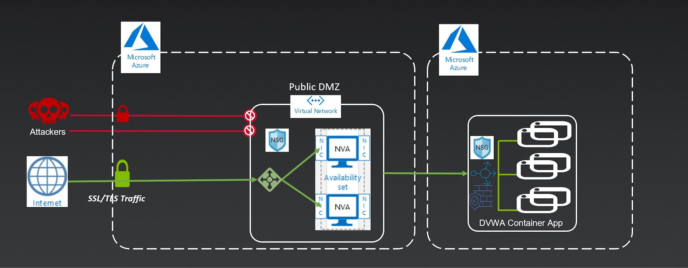

## Documentation

For more information on F5 solutions for Azure, including manual configuration procedures for some deployment scenarios, see the Azure section of [F5 CloudDocs](https://clouddocs.f5.com/cloud/public/v1/azure_index.html). Also check out the [Azure BIG-IP Lightboard Lessons](https://devcentral.f5.com/s/articles/Lightboard-Lessons-BIG-IP-Deployments-in-Azure-Cloud) on DevCentral. This particular HA example is based on the [BIG-IP "HA Failover via LB" F5 ARM Cloud Template on GitHub](https://github.com/F5Networks/f5-azure-arm-templates/tree/master/supported/failover/same-net/via-lb/3nic/new-stack/payg).

## Creating Virtual Servers on the BIG-IP VE

In order to pass traffic from your clients to the servers through the BIG-IP system, you must create a virtual server on the BIG-IP VE. In this template, the AS3 declaration creates 1 VIP listening on 0.0.0.0/0, port 8443. It is preconfigured as an example.

In this template, the Azure public IP address is associated with an Azure Load Balancer that forwards traffic to a backend pool that includes the secondary private IP address of the External NIC on each BIG-IP.

***Note:*** These next steps illustrate the manual way in the GUI to create a virtual server
1. Open the BIG-IP VE Configuration utility
2. Click **Local Traffic > Virtual Servers**
3. Click the **Create** button
4. Type a name in the **Name** field
4. Type an address (ex. 0.0.0.0/0) in the **Destination/Mask** field
5. Type a port (ex. 8443) in the **Service Port**
6. Configure the rest of the virtual server as appropriate
7. Select a pool name from the **Default Pool** list
8. Click the **Finished** button
9. Repeat as necessary for other applications by using different ports (ex. 0.0.0.0/0:9443, 0.0.0.0/0:8444)

## Running BIG-IPs in Active/Active
You can make this deployment of BIG-IP devices run Active/Active too. When you have completed the virtual server configuration, you must modify the virtual addresses to use Traffic Group "None" using the following guidance. This allows both BIG-IP devices to respond to ALB health probes and therefore Active/Active is achieved.

1. On the Main tab, click **Local Traffic > Virtual Servers**
2. On the Menu bar, click the **Virtual Address List** tab
3. Click the address of the virtual server you just created like 0.0.0.0/0
4. From the **Traffic Group** list, select **None**
5. Click **Update**
6. Repeat for each virtual server address

## Redeploy BIG-IP for Replacement or Upgrade
This example illustrates how to replace or upgrade the BIG-IP VE.
  1. Change the *bigip_version* variable to the desired release
  2. Revoke the problematic BIG-IP VE's license (if BYOL)
  3. Run command
```
terraform destroy -target azurerm_virtual_machine.f5vm02
```
  3. Run command
```
terraform apply
```
  4. Repeat steps 1-3 on the other BIG-IP VE in order to establish Device Trust.


## Rerun Declarative Onboarding on the BIG-IP VE
This example illustrates how to re-configure the BIG-IP instances with DO. If you need to make changes to the L1-L3 settings of the BIG-IP device or run HA setup again, you can follow these steps.
  1. Update do.json as needed
  2. Taint resources and apply
```
terraform taint template_file.vm01_do_json
terraform taint template_file.vm02_do_json
terraform taint null_resource.f5vm01_DO
terraform taint null_resource.f5vm02_DO
terraform apply
```

## Rerun Application Services AS3 on the BIG-IP VE
This example illustrates how to run your own custom AS3 (aka application). You can have a catalog of AS3 apps/templates and repeat these steps as many times as desired.
  1. Update as3.json as needed
  2. Taint resources and apply
```
terraform taint template_file.as3_json
terraform taint null_resource.f5vm_AS3
terraform apply
```

## Rerun Telemetry Streaming on the BIG-IP VE
This example illustrates how to re-configure the BIG-IP instances with TS. If you need to make changes to the push consumers (ex. Azure Log Analytics, Splunk, etc) or other telemetry configs of the BIG-IP device, you can follow these steps.
  1. Update ts.json as needed
  2. Taint resources and apply
```
terraform taint template_file.vm_ts_file
terraform taint null_resource.f5vm01_TS
terraform taint null_resource.f5vm02_TS
terraform apply
```

## Service Principal Authentication
This solution might require access to the Azure API to query pool member key:value. If F5 AS3 is used with pool member dynamic service discovery, then you will need an SP. The current demo repo as-is does NOT need an SP. The following provides information/links on the options for configuring a service principal within Azure.

As another reference...head over to F5 CloudDocs to see an example in one of the awesome lab guides. Pay attention to the [Setting Up a Service Principal Account](https://clouddocs.f5.com/training/community/big-iq-cloud-edition/html/class2/module5/lab1.html#setting-up-a-service-principal-account) section and then head back over here!

1. Login to az cli and set default subscription:

```bash
# Login
az login

# Show subscriptions
az account show

# Set default
az account set -s <subscriptionId>
```

2. Create service principal account. Copy the JSON output starting with "{" ending with "}".

***Note:*** Keep this safe. This credential enables read/write access to your Azure Subscription.
```
  $ az ad sp create-for-rbac -n "http://[unique-name]-demo-cc" --role contributor
  {
    "appId": "xxx-xxxx",
    "displayName": "[unique-name]-demo-cc",
    "name": "http://[unique-name]-demo-cc",
    "password": "[password]",
    "tenant": "yyy-yyy"
  }
```

3. Retrieve Azure subscription ID
```
  $ az account show  --query [name,id,isDefault]
  [
    "f5-AZR_xxxx", <-- name
    "xxx-xxx-xxx", <-- subscription id
    true           <-- is this the default subscription
  ]
```


## Azure Sentinel and Log Analytics Integration

This deployment creates an Azure Log Analytic Workspace, and the BIG-IP will push LTM and ASM logs via Telemetry Streaming to the Analytics Workspace. You can create an Azure Log Analytics Workspace a few different ways. Please refer to the following options.

- [Option #1 - Create Azure Sentinel Dashboard](#option-1---create-azure-sentinel-dashboard)
- [Option #2 - Create Azure Log Analytics Workspace with OMSVIEW File](#option-2---create-azure-log-analytics-workspace-with-omsview-file)
- [Option #3 - Query BIG-IP Request Logs in Azure Log Analytics](#option-3---query-big-ip-request-logs-in-azure-log-analytics)

**References:** For more info on option #1, head over to DevCentral to read [Integrating F5 BIG-IP with Azure Sentinel](https://devcentral.f5.com/s/articles/Integrating-the-F5-BIGIP-with-Azure-Sentinel)...with video. For more info on option #2, head over to [F5 CloudDocs Telemtry Streaming to Azure Log Analytics](https://clouddocs.f5.com/products/extensions/f5-telemetry-streaming/latest/setting-up-consumer.html#microsoft-azure-log-analytics).

### Option #1 - Create Azure Sentinel Dashboard
  1. In the Azure Portal, open Azure Sentinel
  2. Click **Add** to add Azure Sentinel to an existing Log Analytics workspace

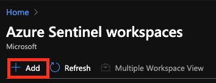

  3. Choose the Log Analytics workspace created by Terraform and click **Add Azure Sentinel** (look for your ***prefix***)

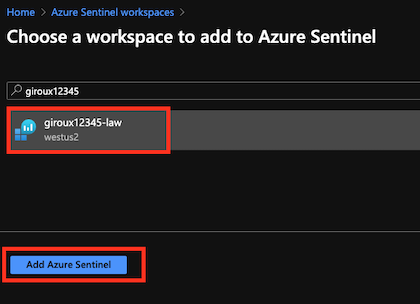

  4. Within the Azure Sentinel page, click **Workbooks** to load the BIG-IP template and click **View Template**

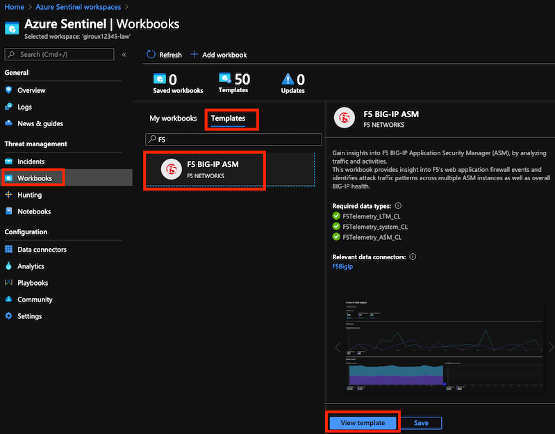

  5. Done!

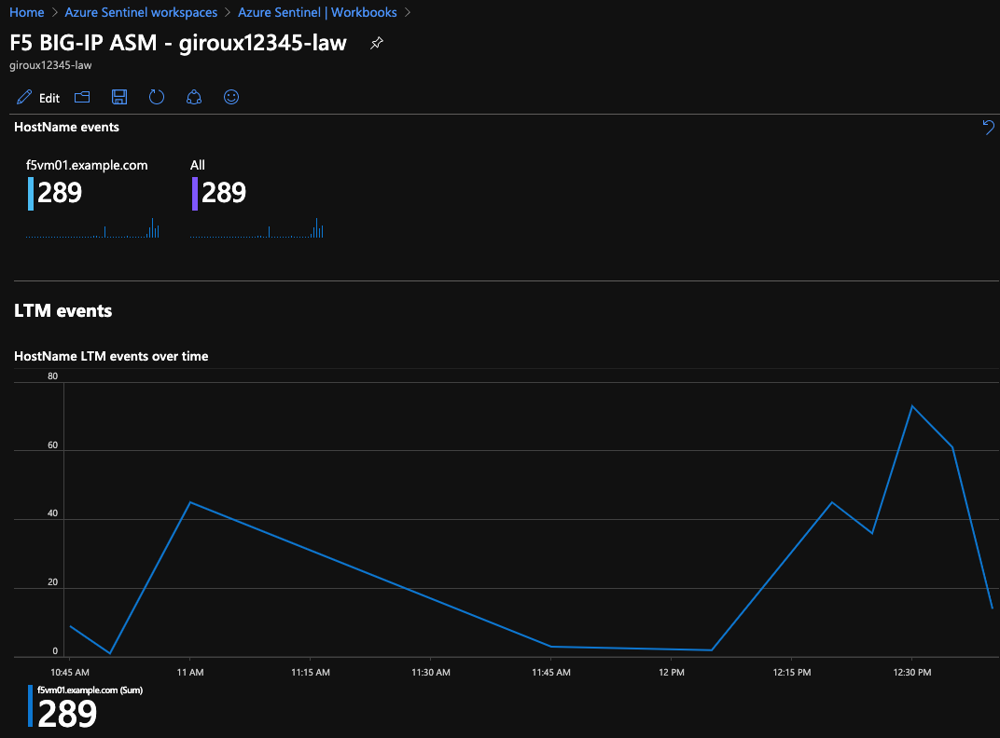

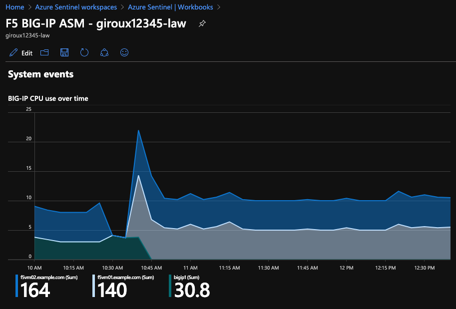

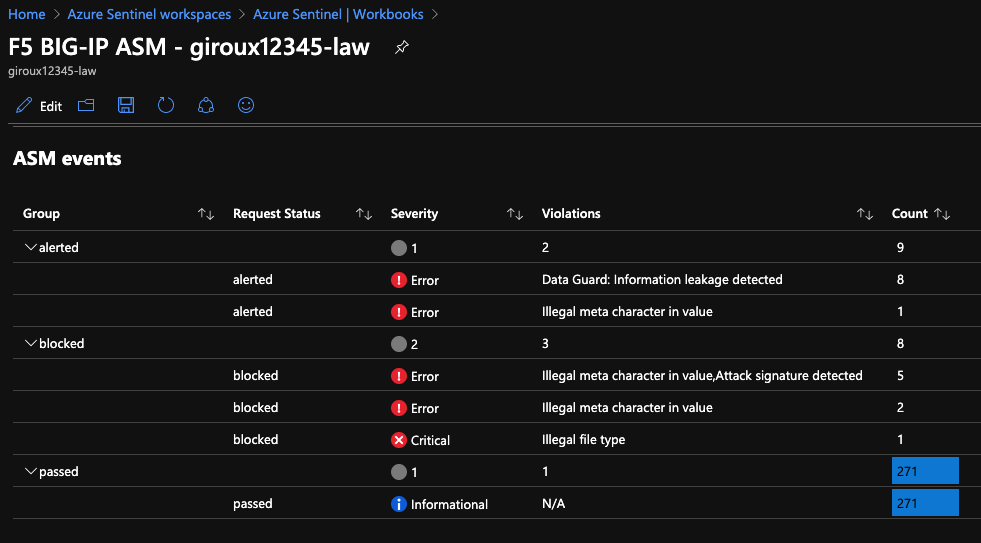

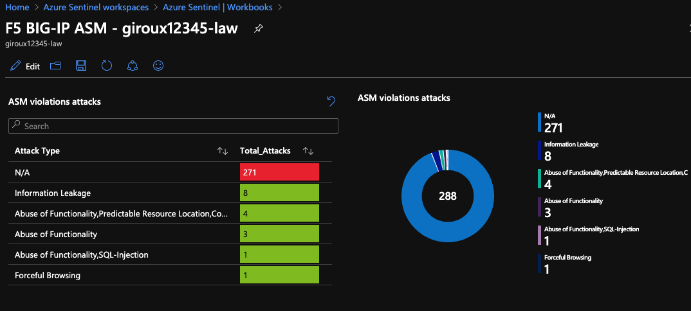

### Option #2 - Create Azure Log Analytics Workspace with OMSVIEW File
  1. In the Azure Portal, open your new resource group
  2. Select the Azure Log Analytics workspace


  3. Click **View Designer**

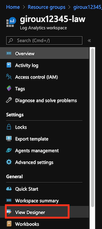

  3. Click **Import** and upload the [telemetry_dashboard.omsview](./telemetry_dashboard.omsview) file

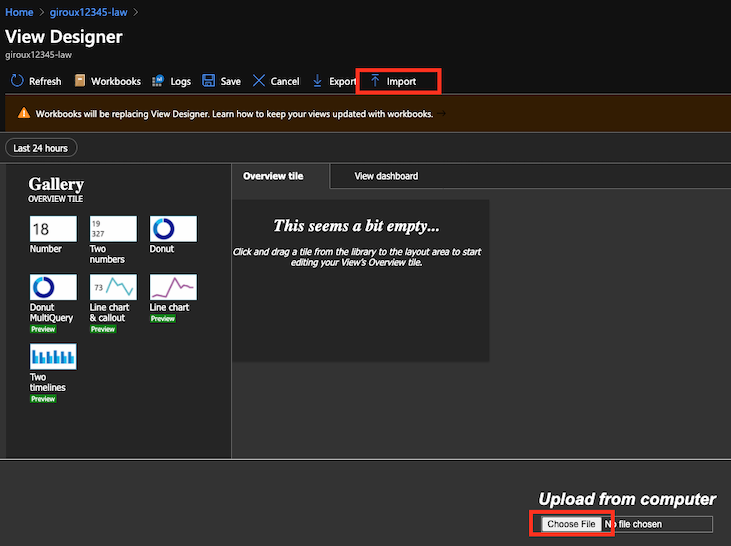

  4. Click **Save** to return to the "Overview" dashboard

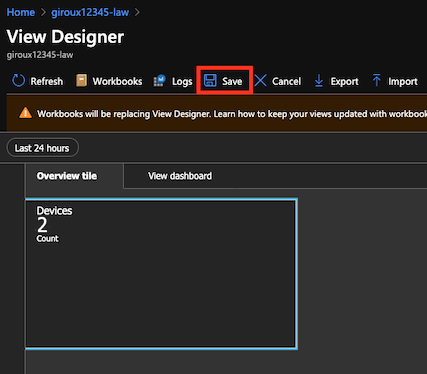

  5. Click anywhere inside the box to open the dashboard

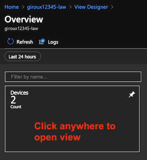

  6. Done!

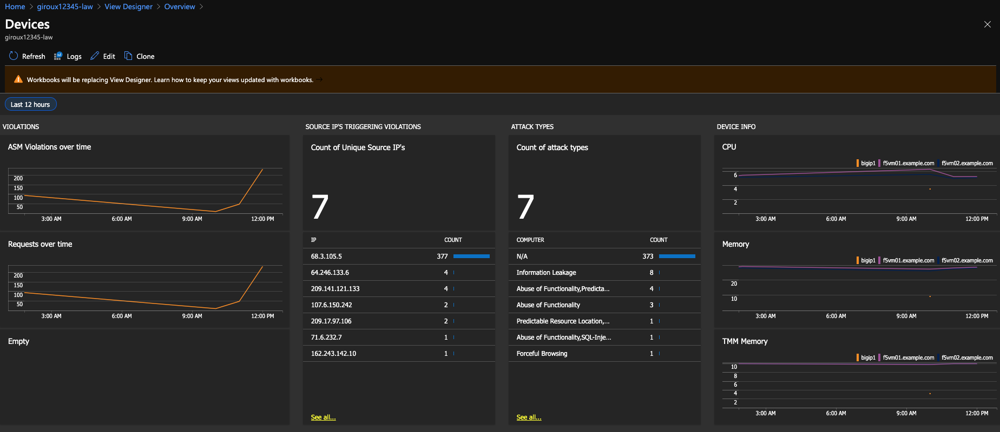

### Option #3 - Query BIG-IP Request Logs in Azure Log Analytics
The previous two options are ways that you can create visual dashboards. The remaining option will show you how to query logs of event_source="request_logging". These logs are sourced from BIG-IP virtual servers that have a traffic request logging profile attached. This profile and the binding to the virtual server were created as part of the Terraform deployment. Relevant configs are found in the as3.json file.

  1. In the Azure Portal, open your new resource group
  2. Select the Azure Log Analytics workspace


  3. Click **Logs** to open the log query screen


  4. Run the query below against log table *F5Telemetry_LTM_CL* in the query window
```
F5Telemetry_LTM_CL
| where TimeGenerated > ago(24h)
| limit 10
```

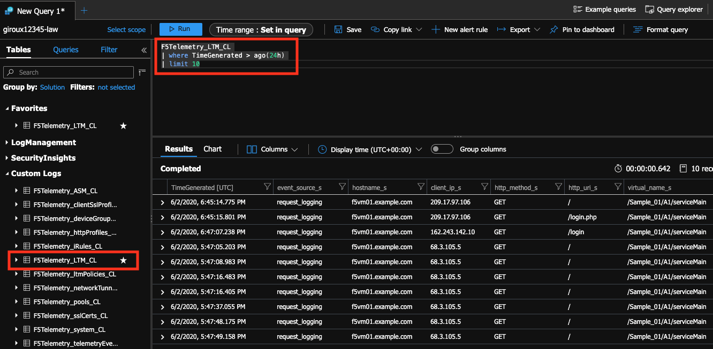

  5. Done!
