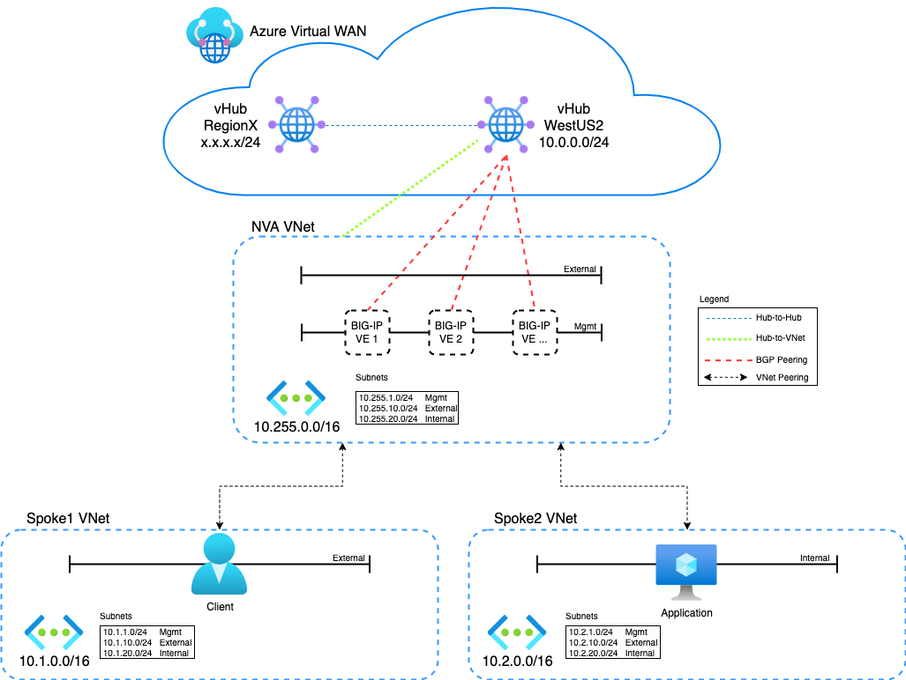
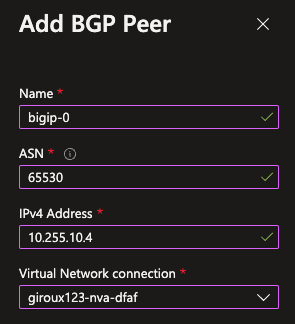
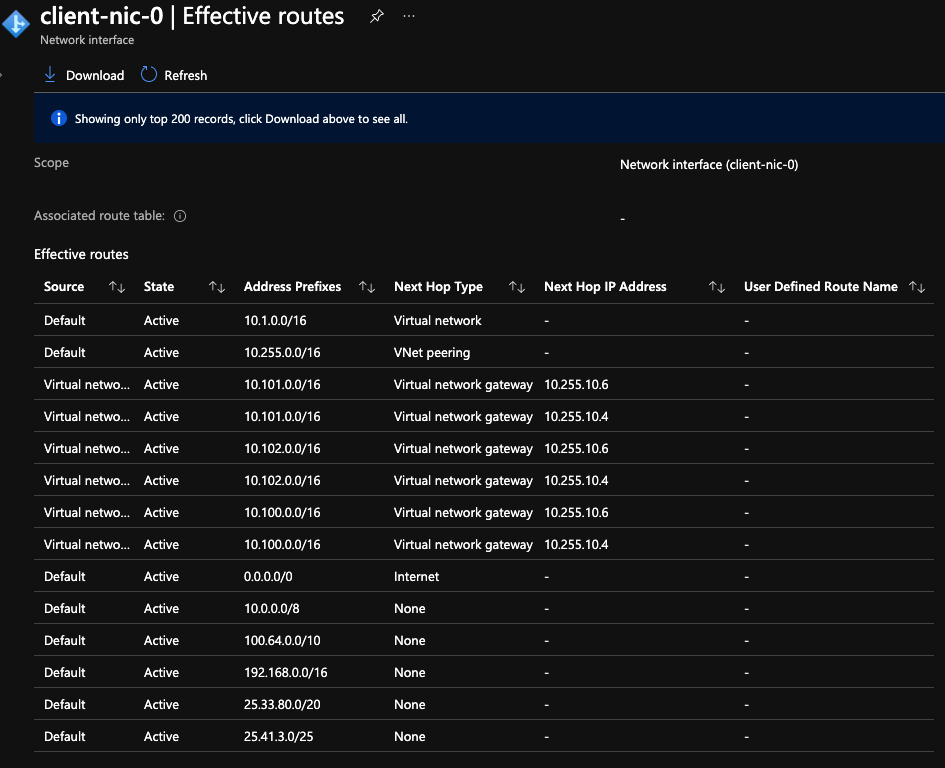
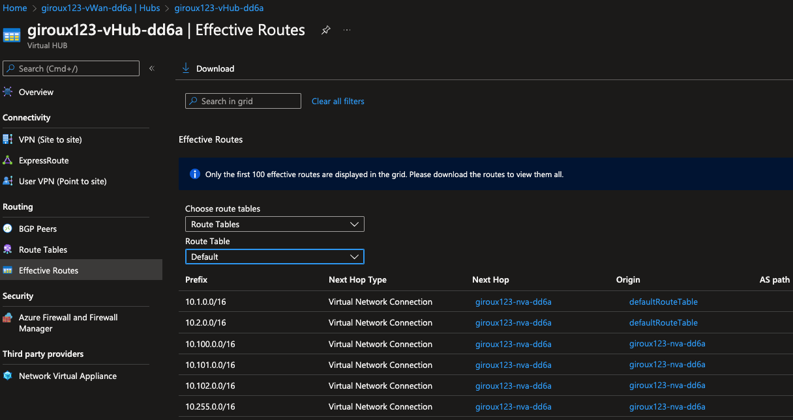
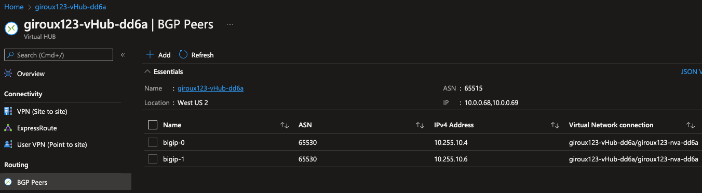

# Description
Azure Virtual WAN and BIG-IP using BGP and eCMP for traffic distribution

## To Do
- Community support only. Template is not F5 supported.
- Finish BIG-IP setup with test app
- Remove test network virtuals (10.100, 10.101, 10.102)...testing only


## Issues
- Find an issue? Fork, clone, create branch, fix and PR. I'll review and merge into the main branch. Or submit a GitHub issue with all necessary details and logs.

## Diagram



## Prerequisites

- Azure CLI
- Terraform
- Azure Subscription
- Azure User with 'Owner' role

## Login to Azure Environment

```bash
# Login
az login

# Show subscriptions
az account show

# Set default
az account set -s <subscriptionId>
```

## Usage example

- Clone the repo and open the solution's directory
```bash
git clone https://github.com/JeffGiroux/f5_terraform.git
cd f5_terraform/Azure/Virtual_WAN/
```

- Create the tfvars file and update it with your settings

```bash
cp admin.auto.tfvars.example admin.auto.tfvars
# MODIFY TO YOUR SETTINGS
vi admin.auto.tfvars
```

- Run the setup script to deploy all of the components into your Azure account (remember that you are responsible for the cost of those components)

```bash
./setup.sh
```

## Manually Add BGP Peers

- (REMOVE LATER) Due to Azure API bug, BGP peering connection fails in Terraform code and must be done manually in the Azure Portal. Follow the steps in the link below to "Add BGP Peer". You will add a BGP peer for each BIG-IP device (using the primary external NIC selfIP).

Bug = https://github.com/hashicorp/terraform-provider-azurerm/issues/17872

BGP peer how-to = https://docs.microsoft.com/en-us/azure/virtual-wan/create-bgp-peering-hub-portal



For reference, this code will automate the BGP peering but is currently commented in main.tf.
```
# Create BGP peer between vHub and BIG-IP devices
resource "azurerm_virtual_hub_bgp_connection" "bigip" {
  count          = var.instanceCountBigIp
  name           = "bigip-${count.index}"
  virtual_hub_id = azurerm_virtual_hub.vHub.id
  peer_asn       = 65530
  peer_ip        = element(flatten(module.bigip[count.index].private_addresses.public_private.private_ip), 0)
}
```

## Test your setup

- View the created objects in Azure Portal. Choose a VM instance or NIC from a spoke VNet and view "Effective Routes". You will see BIG-IP advertised routes via BGP across the VNet peering. This deployment will launch a single BIG-IP instance, but if you modified 'instanceCountBigIp' then you will see identical network prefixes advertised from multiple BIG-IP devices (aka BGP peers) like the screenshot below. The 10.255.10.4 is BIG-IP #1 and 10.255.10.6 is BIG-IP #2.



- View Azure Hub routes in the defaultRouteTable in Azure Virtual WAN > Hub > Effective Routes. Similar routes should be visible.



- View BPG peering in Azure Virtual WAN > Hub > BGP Peers. Notice the Azure Hub router peering IPs 10.0.0.68 and 10.0.0.69. These are used with the BGP neighbor statements in the BIG-IP f5_onboard.tmpl template file.



- Validate BGP peering on BIG-IP using tmsh
```bash
(tmos)# show net routing bgp
------------------------------------------
Net::BGP Instance (route-domain: 0)
------------------------------------------
  Name                               myBGP
  Local AS                           65530

  ----------------------------------------------------------------------------
  | Net::BGP Neighbor - 10.0.0.68 via 10.255.10.4
  ----------------------------------------------------------------------------
  | Remote AS                   0
  | State                       established   0:06:24
  | Notification                Cease/Administratively Shutdown.
  | Address Family              IPv4 Unicast  IPv6 Unicast
  |  Prefix
  |   Accepted                  3
  |   Announced                 6
  |  Table Version
  |   Local                     6
  |   Neighbor                  6
  | Message/Notification/Queue  Sent          Received
  |  Message                    27            26
  |  Notification               0             2
  |  Queued                     0             0
  | Route Refresh               0             0
```

- View running config on BIG-IP using imish
```bash
(tmos)# imish
f5vm01.example.com[0]#show running-config
!
service password-encryption
!
bgp extended-asn-cap
!
router bgp 65530
 bgp graceful-restart restart-time 120
 aggregate-address 10.100.0.0/16 summary-only
 aggregate-address 10.101.0.0/16 summary-only
 aggregate-address 10.102.0.0/16 summary-only
 redistribute kernel
 neighbor Neighbor peer-group
 neighbor Neighbor remote-as 65515
 neighbor Neighbor ebgp-multihop 2
 no neighbor Neighbor capability route-refresh
 neighbor Neighbor soft-reconfiguration inbound
 neighbor Neighbor prefix-list /Common/myPrefixList1 out
 neighbor 10.0.0.68 peer-group Neighbor
 neighbor 10.0.0.69 peer-group Neighbor
 !
 address-family ipv6
 neighbor Neighbor activate
 no neighbor 10.0.0.68 activate
 no neighbor 10.0.0.68 capability graceful-restart
 no neighbor 10.0.0.69 activate
 no neighbor 10.0.0.69 capability graceful-restart
 exit-address-family
!
ip route 0.0.0.0/0 10.255.10.1
!
ip prefix-list /Common/myPrefixList1 seq 10 permit 10.0.0.0/8 ge 16
!
line con 0
 login
line vty 0 39
 login
!
end
```

- Validate BGP on BIG-IP using imish
```bash
f5vm01.example.com[0]>show ip bgp summary
BGP router identifier 10.255.20.4, local AS number 65530
BGP table version is 2
3 BGP AS-PATH entries
0 BGP community entries

Neighbor        V    AS MsgRcvd MsgSent   TblVer  InQ OutQ Up/Down  State/PfxRcd
10.0.0.68       4 65515      24      47        2    0    0 00:09:11        1
10.0.0.69       4 65515      24      46        2    0    0 00:09:11        1

Total number of neighbors 2

##
f5vm01.example.com[0]>show ip bgp
BGP table version is 2, local router ID is 10.255.20.4
Status codes: s suppressed, d damped, h history, * valid, > best, i - internal, l - labeled
              S Stale
Origin codes: i - IGP, e - EGP, ? - incomplete

   Network          Next Hop            Metric     LocPrf     Weight Path
*  10.0.0.0/24      10.0.0.68                0                     0 65515 i
*>                  10.0.0.69                0                     0 65515 i
*> 10.100.0.0/16    0.0.0.0                                    32768 ?
*> 10.101.0.0/16    0.0.0.0                                    32768 ?
*> 10.102.0.0/16    0.0.0.0                                    32768 ?

Total number of prefixes 4
```

## Troubleshooting
If you don't see routes in the spoke VNets, then try deleting the VNet peering and re-run Terraform to have it create the peer again. If you happen to run into this issue, open an issue directly with Azure support to provide feedback.

You can view BIG-IP onboard logs in /var/log/cloud. Review logs for failure message.

You can view BIG-IP onboard config files in /config/cloud. Review the declarative onboarding JSON file as well as the runtime init YAML file for accuracy. Did the variables render correctly?

If BIG-IP imish commands do not provide results to "show ip bgp" or "show run" but you do see "tmsh list net routing", then something happen in the preview tmsh BGP/routing feature. You should simply delete and recreate the device.
```bash
# taint BIG-IP resource
terraform taint module.bigip[0].azurerm_linux_virtual_machine.f5vm01
terraform taint module.bigip[0].azurerm_virtual_machine_extension.vmext
# re-run terraform
./setup.sh
```

You can manually re-run BIG-IP Runtime init and force declarations to re-run. SSH to the BIG-IP, enter 'bash' mode and run this command.
```bash
f5-bigip-runtime-init --config-file /config/cloud/runtime-init-conf.yaml
```

### Serial Logs
Review the serial logs for the Azure virtual machine. Login to the Azure portal, open "Virtual Machines", then locate your instance...click it. Hit Serial Console. Then review the serial logs for errors.

### Onboard Logs
Depending on where onboard fails, you can attempt SSH login and try to troubleshoot further. Inspect the /config/cloud directory for correct runtime init YAML files. Inspect the /var/log/cloud location for error logs.

### F5 Automation Toolchain Components
F5 BIG-IP Runtime Init uses the F5 Automation Toolchain for configuration of BIG-IP instances.  Any errors thrown from these components will be surfaced in the bigIpRuntimeInit.log (or a custom log location as specified below).

Help with troubleshooting individual Automation Toolchain components can be found at F5's [Public Cloud Docs](http://clouddocs.f5.com/cloud/public/v1/):
- DO: https://clouddocs.f5.com/products/extensions/f5-declarative-onboarding/latest/troubleshooting.html
- AS3: https://clouddocs.f5.com/products/extensions/f5-appsvcs-extension/latest/userguide/troubleshooting.html
- FAST: https://clouddocs.f5.com/products/extensions/f5-appsvcs-templates/latest/userguide/troubleshooting.html
- TS: https://clouddocs.f5.com/products/extensions/f5-telemetry-streaming/latest/userguide/troubleshooting.html
- CFE: https://clouddocs.f5.com/products/extensions/f5-cloud-failover/latest/userguide/troubleshooting.html


## Cleanup
Use the following command to destroy all of the resources

```bash
./destroy.sh
```

<!-- markdownlint-disable no-inline-html -->
<!-- BEGINNING OF PRE-COMMIT-TERRAFORM DOCS HOOK -->
## Requirements

| Name | Version |
|------|---------|
| <a name="requirement_terraform"></a> [terraform](#requirement\_terraform) | >= 1.2.0 |
| <a name="requirement_azurerm"></a> [azurerm](#requirement\_azurerm) | >= 3.48.0 |

## Providers

| Name | Version |
|------|---------|
| <a name="provider_azurerm"></a> [azurerm](#provider\_azurerm) | >= 3.48.0 |
| <a name="provider_local"></a> [local](#provider\_local) | n/a |
| <a name="provider_random"></a> [random](#provider\_random) | n/a |

## Modules

| Name | Source | Version |
|------|--------|---------|
| <a name="module_app"></a> [app](#module\_app) | Azure/compute/azurerm | 4.0 |
| <a name="module_bigip"></a> [bigip](#module\_bigip) | F5Networks/bigip-module/azure | 1.2.8 |
| <a name="module_client"></a> [client](#module\_client) | Azure/compute/azurerm | 4.0 |
| <a name="module_network"></a> [network](#module\_network) | Azure/vnet/azurerm | n/a |
| <a name="module_nsg-external"></a> [nsg-external](#module\_nsg-external) | Azure/network-security-group/azurerm | n/a |
| <a name="module_nsg-internal"></a> [nsg-internal](#module\_nsg-internal) | Azure/network-security-group/azurerm | n/a |
| <a name="module_nsg-mgmt"></a> [nsg-mgmt](#module\_nsg-mgmt) | Azure/network-security-group/azurerm | n/a |

## Resources

| Name | Type |
|------|------|
| [azurerm_key_vault_access_policy.main](https://registry.terraform.io/providers/hashicorp/azurerm/latest/docs/resources/key_vault_access_policy) | resource |
| [azurerm_resource_group.rg](https://registry.terraform.io/providers/hashicorp/azurerm/latest/docs/resources/resource_group) | resource |
| [azurerm_route_table.rt](https://registry.terraform.io/providers/hashicorp/azurerm/latest/docs/resources/route_table) | resource |
| [azurerm_virtual_hub.vHub](https://registry.terraform.io/providers/hashicorp/azurerm/latest/docs/resources/virtual_hub) | resource |
| [azurerm_virtual_hub_connection.nva](https://registry.terraform.io/providers/hashicorp/azurerm/latest/docs/resources/virtual_hub_connection) | resource |
| [azurerm_virtual_network_peering.nvaToSpoke](https://registry.terraform.io/providers/hashicorp/azurerm/latest/docs/resources/virtual_network_peering) | resource |
| [azurerm_virtual_network_peering.spokeToNva](https://registry.terraform.io/providers/hashicorp/azurerm/latest/docs/resources/virtual_network_peering) | resource |
| [azurerm_virtual_wan.vWan](https://registry.terraform.io/providers/hashicorp/azurerm/latest/docs/resources/virtual_wan) | resource |
| [random_id.buildSuffix](https://registry.terraform.io/providers/hashicorp/random/latest/docs/resources/id) | resource |
| [azurerm_key_vault.main](https://registry.terraform.io/providers/hashicorp/azurerm/latest/docs/data-sources/key_vault) | data source |
| [azurerm_subnet.externalSubnetNva](https://registry.terraform.io/providers/hashicorp/azurerm/latest/docs/data-sources/subnet) | data source |
| [azurerm_subnet.internalSubnetNva](https://registry.terraform.io/providers/hashicorp/azurerm/latest/docs/data-sources/subnet) | data source |
| [azurerm_subnet.mgmtSubnetNva](https://registry.terraform.io/providers/hashicorp/azurerm/latest/docs/data-sources/subnet) | data source |
| [azurerm_subscription.main](https://registry.terraform.io/providers/hashicorp/azurerm/latest/docs/data-sources/subscription) | data source |
| [azurerm_user_assigned_identity.main](https://registry.terraform.io/providers/hashicorp/azurerm/latest/docs/data-sources/user_assigned_identity) | data source |
| [local_file.appOnboard](https://registry.terraform.io/providers/hashicorp/local/latest/docs/data-sources/file) | data source |

## Inputs

| Name | Description | Type | Default | Required |
|------|-------------|------|---------|:--------:|
| <a name="input_ssh_key"></a> [ssh\_key](#input\_ssh\_key) | public key used for authentication in /path/file format (e.g. /.ssh/id\_rsa.pub) | `string` | n/a | yes |
| <a name="input_AS3_URL"></a> [AS3\_URL](#input\_AS3\_URL) | URL to download the BIG-IP Application Service Extension 3 (AS3) module | `string` | `"https://github.com/F5Networks/f5-appsvcs-extension/releases/download/v3.43.0/f5-appsvcs-3.43.0-2.noarch.rpm"` | no |
| <a name="input_DO_URL"></a> [DO\_URL](#input\_DO\_URL) | URL to download the BIG-IP Declarative Onboarding module | `string` | `"https://github.com/F5Networks/f5-declarative-onboarding/releases/download/v1.36.1/f5-declarative-onboarding-1.36.1-1.noarch.rpm"` | no |
| <a name="input_FAST_URL"></a> [FAST\_URL](#input\_FAST\_URL) | URL to download the BIG-IP FAST module | `string` | `"https://github.com/F5Networks/f5-appsvcs-templates/releases/download/v1.24.0/f5-appsvcs-templates-1.24.0-1.noarch.rpm"` | no |
| <a name="input_INIT_URL"></a> [INIT\_URL](#input\_INIT\_URL) | URL to download the BIG-IP runtime init | `string` | `"https://cdn.f5.com/product/cloudsolutions/f5-bigip-runtime-init/v1.6.0/dist/f5-bigip-runtime-init-1.6.0-1.gz.run"` | no |
| <a name="input_TS_URL"></a> [TS\_URL](#input\_TS\_URL) | URL to download the BIG-IP Telemetry Streaming module | `string` | `"https://github.com/F5Networks/f5-telemetry-streaming/releases/download/v1.32.0/f5-telemetry-1.32.0-2.noarch.rpm"` | no |
| <a name="input_adminSrcAddr"></a> [adminSrcAddr](#input\_adminSrcAddr) | Allowed Admin source IP prefix | `string` | `"0.0.0.0/0"` | no |
| <a name="input_availability_zone"></a> [availability\_zone](#input\_availability\_zone) | Azure Availability Zone for BIG-IP 1 | `number` | `1` | no |
| <a name="input_az_keyvault_authentication"></a> [az\_keyvault\_authentication](#input\_az\_keyvault\_authentication) | Whether to use key vault to pass authentication | `bool` | `false` | no |
| <a name="input_bigIqHost"></a> [bigIqHost](#input\_bigIqHost) | This is the BIG-IQ License Manager host name or IP address | `string` | `""` | no |
| <a name="input_bigIqHypervisor"></a> [bigIqHypervisor](#input\_bigIqHypervisor) | BIG-IQ hypervisor | `string` | `"azure"` | no |
| <a name="input_bigIqLicensePool"></a> [bigIqLicensePool](#input\_bigIqLicensePool) | BIG-IQ license pool name | `string` | `""` | no |
| <a name="input_bigIqLicenseType"></a> [bigIqLicenseType](#input\_bigIqLicenseType) | BIG-IQ license type | `string` | `"licensePool"` | no |
| <a name="input_bigIqPassword"></a> [bigIqPassword](#input\_bigIqPassword) | Admin Password for BIG-IQ | `string` | `"Default12345!"` | no |
| <a name="input_bigIqSkuKeyword1"></a> [bigIqSkuKeyword1](#input\_bigIqSkuKeyword1) | BIG-IQ license SKU keyword 1 | `string` | `"key1"` | no |
| <a name="input_bigIqSkuKeyword2"></a> [bigIqSkuKeyword2](#input\_bigIqSkuKeyword2) | BIG-IQ license SKU keyword 2 | `string` | `"key2"` | no |
| <a name="input_bigIqUnitOfMeasure"></a> [bigIqUnitOfMeasure](#input\_bigIqUnitOfMeasure) | BIG-IQ license unit of measure | `string` | `"hourly"` | no |
| <a name="input_bigIqUsername"></a> [bigIqUsername](#input\_bigIqUsername) | Admin name for BIG-IQ | `string` | `"azureuser"` | no |
| <a name="input_bigip_version"></a> [bigip\_version](#input\_bigip\_version) | BIG-IP Version | `string` | `"16.1.303000"` | no |
| <a name="input_dns_server"></a> [dns\_server](#input\_dns\_server) | Leave the default DNS server the BIG-IP uses, or replace the default DNS server with the one you want to use | `string` | `"8.8.8.8"` | no |
| <a name="input_dns_suffix"></a> [dns\_suffix](#input\_dns\_suffix) | DNS suffix for your domain in the GCP project | `string` | `"example.com"` | no |
| <a name="input_f5_password"></a> [f5\_password](#input\_f5\_password) | BIG-IP Password or Key Vault secret name (value should be Key Vault secret name when az\_key\_vault\_authentication = true, ex. my-bigip-secret) | `string` | `"Default12345!"` | no |
| <a name="input_f5_username"></a> [f5\_username](#input\_f5\_username) | User name for the BIG-IP | `string` | `"azureuser"` | no |
| <a name="input_image_name"></a> [image\_name](#input\_image\_name) | F5 SKU (image) to deploy. Note: The disk size of the VM will be determined based on the option you select.  **Important**: If intending to provision multiple modules, ensure the appropriate value is selected, such as ****AllTwoBootLocations or AllOneBootLocation****. | `string` | `"f5-big-best-plus-hourly-25mbps"` | no |
| <a name="input_instanceCountBigIp"></a> [instanceCountBigIp](#input\_instanceCountBigIp) | Number of BIG-IP instances to deploy | `number` | `1` | no |
| <a name="input_instance_type"></a> [instance\_type](#input\_instance\_type) | Azure instance type to be used for the BIG-IP VE | `string` | `"Standard_DS4_v2"` | no |
| <a name="input_keyvault_name"></a> [keyvault\_name](#input\_keyvault\_name) | Name of Key Vault | `string` | `null` | no |
| <a name="input_keyvault_rg"></a> [keyvault\_rg](#input\_keyvault\_rg) | The name of the resource group in which the Azure Key Vault exists | `string` | `""` | no |
| <a name="input_keyvault_secret"></a> [keyvault\_secret](#input\_keyvault\_secret) | Name of Key Vault secret with BIG-IP password | `string` | `null` | no |
| <a name="input_libs_dir"></a> [libs\_dir](#input\_libs\_dir) | Directory on the BIG-IP to download the A&O Toolchain into | `string` | `"/config/cloud/azure/node_modules"` | no |
| <a name="input_location"></a> [location](#input\_location) | Azure Location of the deployment | `string` | `"westus2"` | no |
| <a name="input_ntp_server"></a> [ntp\_server](#input\_ntp\_server) | Leave the default NTP server the BIG-IP uses, or replace the default NTP server with the one you want to use | `string` | `"0.us.pool.ntp.org"` | no |
| <a name="input_product"></a> [product](#input\_product) | Azure BIG-IP VE Offer | `string` | `"f5-big-ip-best"` | no |
| <a name="input_projectPrefix"></a> [projectPrefix](#input\_projectPrefix) | This value is inserted at the beginning of each Azure object (alpha-numeric, no special character) | `string` | `"demo"` | no |
| <a name="input_resourceOwner"></a> [resourceOwner](#input\_resourceOwner) | This is a tag used for object creation. Example is last name. | `string` | `null` | no |
| <a name="input_timezone"></a> [timezone](#input\_timezone) | If you would like to change the time zone the BIG-IP uses, enter the time zone you want to use. This is based on the tz database found in /usr/share/zoneinfo (see the full list [here](https://github.com/F5Networks/f5-azure-arm-templates/blob/master/azure-timezone-list.md)). Example values: UTC, US/Pacific, US/Eastern, Europe/London or Asia/Singapore. | `string` | `"UTC"` | no |
| <a name="input_user_identity"></a> [user\_identity](#input\_user\_identity) | The ID of the managed user identity to assign to the BIG-IP instance | `string` | `null` | no |
| <a name="input_vm_name"></a> [vm\_name](#input\_vm\_name) | Prefix for BIG-IP instance name. If empty, default is 'bigip' string + prefix + random\_id | `string` | `""` | no |

## Outputs

| Name | Description |
|------|-------------|
| <a name="output_appPrivateIP"></a> [appPrivateIP](#output\_appPrivateIP) | The private ip address allocated for the webapp in Spoke 2 |
| <a name="output_appPublicIP"></a> [appPublicIP](#output\_appPublicIP) | The public ip address allocated for the app in Spoke 2 |
| <a name="output_bigip-private-ips"></a> [bigip-private-ips](#output\_bigip-private-ips) | The private ip address for BIG-IP |
| <a name="output_bigipPassword"></a> [bigipPassword](#output\_bigipPassword) | The password for the BIG-IP (if dynamic\_password is choosen it will be random generated password or if azure\_keyvault is choosen it will be key vault secret name ) |
| <a name="output_bigipPublicIP"></a> [bigipPublicIP](#output\_bigipPublicIP) | The public ip address allocated for the BIG-IP |
| <a name="output_bigipUserName"></a> [bigipUserName](#output\_bigipUserName) | The user name for the BIG-IP |
| <a name="output_clientPrivateIP"></a> [clientPrivateIP](#output\_clientPrivateIP) | The private ip address allocated for the client/jumphost in Spoke 1 |
| <a name="output_clientPublicIP"></a> [clientPublicIP](#output\_clientPublicIP) | The public ip address allocated for the client/jumphost in Spoke 1 |
| <a name="output_vnetIdNva"></a> [vnetIdNva](#output\_vnetIdNva) | NVA VNet ID |
| <a name="output_vnetIdSpoke1"></a> [vnetIdSpoke1](#output\_vnetIdSpoke1) | Spoke1 VNet ID |
| <a name="output_vnetIdSpoke2"></a> [vnetIdSpoke2](#output\_vnetIdSpoke2) | Spoke2 VNet ID |
<!-- END OF PRE-COMMIT-TERRAFORM DOCS HOOK -->
<!-- markdownlint-enable no-inline-html -->


## How to Contribute

Submit a pull request

# Authors
Jeff Giroux
