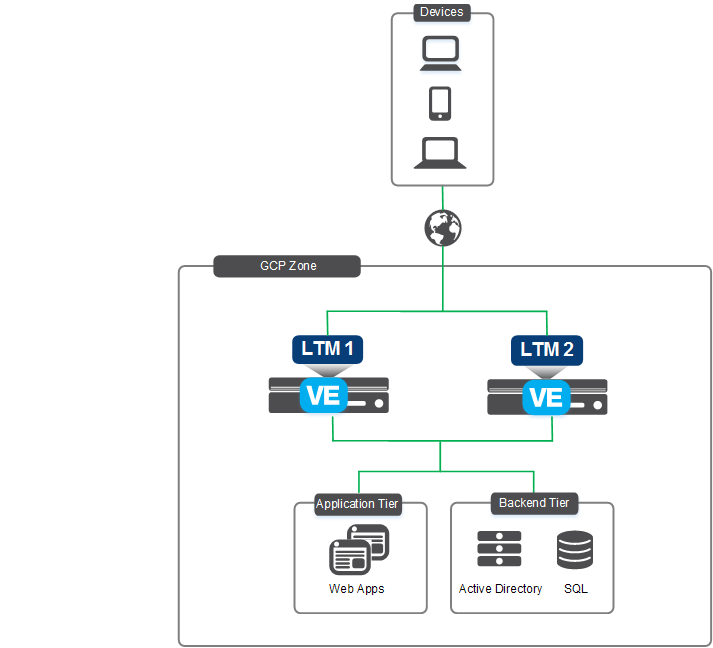

# Deploying BIG-IP VEs in Google - High Availability (Active/Standby): 3-NIC, Failover via API

## To Do
- Community support only. Template is not F5 supported.

## Issues
- Find an issue? Fork, clone, create branch, fix and PR. I'll review and merge into the main branch. Or submit a GitHub issue with all necessary details and logs.

## Contents

- [Introduction](#introduction)
- [Prerequisites](#prerequisites)
- [Important Configuration Notes](#important-configuration-notes)
- [BYOL Licensing](#byol-licensing)
- [BIG-IQ License Manager](#big-iq-license-manager)
- [Installation Example](#installation-example)
- [Configuration Example](#configuration-example)
- [Troubleshooting](#troubleshooting)

## Introduction

This solution uses a Terraform template to launch a 3-NIC deployment of a cloud-focused BIG-IP VE cluster (Active/Standby) in Google GCP. Traffic flows to the BIG-IP VE which then processes the traffic to application servers. The BIG-IP VE instance is running with multiple interfaces: management, external, internal. NIC0 is associated with the external network.

The BIG-IP VEs have the [Local Traffic Manager (LTM)](https://f5.com/products/big-ip/local-traffic-manager-ltm) module enabled to provide advanced traffic management functionality. In addition, the [Application Security Module (ASM)](https://www.f5.com/pdf/products/big-ip-application-security-manager-overview.pdf) can be enabled to provide F5's L4/L7 security features for web application firewall (WAF) and bot protection.

The BIG-IP's configuration, now defined in a single convenient YAML or JSON [F5 BIG-IP Runtime Init](https://github.com/F5Networks/f5-bigip-runtime-init) configuration file, leverages [F5 Automation Tool Chain](https://www.f5.com/pdf/products/automation-toolchain-overview.pdf) declarations which are easier to author, validate and maintain as code. For instance, if you need to change the configuration on the BIG-IPs in the deployment, you update the instance model by passing a new config file (which references the updated Automation Toolchain declarations) via template's runtimeConfig input parameter. New instances will be deployed with the updated configurations.


## Prerequisites

- ***Important***: When you configure the admin password for the BIG-IP VE in the template, you cannot use the character **#**.  Additionally, there are a number of other special characters that you should avoid using for F5 product user accounts.  See [K2873](https://support.f5.com/csp/article/K2873) for details.
- This template requires one or more service accounts for the BIG-IP instance to perform various tasks:
  - See Google's [Understanding service accounts](https://cloud.google.com/iam/docs/understanding-service-accounts)
  - Google Secret Manager secrets access - requires "Secrets Manager Secret Accessor"
    - Performed by VM instance during onboarding to retrieve passwords and private keys
  - Backend pool service discovery - requires "Compute Viewer"
    - Performed by F5 Application Services AS3
  - Google Cloud Monitoring (aka StackDriver) - requires "Monitoring Editor"
    - Performed by F5 Telemetry Streaming
  - Cloud failover via API - requires R/W access to compute and storage (see F5 CloudDocs [Create and assign an IAM role](https://clouddocs.f5.com/products/extensions/f5-cloud-failover/latest/userguide/gcp.html#create-and-assign-an-iam-role))
- This template requires a service account to deploy with the Terraform Google provider and build out all the neccessary Google objects
  - See the [Terraform Google Provider "Adding Credentials"](https://www.terraform.io/docs/providers/google/guides/getting_started.html#adding-credentials) for details. Also, review the [available Google GCP permission scopes](https://cloud.google.com/sdk/gcloud/reference/alpha/compute/instances/set-scopes#--scopes) too.
  - Permissions will depend on the objects you are creating
  - ***Note***: Make sure to [practice least privilege](https://cloud.google.com/iam/docs/understanding-service-accounts#granting_minimum)
- Passwords and secrets can be located in [Google Cloud Secret Manager](https://cloud.google.com/secret-manager/docs/quickstart#secretmanager-quickstart-web).
  - Set *gcp_secret_manager_authentication* to 'true'
  - Set *gcp_secret_name* to the Secret Manager secret name. The secret contents should contain ONLY the password as plain text.
  - Set *gcp_secret_version* to the secret version. If it is not provided, the latest version is retrieved.
- This templates deploys into an *EXISTING* networking stack
  - You must have three VPCs: a VPC for management, an external VPC, and an internal VPC. The management VPC will have one subnet for management traffic. The External VPC will have one subnet for data traffic. The Internal VPC will have one subnet as well.
  - Firewall rules are required to pass traffic to the application
    - BIG-IP will require tcp/22 and tcp/443 on the mgmt network
    - Application access will require tcp/80 and tcp/443 on the external network
  - Storage bucket is used for F5 Cloud Failover. See [F5 Cloud Failover GCP Setup](https://clouddocs.f5.com/products/extensions/f5-cloud-failover/latest/userguide/gcp.html).
  - If you require a new network first, see the [Infrastructure Only folder](../Infrastructure-only) to get started.

## Important Configuration Notes

- Variables are configured in variables.tf
- Sensitive variables like Google SSH keys are configured in terraform.tfvars or Google Cloud Secret Manager
  - ***Note***: Other items like BIG-IP password can be stored in Google Cloud Secret Manager. Refer to the [Prerequisites](#prerequisites).
  - The BIG-IP instance will query Google Metadata API to retrieve the service account's token for authentication.
  - The BIG-IP instance will then use the secret name and the service account's token to query Google Metadata API and dynamically retrieve the password for device onboarding.
- This template uses BIG-IP Runtime Init for the initial configuration. As part of the onboarding script, it will download the F5 Toolchain RPMs automatically. See the [AS3 documentation](http://f5.com/AS3Docs) and [DO documentation](http://f5.com/DODocs) for details on how to use AS3 and Declarative Onboarding on your BIG-IP VE(s). The [Telemetry Streaming](http://f5.com/TSDocs) extension is also downloaded and can be configured to point to [F5 Beacon](https://f5.com/beacon-get-started), Google Cloud Monitoring (old name StackDriver), or many other consumers.
- Files
  - bigip.tf - resources for BIG-IP, NICs, public IPs
  - main.tf - resources for provider, versions
  - f5_onboard.tmpl - onboarding script which is run by commandToExecute (user data). It will be copied to /var/lib/waagent/CustomData upon bootup. This script is responsible for downloading the neccessary F5 Automation Toolchain RPM files, installing them, and then executing the onboarding REST calls via the [BIG-IP Runtime Init tool](https://github.com/F5Networks/f5-bigip-runtime-init).

## BYOL Licensing
This template uses PayGo BIG-IP image for the deployment (as default). If you would like to use BYOL licenses, then these following steps are needed:
1. Find available images/versions with "byol" in the name using Google gcloud:
  ```
          gcloud compute images list --project=f5-7626-networks-public | grep f5

          # example output...

          --snippet--
          f5-bigip-15-1-6-1-0-0-10-payg-best-1gbps-220701174029
          f5-bigip-15-1-6-1-0-0-10-payg-best-200mbps-220701173825
          f5-bigip-15-1-6-1-0-0-10-byol-all-modules-2boot-loc-0701180815
          f5-bigip-16-1-3-1-0-0-11-byol-all-modules-2boot-loc-0721055536
          ...and some more
  ```
2. In the "variables.tf", modify *image_name* with the image name from gcloud CLI results
  ```
          # BIGIP Image
          variable image_name { default = "projects/f5-7626-networks-public/global/images/f5-bigip-16-1-3-1-0-0-11-byol-all-modules-2boot-loc-0721055536" }
  ```
3. In the "variables.tf", modify *license1* with a valid regkey
  ```
          # BIGIP Setup
          variable license1 { default = "" }
  ```
4. In the "f5_onboard.tmpl", add the "myLicense" block under the "Common" declaration ([example here](https://github.com/F5Networks/f5-google-gdm-templates-v2/blob/main/examples/quickstart/bigip-configurations/runtime-init-conf-3nic-byol.yaml))
  ```
          myLicense:
            class: License
            licenseType: regKey
            regKey: '${regKey}'
  ```

## BIG-IQ License Manager
This template uses PayGo BIG-IP image for the deployment (as default). If you would like to use BYOL/ELA/Subscription licenses from [BIG-IQ License Manager (LM)](https://community.f5.com/t5/technical-articles/managing-big-ip-licensing-with-big-iq/ta-p/279797), then these following steps are needed:
1. Find BYOL image. Reference [BYOL Licensing](#byol-licensing) step #1.
2. Replace BIG-IP *image_name* in "variables.tf". Reference [BYOL Licensing](#byol-licensing) step #2.
3. In the "variables.tf", modify the BIG-IQ license section to match your environment
4. In the "f5_onboard.tmpl", add the "myLicense" block under the "Common" declaration ([example here](https://github.com/F5Networks/f5-google-gdm-templates-v2/blob/main/examples/autoscale/bigip-configurations/runtime-init-conf-bigiq-with-app.yaml))
  ```
          myLicense:
            class: License
            licenseType: ${bigIqLicenseType}
            bigIqHost: ${bigIqHost}
            bigIqUsername: ${bigIqUsername}
            bigIqPassword: ${bigIqPassword}
            licensePool: ${bigIqLicensePool}
            skuKeyword1: ${bigIqSkuKeyword1}
            skuKeyword2: ${bigIqSkuKeyword2}
            unitOfMeasure: ${bigIqUnitOfMeasure}
            reachable: false
            hypervisor: ${bigIqHypervisor}
            overwrite: true
  ```

<!-- markdownlint-disable no-inline-html -->
<!-- BEGINNING OF PRE-COMMIT-TERRAFORM DOCS HOOK -->
## Requirements

| Name | Version |
|------|---------|
| <a name="requirement_terraform"></a> [terraform](#requirement\_terraform) | >= 1.2.0 |
| <a name="requirement_google"></a> [google](#requirement\_google) | >= 4.57.0 |

## Providers

| Name | Version |
|------|---------|
| <a name="provider_google"></a> [google](#provider\_google) | 4.57.0 |
| <a name="provider_random"></a> [random](#provider\_random) | 3.4.3 |

## Modules

| Name | Source | Version |
|------|--------|---------|
| <a name="module_bigip"></a> [bigip](#module\_bigip) | F5Networks/bigip-module/gcp | 1.1.11 |
| <a name="module_bigip2"></a> [bigip2](#module\_bigip2) | F5Networks/bigip-module/gcp | 1.1.11 |

## Resources

| Name | Type |
|------|------|
| [google_compute_address.ext](https://registry.terraform.io/providers/hashicorp/google/latest/docs/resources/compute_address) | resource |
| [google_compute_address.ext2](https://registry.terraform.io/providers/hashicorp/google/latest/docs/resources/compute_address) | resource |
| [google_compute_address.int](https://registry.terraform.io/providers/hashicorp/google/latest/docs/resources/compute_address) | resource |
| [google_compute_address.int2](https://registry.terraform.io/providers/hashicorp/google/latest/docs/resources/compute_address) | resource |
| [google_compute_address.mgt](https://registry.terraform.io/providers/hashicorp/google/latest/docs/resources/compute_address) | resource |
| [google_compute_address.mgt2](https://registry.terraform.io/providers/hashicorp/google/latest/docs/resources/compute_address) | resource |
| [google_compute_address.vip](https://registry.terraform.io/providers/hashicorp/google/latest/docs/resources/compute_address) | resource |
| [google_compute_address.vip1](https://registry.terraform.io/providers/hashicorp/google/latest/docs/resources/compute_address) | resource |
| [google_compute_address.vip2](https://registry.terraform.io/providers/hashicorp/google/latest/docs/resources/compute_address) | resource |
| [google_compute_forwarding_rule.vip1](https://registry.terraform.io/providers/hashicorp/google/latest/docs/resources/compute_forwarding_rule) | resource |
| [google_compute_target_instance.f5vm01](https://registry.terraform.io/providers/hashicorp/google/latest/docs/resources/compute_target_instance) | resource |
| [google_compute_target_instance.f5vm02](https://registry.terraform.io/providers/hashicorp/google/latest/docs/resources/compute_target_instance) | resource |
| [google_storage_bucket.main](https://registry.terraform.io/providers/hashicorp/google/latest/docs/resources/storage_bucket) | resource |
| [random_id.buildSuffix](https://registry.terraform.io/providers/hashicorp/random/latest/docs/resources/id) | resource |

## Inputs

| Name | Description | Type | Default | Required |
|------|-------------|------|---------|:--------:|
| <a name="input_ssh_key"></a> [ssh\_key](#input\_ssh\_key) | public key used for authentication in /path/file format (e.g. /.ssh/id\_rsa.pub) | `string` | n/a | yes |
| <a name="input_AS3_URL"></a> [AS3\_URL](#input\_AS3\_URL) | URL to download the BIG-IP Application Service Extension 3 (AS3) module | `string` | `"https://github.com/F5Networks/f5-appsvcs-extension/releases/download/v3.43.0/f5-appsvcs-3.43.0-2.noarch.rpm"` | no |
| <a name="input_CFE_URL"></a> [CFE\_URL](#input\_CFE\_URL) | URL to download the BIG-IP Cloud Failover Extension module | `string` | `"https://github.com/F5Networks/f5-cloud-failover-extension/releases/download/v1.14.0/f5-cloud-failover-1.14.0-0.noarch.rpm"` | no |
| <a name="input_DO_URL"></a> [DO\_URL](#input\_DO\_URL) | URL to download the BIG-IP Declarative Onboarding module | `string` | `"https://github.com/F5Networks/f5-declarative-onboarding/releases/download/v1.36.1/f5-declarative-onboarding-1.36.1-1.noarch.rpm"` | no |
| <a name="input_FAST_URL"></a> [FAST\_URL](#input\_FAST\_URL) | URL to download the BIG-IP FAST module | `string` | `"https://github.com/F5Networks/f5-appsvcs-templates/releases/download/v1.24.0/f5-appsvcs-templates-1.24.0-1.noarch.rpm"` | no |
| <a name="input_INIT_URL"></a> [INIT\_URL](#input\_INIT\_URL) | URL to download the BIG-IP runtime init | `string` | `"https://cdn.f5.com/product/cloudsolutions/f5-bigip-runtime-init/v1.6.0/dist/f5-bigip-runtime-init-1.6.0-1.gz.run"` | no |
| <a name="input_TS_URL"></a> [TS\_URL](#input\_TS\_URL) | URL to download the BIG-IP Telemetry Streaming module | `string` | `"https://github.com/F5Networks/f5-telemetry-streaming/releases/download/v1.32.0/f5-telemetry-1.32.0-2.noarch.rpm"` | no |
| <a name="input_bigIqHost"></a> [bigIqHost](#input\_bigIqHost) | This is the BIG-IQ License Manager host name or IP address | `string` | `""` | no |
| <a name="input_bigIqHypervisor"></a> [bigIqHypervisor](#input\_bigIqHypervisor) | BIG-IQ hypervisor | `string` | `"gce"` | no |
| <a name="input_bigIqLicensePool"></a> [bigIqLicensePool](#input\_bigIqLicensePool) | BIG-IQ license pool name | `string` | `""` | no |
| <a name="input_bigIqLicenseType"></a> [bigIqLicenseType](#input\_bigIqLicenseType) | BIG-IQ license type | `string` | `"licensePool"` | no |
| <a name="input_bigIqPassword"></a> [bigIqPassword](#input\_bigIqPassword) | Admin Password for BIG-IQ | `string` | `"Default12345!"` | no |
| <a name="input_bigIqSkuKeyword1"></a> [bigIqSkuKeyword1](#input\_bigIqSkuKeyword1) | BIG-IQ license SKU keyword 1 | `string` | `"key1"` | no |
| <a name="input_bigIqSkuKeyword2"></a> [bigIqSkuKeyword2](#input\_bigIqSkuKeyword2) | BIG-IQ license SKU keyword 2 | `string` | `"key2"` | no |
| <a name="input_bigIqUnitOfMeasure"></a> [bigIqUnitOfMeasure](#input\_bigIqUnitOfMeasure) | BIG-IQ license unit of measure | `string` | `"hourly"` | no |
| <a name="input_bigIqUsername"></a> [bigIqUsername](#input\_bigIqUsername) | Admin name for BIG-IQ | `string` | `"admin"` | no |
| <a name="input_customImage"></a> [customImage](#input\_customImage) | A custom SKU (image) to deploy that you provide. This is useful if you created your own BIG-IP image with the F5 image creator tool. | `string` | `""` | no |
| <a name="input_customUserData"></a> [customUserData](#input\_customUserData) | The custom user data to deploy when using the 'customImage' paramater too. | `string` | `""` | no |
| <a name="input_dns_server"></a> [dns\_server](#input\_dns\_server) | Leave the default DNS server the BIG-IP uses, or replace the default DNS server with the one you want to use | `string` | `"169.254.169.254"` | no |
| <a name="input_dns_suffix"></a> [dns\_suffix](#input\_dns\_suffix) | DNS suffix for your domain in the GCP project | `string` | `"example.com"` | no |
| <a name="input_extSubnet"></a> [extSubnet](#input\_extSubnet) | External subnet | `string` | `null` | no |
| <a name="input_extVpc"></a> [extVpc](#input\_extVpc) | External VPC network | `string` | `null` | no |
| <a name="input_f5_cloud_failover_label"></a> [f5\_cloud\_failover\_label](#input\_f5\_cloud\_failover\_label) | This is a tag used for F5 Cloud Failover extension | `string` | `"myfailover"` | no |
| <a name="input_f5_password"></a> [f5\_password](#input\_f5\_password) | BIG-IP Password or Google secret name (value should be Google secret name when gcp\_secret\_manager\_authentication = true, ex. my-bigip-secret) | `string` | `"Default12345!"` | no |
| <a name="input_f5_username"></a> [f5\_username](#input\_f5\_username) | User name for the BIG-IP | `string` | `"admin"` | no |
| <a name="input_gcp_project_id"></a> [gcp\_project\_id](#input\_gcp\_project\_id) | GCP Project ID for provider | `string` | `null` | no |
| <a name="input_gcp_region"></a> [gcp\_region](#input\_gcp\_region) | GCP Region for provider | `string` | `"us-west1"` | no |
| <a name="input_gcp_secret_manager_authentication"></a> [gcp\_secret\_manager\_authentication](#input\_gcp\_secret\_manager\_authentication) | Whether to use secret manager to pass authentication | `bool` | `false` | no |
| <a name="input_gcp_secret_name"></a> [gcp\_secret\_name](#input\_gcp\_secret\_name) | The Secret Manager secret name | `string` | `null` | no |
| <a name="input_gcp_secret_version"></a> [gcp\_secret\_version](#input\_gcp\_secret\_version) | The version of the secret to get. If it is not provided, the latest version is retrieved. | `string` | `"latest"` | no |
| <a name="input_gcp_zone_1"></a> [gcp\_zone\_1](#input\_gcp\_zone\_1) | GCP Zone 1 for provider | `string` | `"us-west1-a"` | no |
| <a name="input_gcp_zone_2"></a> [gcp\_zone\_2](#input\_gcp\_zone\_2) | GCP Zone 2 for provider | `string` | `"us-west1-b"` | no |
| <a name="input_image_name"></a> [image\_name](#input\_image\_name) | F5 SKU (image) to deploy. Note: The disk size of the VM will be determined based on the option you select.  **Important**: If intending to provision multiple modules, ensure the appropriate value is selected, such as ****AllTwoBootLocations or AllOneBootLocation****. | `string` | `"projects/f5-7626-networks-public/global/images/f5-bigip-16-1-3-3-0-0-3-payg-best-plus-25mbps-221222234728"` | no |
| <a name="input_intSubnet"></a> [intSubnet](#input\_intSubnet) | Internal subnet | `string` | `null` | no |
| <a name="input_intVpc"></a> [intVpc](#input\_intVpc) | Internal VPC network | `string` | `null` | no |
| <a name="input_libs_dir"></a> [libs\_dir](#input\_libs\_dir) | Directory on the BIG-IP to download the A&O Toolchain into | `string` | `"/config/cloud/gcp/node_modules"` | no |
| <a name="input_license1"></a> [license1](#input\_license1) | The license token for the 1st F5 BIG-IP VE (BYOL) | `string` | `""` | no |
| <a name="input_license2"></a> [license2](#input\_license2) | The license token for the 2nd F5 BIG-IP VE (BYOL) | `string` | `""` | no |
| <a name="input_machine_type"></a> [machine\_type](#input\_machine\_type) | Google machine type to be used for the BIG-IP VE | `string` | `"n1-standard-8"` | no |
| <a name="input_managed_route"></a> [managed\_route](#input\_managed\_route) | A custom route can used for testing managed-route failover. Enter address prefix like x.x.x.x/x. | `string` | `"192.0.2.0/24"` | no |
| <a name="input_mgmtSubnet"></a> [mgmtSubnet](#input\_mgmtSubnet) | Management subnet | `string` | `null` | no |
| <a name="input_mgmtVpc"></a> [mgmtVpc](#input\_mgmtVpc) | Management VPC network | `string` | `null` | no |
| <a name="input_ntp_server"></a> [ntp\_server](#input\_ntp\_server) | Leave the default NTP server the BIG-IP uses, or replace the default NTP server with the one you want to use | `string` | `"0.us.pool.ntp.org"` | no |
| <a name="input_projectPrefix"></a> [projectPrefix](#input\_projectPrefix) | This value is inserted at the beginning of each Google object (alpha-numeric, no special character) | `string` | `"demo"` | no |
| <a name="input_resourceOwner"></a> [resourceOwner](#input\_resourceOwner) | This is a tag used for object creation. Example is last name. | `string` | `null` | no |
| <a name="input_svc_acct"></a> [svc\_acct](#input\_svc\_acct) | Service Account for VM instance | `string` | `null` | no |
| <a name="input_telemetry_privateKeyId"></a> [telemetry\_privateKeyId](#input\_telemetry\_privateKeyId) | ID of private key for the 'svc\_acct' used in Telemetry Streaming to Google Cloud Monitoring. If you are not using this feature, you do not need this secret in Secret Manager. | `string` | `""` | no |
| <a name="input_telemetry_secret"></a> [telemetry\_secret](#input\_telemetry\_secret) | Contains the value of the 'svc\_acct' private key. Currently used for BIG-IP telemetry streaming to Google Cloud Monitoring (aka StackDriver). If you are not using this feature, you do not need this secret in Secret Manager. | `string` | `""` | no |
| <a name="input_timezone"></a> [timezone](#input\_timezone) | If you would like to change the time zone the BIG-IP uses, enter the time zone you want to use. This is based on the tz database found in /usr/share/zoneinfo (see the full list [here](https://cloud.google.com/dataprep/docs/html/Supported-Time-Zone-Values_66194188)). Example values: UTC, US/Pacific, US/Eastern, Europe/London or Asia/Singapore. | `string` | `"UTC"` | no |
| <a name="input_vm2_name"></a> [vm2\_name](#input\_vm2\_name) | Name of 2nd BIG-IP. If empty, default is 'bigip2' string + prefix + random\_id | `string` | `""` | no |
| <a name="input_vm_name"></a> [vm\_name](#input\_vm\_name) | Name of 1st BIG-IP. If empty, default is 'bigip1' string + prefix + random\_id | `string` | `""` | no |

## Outputs

| Name | Description |
|------|-------------|
| <a name="output_f5vm01_ext_private_ip"></a> [f5vm01\_ext\_private\_ip](#output\_f5vm01\_ext\_private\_ip) | f5vm01 external primary IP address (self IP) |
| <a name="output_f5vm01_ext_public_ip"></a> [f5vm01\_ext\_public\_ip](#output\_f5vm01\_ext\_public\_ip) | f5vm01 external public IP address (self IP) |
| <a name="output_f5vm01_mgmt_name"></a> [f5vm01\_mgmt\_name](#output\_f5vm01\_mgmt\_name) | f5vm01 management device name |
| <a name="output_f5vm01_mgmt_pip_url"></a> [f5vm01\_mgmt\_pip\_url](#output\_f5vm01\_mgmt\_pip\_url) | f5vm01 management public URL |
| <a name="output_f5vm01_mgmt_private_ip"></a> [f5vm01\_mgmt\_private\_ip](#output\_f5vm01\_mgmt\_private\_ip) | f5vm01 management private IP address |
| <a name="output_f5vm01_mgmt_public_ip"></a> [f5vm01\_mgmt\_public\_ip](#output\_f5vm01\_mgmt\_public\_ip) | f5vm01 management public IP address |
| <a name="output_f5vm02_ext_private_ip"></a> [f5vm02\_ext\_private\_ip](#output\_f5vm02\_ext\_private\_ip) | f5vm02 external primary IP address (self IP) |
| <a name="output_f5vm02_ext_public_ip"></a> [f5vm02\_ext\_public\_ip](#output\_f5vm02\_ext\_public\_ip) | f5vm02 external public IP address (self IP) |
| <a name="output_f5vm02_mgmt_name"></a> [f5vm02\_mgmt\_name](#output\_f5vm02\_mgmt\_name) | f5vm02 management device name |
| <a name="output_f5vm02_mgmt_pip_url"></a> [f5vm02\_mgmt\_pip\_url](#output\_f5vm02\_mgmt\_pip\_url) | f5vm02 management public URL |
| <a name="output_f5vm02_mgmt_private_ip"></a> [f5vm02\_mgmt\_private\_ip](#output\_f5vm02\_mgmt\_private\_ip) | f5vm02 management private IP address |
| <a name="output_f5vm02_mgmt_public_ip"></a> [f5vm02\_mgmt\_public\_ip](#output\_f5vm02\_mgmt\_public\_ip) | f5vm02 management public IP address |
| <a name="output_public_vip"></a> [public\_vip](#output\_public\_vip) | Public IP for the BIG-IP listener (VIP) |
| <a name="output_public_vip_url"></a> [public\_vip\_url](#output\_public\_vip\_url) | public URL for application |
| <a name="output_storage_bucket"></a> [storage\_bucket](#output\_storage\_bucket) | Storage bucket name |
<!-- END OF PRE-COMMIT-TERRAFORM DOCS HOOK -->
<!-- markdownlint-enable no-inline-html -->

## Installation Example

To run this Terraform template, perform the following steps:
  1. Clone the repo to your favorite location
  2. Modify terraform.tfvars with the required information
  ```
      # BIG-IP Environment
      f5_username = "admin"
      f5_password = "Default12345!"
      ssh_key     = "~/.ssh/id_rsa.pub"
      mgmtVpc     = "xxxxx-net-mgmt"
      extVpc      = "xxxxx-net-ext"
      intVpc      = "xxxxx-net-int"
      mgmtSubnet  = "xxxxx-subnet-mgmt"
      extSubnet   = "xxxxx-subnet-ext"
      intSubnet   = "xxxxx-subnet-int"
      dns_suffix  = "example.com"

      # BIG-IQ Environment
      bigIqUsername = "admin"
      bigIqPassword = "Default12345!"

      # Google Environment
      projectPrefix  = "mydemo123"
      gcp_project_id = "xxxxx"
      gcp_region     = "us-west1"
      gcp_zone_1     = "us-west1-a"
      gcp_zone_2     = "us-west1-b"
      svc_acct       = "xxxxx@xxxxx.iam.gserviceaccount.com"
      resourceOwner  = "myLastName"
  ```
  3. Initialize the directory
  ```
      terraform init
  ```
  4. Test the plan and validate errors
  ```
      terraform plan
  ```
  5. Finally, apply and deploy
  ```
      terraform apply
  ```
  6. When done with everything, don't forget to clean up!
  ```
      terraform destroy
  ```

## Configuration Example

The following is an example configuration diagram for this solution deployment. In this scenario, all access to the BIG-IP VE cluster (Active/Standby) is direct to each BIG-IP via the management interface. The IP addresses in this example may be different in your implementation.



## Documentation

For more information on F5 solutions for Google, including manual configuration procedures for some deployment scenarios, see the Google GCP section of [F5 CloudDocs](https://clouddocs.f5.com/cloud/public/v1/google_index.html). Also check out the [Using Cloud Templates for BIG-IP in Google](https://community.f5.com/t5/technical-articles/using-cloud-templates-to-change-big-ip-versions-google-gcp/ta-p/284366) on DevCentral. This particular HA example is based on the [BIG-IP example "Failover" F5 GDM Cloud Template on GitHub](https://github.com/F5Networks/f5-google-gdm-templates-v2/tree/main/examples/failover).

## Creating Virtual Servers on the BIG-IP VE

In order to pass traffic from your clients to the servers through the BIG-IP system, you must create a virtual server on the BIG-IP VE. In this template, the AS3 declaration creates 1 VIP listening on 0.0.0.0/0:80 as an example.

In this template, the Google public IP address is associated with the active BIG-IP device NIC0. The address is created with a [Google Forwarding Rule](https://cloud.google.com/load-balancing/docs/forwarding-rule-concepts), and this IP address will be the same IP you see as a virtual server on the BIG-IP.

***Note:*** These next steps illustrate the manual way in the GUI to create a virtual server
1. Open the BIG-IP VE Configuration utility
2. Click **Local Traffic > Virtual Servers**
3. Click the **Create** button
4. Type a name in the **Name** field
4. Type an address (ex. 0.0.0.0/0) in the **Destination/Mask** field
5. Type a port (ex. 80) in the **Service Port**
6. Configure the rest of the virtual server as appropriate
7. Select a pool name from the **Default Pool** list
8. Click the **Finished** button
9. Repeat as necessary for other applications

## Redeploy BIG-IP for Replacement or Upgrade
This example illustrates how to replace or upgrade the BIG-IP VE.
  1. Change the *image_name* variable to the desired release
  2. Revoke the problematic BIG-IP VE's license (if BYOL)
  3. Run command
```
terraform taint module.bigip.google_compute_instance.f5vm01
terraform taint module.bigip2.google_compute_instance.f5vm01
terraform taint google_compute_target_instance.f5vm01
terraform taint google_compute_target_instance.f5vm02
terraform taint google_compute_forwarding_rule.vip1
```
  3. Run command
```
terraform apply
```

## Troubleshooting

### Serial Logs
Review the serial logs for the Google virtual machine. Login to the Google Cloud console, open "Compute Engine", then locate your instance...click it. Then review the serial logs for errors.

### Onboard Logs
Depending on where onboard fails, you can attempt SSH login and try to troubleshoot further. Inspect the /config/cloud directory for correct runtime init YAML files. Inspect the /var/log/cloud location for error logs.

### F5 Automation Toolchain Components
F5 BIG-IP Runtime Init uses the F5 Automation Toolchain for configuration of BIG-IP instances.  Any errors thrown from these components will be surfaced in the bigIpRuntimeInit.log (or a custom log location as specified below).

Help with troubleshooting individual Automation Toolchain components can be found at F5's [Public Cloud Docs](http://clouddocs.f5.com/cloud/public/v1/):
- DO: https://clouddocs.f5.com/products/extensions/f5-declarative-onboarding/latest/troubleshooting.html
- AS3: https://clouddocs.f5.com/products/extensions/f5-appsvcs-extension/latest/userguide/troubleshooting.html
- FAST: https://clouddocs.f5.com/products/extensions/f5-appsvcs-templates/latest/userguide/troubleshooting.html
- TS: https://clouddocs.f5.com/products/extensions/f5-telemetry-streaming/latest/userguide/troubleshooting.html
- CFE: https://clouddocs.f5.com/products/extensions/f5-cloud-failover/latest/userguide/troubleshooting.html
