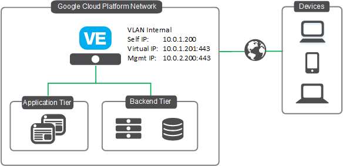

# Deploying BIG-IP VE in Google GCP - Standalone Two NICs

## Contents

- [Introduction](#introduction)
- [Prerequisites](#prerequisites)
- [Important Configuration Notes](#important-configuration-notes)
- [BYOL Licensing](#byol-licensing)
- [Installation Example](#installation-example)
- [Configuration Example](#configuration-example)

## Introduction

This solution uses a Terraform template to launch a two NIC deployment of a cloud-focused BIG-IP VE standalone device in Google GCP. Traffic flows to the BIG-IP VE which then processes the traffic to application servers. This is the standard cloud design where the BIG-IP VE instance is running with a dual interface. Management traffic is processed on NIC 1, and data plane traffic is processed NIC 0.

The BIG-IP VEs have the [Local Traffic Manager (LTM)](https://f5.com/products/big-ip/local-traffic-manager-ltm) module enabled to provide advanced traffic management functionality. In addition, the [Application Security Module (ASM)](https://www.f5.com/pdf/products/big-ip-application-security-manager-overview.pdf) can be enabled to provide F5's L4/L7 security features for web application firewall (WAF) and bot protection.

Terraform is beneficial as it allows composing resources a bit differently to account for dependencies into Immutable/Mutable elements. For example, mutable includes items you would typically frequently change/mutate, such as traditional configs on the BIG-IP. Once the template is deployed, there are certain resources (network infrastructure) that are fixed while others (BIG-IP VMs and configurations) can be changed.

Example...

-> Run once
- Deploy the entire infrastructure with all the neccessary resources, then use Declarative Onboarding (DO) to configure the BIG-IP cluster, Application Services (AS3) to create a sample app proxy, then lastly use Service Discovery to automatically add the DVWA container app to the BIG-IP pool.

-> Run many X
- [Redeploy BIG-IP for Replacement or Upgrade](#Redeploy-BIG-IP-for-replacement-or-upgrade)

**Networking Stack Type:** This solution deploys into an *EXISTING* networking stack. You are required to have existing VPC networks, firewall rules, and proper routing. Refer to the [Prerequisites](#prerequisites). Visit DevCentral to read [Service Discovery in Google Cloud with F5 BIG-IP](https://devcentral.f5.com/s/articles/Service-Discovery-in-Google-Cloud-with-F5-BIG-IP) where I show you my basic VPC setup (networks, subnets) along with firewall rules.

## Version
This template is tested and worked in the following version
Terraform v0.12.26
+ provider.google v3.24
+ provider.local v1.4

## Prerequisites

- ***Important***: When you configure the admin password for the BIG-IP VE in the template, you cannot use the character **#**.  Additionally, there are a number of other special characters that you should avoid using for F5 product user accounts.  See [K2873](https://support.f5.com/csp/article/K2873) for details.
- This template requires a service account for backend pool service discovery.
  - ***Note***: you MUST have "compute-ro" for service discovery
- This deployment will be using the Terraform Google provider to build out all the neccessary Google objects.
  - ***Note***: You MUST have "Editor" on the service account in order to create resources in your project with Terraform. See the [Terraform Google Provider "Adding Credentials"](https://www.terraform.io/docs/providers/google/guides/getting_started.html#adding-credentials) for details. Also, review the [available Google GCP permission scopes](https://cloud.google.com/sdk/gcloud/reference/alpha/compute/instances/set-scopes#--scopes) too.
- Passwords and secrets are located in [Google Cloud Secret Manager](https://cloud.google.com/secret-manager/docs/quickstart#secretmanager-quickstart-web). Make sure you have an existing Google Cloud "secret" with the data containing the clear text passwords for each relevant item: BIG-IP password, service account credentials, BIG-IQ password, etc.
  - ***Note***: The name of your Google Cloud Secret Manager secret is for variable 'usecret'. Refer to [Template Parameters](#template-parameters).
- This template deploys into an existing network
  - You must have a VPC for management and a VPC for data traffic (client/server). The management VPC will have one subnet for management traffic. The other VPC will have one subnet for data traffic.
  - Firewall rules are required to pass traffic to the application. These ports will depend on your application and the ports you choose to use.
  - BIG-IP will require tcp/22 and tcp/443 for management access
  

## Important Configuration Notes

- Variables are configured in variables.tf
- Sensitive variables like Google SSH keys are configured in terraform.tfvars
  - ***Note***: Other items like BIG-IP password are stored in Google Cloud Secret Manager. Refer to the [Prerequisites](#prerequisites).
  - The BIG-IP instance will query Google Metadata API to retrieve the service account's token for authentication.
  - The BIG-IP instance will then use the secret name and the service account's token to query Google Metadata API and dynamically retrieve the password for device onboarding.
- This template uses Declarative Onboarding (DO) and Application Services 3 (AS3) packages for the initial configuration. As part of the onboarding script, it will download the RPMs automatically. See the [AS3 documentation](https://clouddocs.f5.com/products/extensions/f5-appsvcs-extension/latest/) and [DO documentation](https://clouddocs.f5.com/products/extensions/f5-declarative-onboarding/latest/) for details on how to use AS3 and Declarative Onboarding on your BIG-IP VE(s). The [Telemetry Streaming](https://clouddocs.f5.com/products/extensions/f5-telemetry-streaming/latest/) extension is also downloaded and can be configured to point to Google Cloud Monitoring (old name StackDriver). 
- Files
  - bigip.tf - resources for BIG-IP, NICs, public IPs
  - main.tf - resources for provider, versions
  - onboard.tpl - onboarding script which is run by startup-script (user data). It will be copied to **startup-script=*path-to-file*** upon bootup. This script is responsible for downloading the neccessary F5 Automation Toolchain RPM files, installing them, and then executing the onboarding REST calls.
  - do.json - contains the L1-L3 BIG-IP configurations used by DO for items like VLANs, IPs, and routes.
  - as3.json - contains the L4-L7 BIG-IP configurations used by AS3 for items like pool members, virtual server listeners, security policies, and more.
  - ts.json - contains the BIG-IP configurations used by TS for items like telemetry streaming, CPU, memory, application statistics, and more.

## BYOL Licensing
This template uses PayGo BIG-IP image for the deployment (as default). If you would like to use BYOL licenses, then these following steps are needed:
1. Find available images/versions with "byol" in SKU name using Google gcloud:
  ```
          gcloud compute images list --project=f5-7626-networks-public | grep f5

          # example output...

          --snippet--
          f5-bigip-13-1-3-2-0-0-4-payg-best-1gbps-20191105210022
          f5-bigip-13-1-3-2-0-0-4-payg-best-200mbps-20191105210022
          f5-bigip-13-1-3-2-0-0-4-byol-all-modules-2slot-20191105200157
          ...and some more
          f5-bigip-14-1-2-3-0-0-5-byol-ltm-1boot-loc-191218142225
          f5-bigip-14-1-2-3-0-0-5-payg-best-1gbps-191218142340
          f5-bigip-15-1-0-2-0-0-9-payg-best-25mbps-200321032524
  ```
2. In the "variables.tf", modify *image_name* and *product* with the SKU and offer from gcloud CLI results
  ```
          # BIGIP Image
          variable image_name { default = "f5-bigip-14-1-2-3-0-0-5-byol-ltm-1boot-loc-191218142225" }
  ```
3. In the "variables.tf", modify *license1* with a valid regkey
  ```
          # BIGIP Setup
          variable license1 { default = "" }
  ```
4. In the "do.json", add the "myLicense" block under the "Common" declaration ([full declaration example here](https://clouddocs.f5.com/products/extensions/f5-declarative-onboarding/latest/bigip-examples.html#standalone-declaration))
  ```
        "myLicense": {
            "class": "License",
            "licenseType": "regKey",
            "regKey": "${regKey}"
        },
  ```

## Template Parameters

| Parameter | Required | Description |
| --- | --- | --- |
| prefix | Yes | This value is inserted at the beginning of each Google object (alpha-numeric, no special character) |
| svc_account | Yes | This is the GCP service account for programmatic API calls |
| uname | Yes | User name for the Virtual Machine |
| usecret | Yes | Retrieved from Google Cloud Secret Manager and contains password for the Virtual Machine  |
| gceSshPubKey | Yes | SSH public key for admin authentation |
| adminSrcAddr | Yes | Trusted source network for admin access |
| gcp_project_id | Yes | GCP Project ID for provider |
| gcp_zone | Yes | GCP Zone for provider |
| gcp_region | Yes | GCP Region for provider |
| svc_acct | Yes | Service Account for VM instance |
| privateKeyId | No | ID of private key for the service account used in Telemetry Streaming to Google Cloud Monitoring |
| privateKey | No | Private key (aka password) for the service account used in Telemetry Streaming to Google Cloud Monitoring |
| extVpc | Yes | External VPC network |
| mgmtVpc | Yes | Management VPC network |
| extSubnet | Yes | External subnet |
| mgmtSubnet | Yes | Management subnet |
| alias_ip_range | Yes | An array of alias IP ranges for the BIG-IP network interface (used for VIP traffic, SNAT IPs, etc) |
| bigipMachineType | Yes | Google machine type to be used for the BIG-IP VE |
| image_name | Yes | F5 SKU (image) to deploy. Note: The disk size of the VM will be determined based on the option you select.  **Important**: If intending to provision multiple modules, ensure the appropriate value is selected, such as ****AllTwoBootLocations or AllOneBootLocation****. |
| license1 | No | The license token for the F5 BIG-IP VE (BYOL) |
| host1_name | Yes | Hostname for the 1st BIG-IP |
| ntp_server | Yes | Leave the default NTP server the BIG-IP uses, or replace the default NTP server with the one you want to use |
| timezone | Yes | If you would like to change the time zone the BIG-IP uses, enter the time zone you want to use. This is based on the tz database found in /usr/share/zoneinfo (see the full list [here](https://cloud.google.com/dataprep/docs/html/Supported-Time-Zone-Values_66194188)). Example values: UTC, US/Pacific, US/Eastern, Europe/London or Asia/Singapore. |
| dns_server | Yes | Leave the default DNS server the BIG-IP uses, or replace the default DNS server with the one you want to use | 
| dns_suffix | Yes | DNS suffix for your domain | 
| DO_URL | Yes | This is the raw github URL for downloading the Declarative Onboarding RPM |
| AS3_URL | Yes | This is the raw github URL for downloading the AS3 RPM |
| TS_URL | Yes | This is the raw github URL for downloading the Telemetry RPM |
| onboard_log | Yes | This is where the onboarding logs all the events |

## Installation Example

To run this Terraform template, perform the following steps:
  1. Clone the repo to your favorite location
  2. Modify terraform.tfvars with the required information
  ```
      # BIG-IP Environment
      uname        = "admin"
      usecret      = "my-secret"
      gceSshPubKey = "ssh-rsa xxxxx
      prefix       = "mydemo123"
      adminSrcAddr = "0.0.0.0/0"
      mgmtVpc      = "xxxxx-net-mgmt"
      extVpc       = "xxxxx-net-ext"
      mgmtSubnet   = "xxxxx-subnet-mgmt"
      extSubnet    = "xxxxx-subnet-ext"
      dns_suffix   = "example.com"

      # Google Environment
      gcp_project_id = "xxxxx"
      gcp_region     = "us-west1"
      gcp_zone       = "us-west1-b"
      svc_acct       = "xxxxx@xxxxx.iam.gserviceaccount.com"
  ```
  3. Initialize the directory
  ```
      terraform init
  ```
  4. Test the plan and validate errors
  ```
      terraform plan
  ```
  5. Finally, apply and deploy
  ```
      terraform apply
  ```
  6. When done with everything, don't forget to clean up!
  ```
      terraform destroy
  ```

## Configuration Example

The following is an example configuration diagram for this solution deployment. In this scenario, all access to the BIG-IP VE device is direct to the BIG-IP via the management interface. The IP addresses in this example may be different in your implementation.



## Documentation

For more information on F5 solutions for Google, including manual configuration procedures for some deployment scenarios, see the Google GCP section of [F5 CloudDocs](https://clouddocs.f5.com/cloud/public/v1/google_index.html). Also check out the [Using Cloud Templates for BIG-IP in Google](https://devcentral.f5.com/s/articles/Using-Cloud-Templates-to-Change-BIG-IP-Versions-Google) on DevCentral. This particular standalone example is based on the [BIG-IP Standalone F5 ARM Cloud Template on GitHub](https://github.com/F5Networks/f5-google-gdm-templates/tree/master/supported/standalone/2nic/existing-stack/payg).

## Creating Virtual Servers on the BIG-IP VE

In order to pass traffic from your clients to the servers through the BIG-IP system, you must create a virtual server on the BIG-IP VE. In this template, the AS3 declaration creates 2 VIPs: one for public internet facing, and one for private internal usage. It is preconfigured as an example.

***Note:*** These next steps illustrate the manual way in the GUI to create a virtual server
1. Open the BIG-IP VE Configuration utility
2. Click **Local Traffic > Virtual Servers**
3. Click the **Create** button
4. Type a name in the **Name** field
4. Type an address (ex. x.x.x.x/x) in the **Destination/Mask** field
5. Type a port (ex. 443) in the **Service Port**
6. Configure the rest of the virtual server as appropriate
7. Select a pool name from the **Default Pool** list
8. Click the **Finished** button
9. Repeat as necessary for other applications

## Redeploy BIG-IP for Replacement or Upgrade
This example illustrates how to replace or upgrade the BIG-IP VE.
  1. Change the *image_name* variable to the desired release 
  2. Revoke the problematic BIG-IP VE's license (if BYOL)
  3. Run command
```
terraform destroy -target google_compute_instance.f5vm01
```
  3. Run command
```
terraform apply
```
