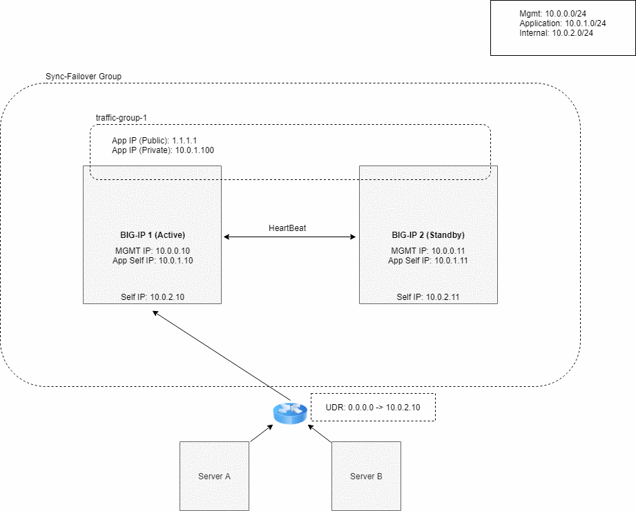

# Deploying BIG-IP VEs in Azure - High Availability (Active/Standby): Two NICs

## Contents

- [Introduction](#introduction)
- [Prerequisites](#prerequisites)
- [Important Configuration Notes](#important-configuration-notes)
- [Security](#security)
- [Configuration Example](#configuration-example)

## Introduction

This solution uses an Terraform template to launch a two NIC deployment of a cloud-focused BIG-IP VE cluster (Active/Standby) in Microsoft Azure. Traffic flows to the HA BIG-IP VE which then send to DVWA app server. This is the standard cloud design where the BIG-IP VE instance is running with a dual interface, where both management and data plane traffic is processed on each one.  

The BIG-IP VEs have both the [Local Traffic Manager (LTM)](https://f5.com/products/big-ip/local-traffic-manager-ltm) and [Application Security Module (ASM)](https://www.f5.com/products/security/advanced-waf) modules enabled to provide advanced traffic management functionality. This means you can also configure the BIG-IP VE to enable F5's L4/L7 security features, access control, Advance WAF and intelligent traffic management.

The one big thing in this Terraform accounted for is composing resources a bit differently to account for dependencies into Immutable/Mutable elements. i.e. stuff you would typically frequently change/mutate, such as traditional config on the BIG-IP. Once the template is deployed, there are certain resources (like the network infrastructure) that are fixed while others (like BIG-IP VMs and configurations) can be changed   
Ex.
-> Run once
- Deploy the entire infrastructure with all the neccessary resources, then we use Declarative Onboarding to configure the BIG-IP Cluster; AS3 to create a sample app proxy; then lastly use Service Discovery automatically add the DVWA container app to the LTM pool (Please note currently we also hardcode the node IP in the pool due to a bug in our AS3, which will be fixed in the next release)

-> Run many X
- [Redeploy BIG-IP for replacement or upgrade](#Redeploy-BIG-IP-for-replacement-or-upgrade)
- [Reconfigure BIG-IP configurations](#Rerun-AS3-on-the-big-ip-ve)

**Networking Stack Type:** This solution deploys into a new networking stack, which is created along with the solution.

## Prerequisites

- **Important**: When you configure the admin password for the BIG-IP VE in the template, you cannot use the character **#**.  Additionally, there are a number of other special characters that you should avoid using for F5 product user accounts.  See [K2873](https://support.f5.com/csp/article/K2873) for details.
- This template requires a service principal. **Important**: you MUST have "OWNER" previlidge on the SP in order to assign role to the resources in your subscription. See the [Service Principal Setup section](#service-principal-authentication) for details, including required permissions.
- The HA BIG-IP VMs use Azure RBAC role for the failover instead of using Service Prinicipal.
- These BIG-IP VMs are deploy across different Availability Zones, please ensure the region you've chosen can support AZ
- This deployment will be using the Terraform Azurerm provider to build out all the neccessary Azure objects. Therefore, Azure CLI is required. for installation, please follow this [Microsoft link](https://docs.microsoft.com/en-us/cli/azure/install-azure-cli-apt?view=azure-cli-latest)
- If this is the first time to deploy the F5 image, the subscription used in this deployment needs to be enabled to programatically deploy. For more information, please refer to [Configure Programatic Deployment](https://azure.microsoft.com/en-us/blog/working-with-marketplace-images-on-azure-resource-manager/)

## Important configuration notes

- All variables are configured in variables.tf 
- Azure Subscription and Service Principal are configured in provider.tf
- This template would require Declarative Onboarding and AS3 packages for the initial configuration. As part of the onboarding script, it will download the RPMs respectively. So please see the [AS3 documentation](https://clouddocs.f5.com/products/extensions/f5-appsvcs-extension/3.5.1/) and [DO documentation](https://clouddocs.f5.com/products/extensions/f5-declarative-onboarding/latest/prereqs.html) for details on how to use AS3 and Declarative Onboarding on your BIG-IP VE(s).
- onboard.tpl is the onboarding script, which is run by commandToExecute, and it will be copy to /var/lib/waagent/CustomData upon bootup. This script is basically responsible for downloading the neccessary DO and AS3 RPM files, installing them, and then executing the onboarding REST calls.
- This template uses PayGo BIGIP image for the deployment (as default). If you would like to use BYOL, then these following steps are needed:
1. In the "variables.tf", specify the BYOL image and licenses regkeys.
2. In the "main.tf", uncomment the "local_sku" lines.
3. Add the following lines to the "cluster.json" file just under the "Common" declaration:
  ```
          "myLicense": {
            "class": "License",
            "licenseType": "regKey",
            "regKey": "${local_sku}"
          },
  ```
- In order to pass traffic from your clients to the servers, after launching the template, you must create virtual server(s) on the BIG-IP VE.  See [Creating a virtual server](#creating-virtual-servers-on-the-big-ip-ve).
- See the **[Configuration Example](#configuration-example)** section for a configuration diagram and description for this solution.

### Template parameters

| Parameter | Required | Description |
| --- | --- | --- |
| prefix | Yes | This value is insert in the beginning of each Azure object, try keeps it alpha-numeric without any special character |
| rest_do_uri | Yes | URI of the Declarative Onboarding REST call. |
| rest_as3_uri | Yes | URI of the AS3 REST call. |
| rest_CF_uri | Yes | URI of the Cloud-Failover REST call. |
| rest_do_method | Yes | Available options are GET, POST, and DELETE. |
| rest_AS3_method | Yes | Available options are GET, POST, and DELETE. |
| rest_vm01_do_file | Yes | Terraform will generate the vm01 DO json file, where you can manually run it again for debugging. |
| rest_vm02_do_file | Yes | Terraform will generate the vm02 DO json file, where you can manually run it again for debugging. |
| rest_vm_as3_file | Yes | Terraform will generate the AS3 json file, where you can manually run it again for debugging. |
| rest_vm_CF_file | Yes | Terraform will generate the CF json file, where you can manually run it again for debugging. |
| SP | YES | This is the service principal of your Azure subscription. |
| uname | Yes | User name for the Virtual Machine. |
| upassword | Yes | Password for the Virtual Machine. |
| location | Yes | Location of the deployment. |
| region | Yes | Region of the deployment. |
| cidr | Yes | IP Address range of the Virtual Network. |
| subnet1 | Yes | Subnet IP range of the management network. |
| subnet2 | Yes | Subnet IP range of the external network. |
| subnet3 | No | Subnet IP range of the internal network. |
| managed_route1 | Yes | A UDR route can used for testing managed-route failover. |
| f5vm01mgmt | Yes | IP address for 1st BIG-IP's management interface. |
| f5vm02mgmt | Yes | IP address for 2nd BIG-IP's management interface. |
| f5vm01ext | Yes | IP address for 1st BIG-IP's external interface. |
| f5vm01ext_sec | Yes | Secondary IP address for 1st BIG-IP's external interface. |
| f5vm02ext | Yes | IP address for 2nd BIG-IP's external interface. |
| f5vm02ext_sec | Yes | Secondary IP address for 2nd BIG-IP's external interface. |
| instance_type | Yes | Azure instance to be used for the BIG-IP VE. |
| product | Yes | Azure BIG-IP VE Offer. |
| bigip_version | Yes | It is set to default to use the latest software. |
| image_name | Yes | F5 SKU (image) to you want to deploy. Note: The disk size of the VM will be determined based on the option you select.  **Important**: If intending to provision multiple modules, ensure the appropriate value is selected, such as ****AllTwoBootLocations or AllOneBootLocation****. |
| license1 | No | The license token for the F5 BIG-IP VE (BYOL). |
| license2 | No | The license token for the F5 BIG-IP VE (BYOL). |
| host1_name | Yes | Hostname for the 1st BIG-IP. |
| host2_name | Yes | Hostname for the 2nd BIG-IP. |
| ntp_server | Yes | Leave the default NTP server the BIG-IP uses, or replace the default NTP server with the one you want to use. |
| timezone | Yes | If you would like to change the time zone the BIG-IP uses, enter the time zone you want to use. This is based on the tz database found in /usr/share/zoneinfo (see the full list [here](https://github.com/F5Networks/f5-azure-arm-templates/blob/master/azure-timezone-list.md)). Example values: UTC, US/Pacific, US/Eastern, Europe/London or Asia/Singapore. |
| dns_server | Yes | Least the default DNS server the BIG-IP uses, or replace the default DNS server with the one you want to use. | 
| DO_onboard_URL | Yes | This is the raw github URL for downloading the Declarative Onboarding RPM |
| AS3_URL | Yes | This is the raw github URL for downloading the AS3 RPM. |
| TS_URL | Yes | This is the raw github URL for downloading the Telemetry RPM. |
| CFsdk_URL | Yes | This is the raw github URL for downloading the Cloud-Failover RPM. |
| libs_dir | Yes | This is where all the temporary libs and RPM will be store in BIG-IP. |
| onboard_log | Yes | This is where the onboarding script logs all the events. |
| f5_cloud_failover_label | Yes | This is a tag used for failover. |


## Configuration Example

The following is an example configuration diagram for this solution deployment. In this scenario, all access to the BIG-IP VE cluster (Active/Standby) is through an ALB. The IP addresses in this example may be different in your implementation.




## Documentation

For more information on F5 solutions for Azure, including manual configuration procedures for some deployment scenarios, see the Azure section of [Cloud Failover Doc](https://clouddocs.f5networks.net/products/extensions/f5-cloud-failover/latest/userguide/azure.html).

## Creating virtual servers on the BIG-IP VE

In order to pass traffic from your clients to the servers through the BIG-IP system, you must create a virtual server on the BIG-IP VE. In this template, it creates 2 VIPs, one for public internet facing and one for private internal usage. They are preconfigured as an example and configured the same way as on-prem BIG-IP.

## Redeploy BIG-IP for replacement or upgrade
This example illustrates how to replace the BIG-IP VE
  1. Revoke the problematic BIG-IP VE's license (if BYOL)
  2. Run command
```
terraform destroy -target azurerm_virtual_machine.f5vm02
```
  3. Run command
```
terraform apply
```
  4. At this time, you have 2 standalone BIG-IP VEs behind the Azure LB, which is fine. Repeate step 1 to step 3 on the other BIG-IP VE otherwise, the Device Trust won't be configured correctly


This example illustrate how to upgrade the BIG-IP VEs (remember, when replace a VE, we replace both, can't be just single VE)
  1. Change the 'bigip_version' variable to the desired release 
  2. Revoke the problematic BIG-IP VE's license
  3. Run command
```
terraform destroy -target azurerm_virtual_machine.f5vm02
```
  4. Run command
```
terraform apply
```
  5. At this time, you have 2 standalone BIG-IP VEs behind the Azure LB, which is fine. Repeate step 2 to step 4 on the other BIG-IP VE otherwise, the Device Trust won't be configured correctly

## Rerun AS3 on the Big-ip ve
- This example illustrate how to run your own custom AS3, you can have a catalog of AS3 and repeat this steps as many times as desired
```
terraform taint null_resource.f5vm_AS3
terraform apply -target null_resource.f5vm_AS3 -var "rest_as3_method=POST" -var "rest_vm_as3_file=test.json" 
```
- If you would like to re-run your DO json, it would be similar to the above procedure.
